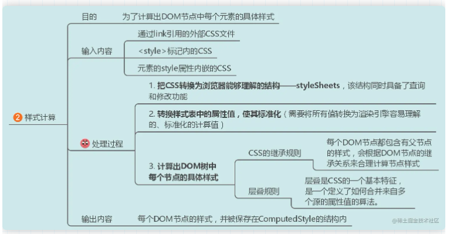
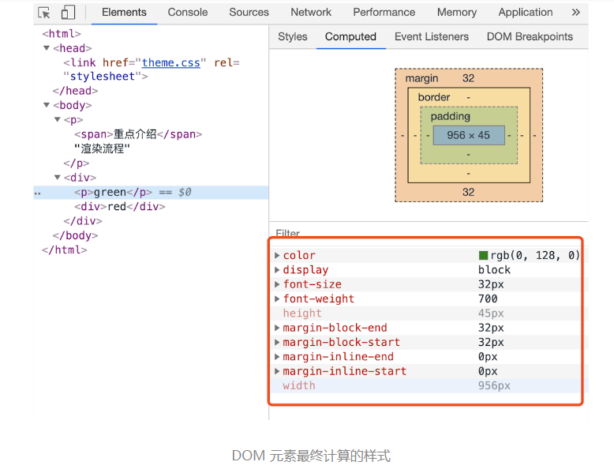

js 引擎需要容器才能执行，这个章节通过浏览器容器来看 整个执行过程

**js 作为高级语言（解释型语言）**，在执行过程中需要将**源码转换成字节码等中间代码或者是机器码**，这个让cpu 识别 js 语言的过程通常会交给js 引擎，我们常说的引擎都有Chrome V8引擎 (chrome、Node、Opera、Edge）、SpiderMonkey （Firefox）Nitro (Safari）、Chakra （Edge)

**JS 引擎（单线程）往往不是单独运行的** 它运行在一个宿主环境中，对于大多数开发者来说就是典型的**浏览器和 Node.js**

## 浏览器容器

  

以谷歌浏览器为例 作为作为**多进程**的容器， 点击 Chrome 浏览器右上角的 "选项" 菜单，选择 "更多工具" 子菜单，点击 "任务管理器" 或者"shift + Esc"打开chrome的**任务管理器**，可以看到一个tab 页占用一个进,并且还有一些浏览器默认进程

  

上图中的Chrome 进程架构，包括：1 个浏览器（Browser）主进程、1 个 GPU 进程、1 个网络（NetWork）进程、多个渲染进程和多个插件进程。

1. **浏览器进程**：浏览器进程是整个浏览器的主进程，负责协调和管理其他进程。它主要执行以下任务：
   - 界面显示：负责渲染浏览器的用户界面，如地址栏、书签栏、菜单栏等。
   - 用户交互：处理用户的输入，如点击、滚动、键盘输入等。
   - 子进程管理：创建、监控和终止其他进程，如渲染进程、GPU 进程等。
   - 存储管理：负责浏览器的存储功能，如 Cookie、缓存、历史记录等。

2. **渲染进程**：渲染进程负责将网页代码（HTML、CSS、JavaScript）转换成可视化的网页。它主要执行以下任务：
   - HTML 解析：将 HTML 代码解析成 DOM（文档对象模型）树。
   - CSS 解析：将 CSS 代码解析成 CSSOM（CSS 对象模型）树。
   - 渲染树构建：将 DOM 树和 CSSOM 树合并成渲染树。
   - 布局：计算渲染树中每个元素的位置和大小。
   - 绘制：将渲染树中的元素绘制到屏幕上。
   - JavaScript 执行：运行 JavaScript 代码，实现网页的交互功能。

3. **GPU 进程**：GPU 进程负责处理图形和图像的渲染。它主要执行以下任务：
   - 3D 渲染：使用 WebGL 技术实现 3D 图形渲染。
   - 2D 渲染：使用 Canvas 2D 技术实现 2D 图形渲染。
   - 硬件加速：利用 GPU 的并行计算能力，加速网页和浏览器界面的渲染。
   - 视频解码：使用 GPU 进行高效的视频解码，降低 CPU 负载。

4. **网络进程**：网络进程负责处理网页的网络资源加载。它主要执行以下任务：
   - 资源请求：向服务器发送请求，获取网页所需的资源，如图片、CSS、JavaScript 等。
   - 数据接收：接收服务器返回的资源数据，并将其传递给渲染进程。
   - 缓存管理：根据缓存策略，将已加载的资源存储到本地，以便下次访问时直接使用。
   - 协议处理：处理各种网络协议，如 HTTP、HTTPS、WebSocket 等。

5. **插件进程**：插件进程负责运行浏览器插件。它主要执行以下任务：
   - 插件加载：加载并初始化插件，如 Flash、PDF 阅读器等。
   - 插件运行：运行插件代码，实现插件的功能。
   - 插件沙箱：为插件提供一个隔离的运行环境，防止插件影响浏览器和网页的稳定性。

通过这种多进程架构，Chrome 浏览器可以在不同的进程中处理不同的任务，从而提高性能、稳定性和安全性。同时，当某个进程出现问题时，浏览器可以快速恢复，不会影响到其他进程和用户体验。或者某个页面崩溃只是自己的 对应的 tab 页进程崩溃并不会影响到其他页面，这种带来的缺点**更高的资源占用**。因为每个进程都会包含公共基础结构的副本（如 JavaScript 运行环境），这就意味着浏览器会消耗更多的内存资源。

**注意即使是如今的多进程架构，偶尔还会碰到一些由于单个页面卡死最终崩溃导致所有页面崩溃的情况，原因是因为**

Chrome 的默认策略是，每个标签对应一个渲染进程。**但如果从一个页面打开了另一个新页面，而新页面和当前页面属于同一站点（定义为根域名加上协议，该根域名下的所有子域名和不同的端口，通俗点一级域名二级域名这种）的话，那么新页面会复用父页面的渲染进程**。官方把这个默认策略叫 process-per-site-instance。

这个过程：A 页面打开 B 页面，且 A 和 B 都属于同一站点的话，那么 B 页面复用 A 页面的渲染进程；如果是其他情况，浏览器进程则会为 B 创建一个新的渲染进程

  

那js 引擎线程在那个进程中，你要知道，当我们打开一个tab页面时就会开启一个新的进程，**默认每个Tab对应对应一个遣染进程**，**这是为了防止一个页面卡死而造成所有页面无法响应，整个浏览器需要强制退出，每个遣染进程中又有很多的线程，例如其他线程**：

* **GUI渲染线程**:负责渲染页面和绘制图形，即将HTML、CSS和图片等资源解析为可视化的网页元素
* **JS引擎线程**:负责解析和执行JavaScript代码，使得网页具有交互性和动态效果。
* **事件触发线程**:负责监听用户操作或其他事件（如点击、滚动等），并触发相应的事件处理函数。
* **定时触发器线程**:负责执行定时器（如setTimeout和setInterval）中的回调函数，按照预定的时间间隔触发。
* **异步HTTP请求线程**:负责处理异步网络请求（如AJAX），从服务器端获取资源和信息，不会阻塞其他线程的执行。
* **WebWorker**:是一种在浏览器后台运行的JavaScript脚本，可以在不影响主线程的情况下执行耗时或复杂的任务。

浏览器内核，通过下表也能发现**浏览器内核等同渲染引擎（GUI渲染线程）** 是浏览器的核心部分，它决定了浏览器如何解析和显示网页内容

| 浏览器内核 | 渲染引擎 | JavaScript引擎 | 常见浏览器 |
| --- | --- | --- | --- |
| Blink | Blink | V8 | Google Chrome, Opera, Microsoft Edge(Chromium版), Brave,Vivaldi等 |
| WebKit | WebKit | JavaScriptCore | Safari, Google Chrome, Opera等 |
| Gecko | Gecko | SpiderMonkey | Firefox,SeaMonkey等 |
| Trident | MSHTML | Chakra | Internet Explorer, Maxthon等 |
| EdgeHTML | EdgeHTML | Chakra | Microsoft Edge(旧版) |

说明：

* **Blink内核是由Google开发的浏览器渲染引擎**，它是Webkit内核的一个分支，目前被Google Chrome、Opera等多个浏览器采用。V8引擎是Blink内核专门为JavaScript开发的引擎，具有快速、高效等特点。

* **WebKit内核最早由苹果公司开发**，包括Safari、Chrome、Opera等多个浏览器都采用了WebKit内核。JavaScriptCore引擎是WebKit内核专门为JavaScript开发的引擎。

* **Gecko内核是由Mozilla基金会开发的浏览器渲染引擎**，包括Firefox、SeaMonkey等多个浏览器都采用了Gecko内核。SpiderMonkey引擎是Gecko内核专门为JavaScript开发的引擎。

* **Trident内核是由微软公司开发的浏览器渲染引擎**，包括IE、Maxthon等多个浏览器都采用了Trident内核。Chakra引擎是Trident内核专门为JavaScript开发的引擎。

* **EdgeHTML内核是由微软公司开发的浏览器渲染引擎**，用于最初的Microsoft Edge浏览器。然而，自2020年1月起，Microsoft Edge已经转向使用Chromium内核。

  

一个浏览器至少实现三个常驻线程：**javascript引擎线程**，**GUI渲染线程**，**浏览器事件触发线程**。以Webkit内核为例，WebCore：负责HTML解析、布局、渲染等相关的操作；JavaScriptCore（JSCore）：解析和执行JavaScript代码；

### 运行时Runtime

**JavaScript宿主环境，也可以叫做 JavaScript运行时（Runtime）**，宿主环境创建的一个作用域（scope）。在这个作用域内，JavaScript代码可以访问宿主环境提供的一系列特性。以浏览器为例，提供了一些额外的对象（API），**这些对象可以让JavaScript代码与宿主环境进行交互**。并且让这些API使得JavaScript代码能够访问和操作环境中的特定功能

例如操作DOM（浏览器中的文档对象模型）、发起网络请求（如Ajax请求）或内置API（如setTimeout、Promise等）以及宿主环境提供的特定API（如浏览器中的window、document对象）。

同样Node.js 作为运行时Runtime 也提供了fs、http模块等

**所以有了 Javascript 运行时（Runtime）就可以相同的JS引擎，在不同的环境下，便有不同的能力，js 常见提供 Javascript Runtime宿主, web 浏览器, node.js**，下表展示两种不同的宿主环境（浏览器和Node.js），虽然他们的 js 引擎都是 V8 但是他们 容器不同，基于了他们额外的特性

| 宿主环境 | JS引擎      | 运行时特性                                      |
| -------- | ----------- | --------------------------------------------- |
| 浏览器   | Chrome V8引擎 | DOM、window对象、用户事件、Timers等          |
| Node.js  | Chrome V8引擎 | require对象、Buffer、Processes、fs等         |

### webAPI

**webAPI 作为浏览器提供的一些额外的对象（API）** 例如 setTimeout、setInterval和XHR在MDN上，这些功能被归类为"Web API"，它们是由WHATWG组织定义的。因此setTimeout和setInterval这类我们认为的 JavaScript的异步能力实际上是由所在容器（如浏览器）提供的，并不是JavaScript引擎本身的功能。

而JavaScript 引擎中的API 本身是由ECMAScript组织定义的。

"Web API"并不是JavaScript规范的一部分，而是浏览器容器额外提供的一些API方法。简单地说，**"Web API"就是浏览器这个容器提供的JavaScript运行时**。

从本质上讲，这些Web API是你无法直接访问的线程，但你可以调用它们。它们是浏览器并行启动的一部分。如果你是一个Node.js开发者，这些就相当于C++的一些API。

浏览器中 Web API的主要能力包括：
1. **事件监听（Event Listeners）**：允许JavaScript代码响应用户事件，如点击、滚动等。
   
2. **HTTP请求（HTTP request）**：允许JavaScript代码通过XHR或Fetch API与服务器进行通信。
   
3. **定时功能（Timing functions）**：如setTimeout和setInterval，允许JavaScript代码在特定时间后或周期性地执行某些操作。

## 浏览器输入网址后解析过程

之前我们是讨论是 V8 js引擎执行过程，现在将V8 放入到浏览器容器后，看整个浏览器执行过程
  

1. 首先，**用户在浏览器搜索栏中输入服务器地址，与服务器建立连接**，对浏览器输入的地址进行DNS解析，将域名解析成对应的IP地址；然后向这个IP地址发送http请求，服务器收到发送的http请求，处理并响应

2. 处理 URL 请求响应回来的数据类型，根据响应头中的字段 `Content-Type` 它告诉浏览器服务器返回的响应体数据是什么类型,如果Content-type 字段的值不是 text/html。例如 application/octet-stream 浏览器判断为下载类型，那么该请求会被提交给浏览器的下载管理器，如果是 text/html  进入下一个流程，**由于 Chrome 的页面渲染是运行在渲染进程中的，所以接下来就需要准备渲染进程了**

3. 默认情况下，Chrome 会为每个页面分配一个渲染进程，也就是说，每打开一个新页面就会配套创建一个新的渲染进程，服务器**返回对应的静态资源取到 HTML 内容**，浏览器获取到 HTML 内容后，就开始从上到下解析 HTML 的元素

4. `<head>`元素内容会先被解析，此时浏览器还没开始渲染页面。当遇到`head` 标签内部一般会有
   * 页面元数据的`<meta>`元素
   * 还有一些`<link>`元素涉及外部资源（如图片、CSS 样式等），此时浏览器会去获取这些外部 
  资源。
   * `<script>`元素通过src属性指向外部资源。

1. 当浏览器解析`<script>`，会暂停解析并这个解析包裹 html css 解析。

2. 当 JavaScript 脚本下载完成后，浏览器的控制权转交给 JavaScript 引擎。当脚本执行完成后，控制权会交回给渲染引擎，渲染引擎继续往下解析 HTML 页面。

3. `<body>`元素内容开始被解析，浏览器开始渲染页面。 

### 浏览器的页面渲染过程

浏览器运行过程已经了解 下面进一步的页面渲染过程，也就是 渲染模块进程处理的过程
  

1. **HTML Parser将HTML解析转换成DOM树**；

2. **CSS Parser将样式表解析转换成CSS规则树**；

3. 转换完成的DOM树和CSS规则树Attachment（附加）在一起，并生成一个**Render Tree（渲染树）**；

4. 需要注意的是，**在生成Render Tree并不会立即进行绘制，中间还会有一个Layout（布局）操作，也就是布局引擎**；

5. 为什么需要布局引擎再对Render Tree进行操作？因为不同时候浏览器所处的状态是不一样的（比如浏览器宽度），**Layout的作用就是确定元素具体的展示位置和展示效果；**

6. **有了最终的Render Tree，浏览器就进行Painting（绘制）**，最后进行Display展示；

7. 可以发现图中还有一个紫色的DOM三角，实际上这里是js对DOM的相关操作；

8. 在HTML解析时，如果遇到JavaScript标签，就会停止解析HTML，而去加载和执行JavaScript代码；

更加具体过程需要先了解下面几个知识点

### DOM 树 -- 处理 HTML 标记，构建 DOM 树

从发送HTTP请求到生成DOM树的过程，包括数据的传输、解析、词法分析和树结构生成。**在渲染引擎内部，有一个叫 HTML 解析器（HTMLParser）的模块，它的职责就是负责将 HTML 字节流转换为 DOM 结构**

DOM树是HTML文档的结构化表示，它由一系列节点组成，包括元素节点、文本节点、注释节点等。DOM树的根节点是文档节点，它代表整个HTML文档，而其他节点则代表文档中的各个元素和内容。DOM树的每个节点都有一个对应的JavaScript对象，可以通过JavaScript来操作和修改DOM树中的节点和属性。

**HTML 解析器并不是等整个文档加载完成之后再解析的，而是网络进程加载了多少数据，HTML 解析器便解析多少数据。**

  

  

1. 从服务器基于HTTP网路请求回来的数据：当我们在浏览器中输入一个网址并访问时，浏览器会向服务器发送一个HTTP请求，请求获取网页的数据。

2. 16进制的文件流：服务器返回的数据是以16进制的文件流形式存在的，这是一种编码方式，用于在网络传输过程中保证数据的完整性。

3. 浏览器把它解析为字符串（HTML字符串）：浏览器接收到16进制的文件流后，会将其解析成HTML字符串，也就是我们通常看到的HTML代码。

4. 按照W3C规则识别成为一个个的节点「词法解析」：浏览器会根据W3C（万维网联盟）制定的规则，对HTML字符串进行词法解析，将其识别为一个个的节点，如标签、属性等。由图可以看出，Tag Token 又分 StartTag 和 EndTag，比如<body>就是 StartTag ，</body>就是EndTag，分别对于图中的蓝色和红色块，文本 Token 对应的绿色块，和**vue 虚拟dom部分很类似**。

  

5. 生成树：经过词法解析后，浏览器会根据节点之间的关系生成一棵树结构，这棵树被称为DOM（文档对象模型）树。DOM树是浏览器对网页结构的一种表现形式，便于浏览器渲染页面和开发者操作页面元素。

  

* **总结图**
  

### CSSOM树

**参考 浏览器工作原理与实践李兵老师的解释，在源码里面并没有CSSOM这个词，你说的CSSOM 应该是就是styleSheets，这个styleSheets是能直观感受的到的**

CSSOM树是CSS样式表的结构化表示，它由一系列CSS规则组成，每个规则包含一个或多个CSS选择器和对应的样式声明，它包括了所有的 CSS 规则、样式属性和值，以及它们的优先级和继承关系等信息。CSSOM树的根节点是样式表节点，它代表整个CSS样式表，而其他节点则代表CSS规则和样式声明。CSSOM树的每个节点都有一个对应的JavaScript对象，可以通过JavaScript来操作和修改CSSOM树中的规则和属性。

1. 当处理HTML时，解析器可能会遇到包含，css 样式 此时需要将 CSS 转换为浏览器能够理解的结构，常见的 css 样式来源主要有三种
   * 通过 link 引用的外部 CSS 文件
   * `<style>`标记内的 CSS
   * 元素的 style 属性内嵌的 CSS

当渲染引擎接收到 CSS 文本时，会执行一个转换操作，将 CSS 文本转换为浏览器可以理解的结构——styleSheets。可以在 Chrome 控制台中查看其结构，只需要在控制台中输入 `document.styleSheets`

  

2. 转换样式表中的属性值，使其标准化,CSS 文本中有很多属性值，如 2em、blue、bold，这些类型数值不容易被渲染引擎理解，所以需要将所有值转换为渲染引擎容易理解的、标准化的计算值，这个过程就是属性值标准化。
   
  

3. 计算出 DOM 树中每个节点的具体样式,接着，根据CSS对象模型（CSSOM）规范，将这个CSS样式表解析成一个映射表（地图）。CSS 继承就是每个 DOM 节点都包含有父节点的样式计算时候要考虑进去

* **如 body 节点的 font-size 属性是 20，那 body 节点下面的所有节点的 font-size 都等于 20。**
  
  

* **关于css 继承这里 可以参考， Chrome 的“开发者工具”，选择第一个 'element' 标签，再选择 'style' 子标签，你会看到如下界面**
  
  

* 看到继承后每个 DOM 元素最终的计算样式，可以打开 Chrome 的 开发者工具，选择第一个 element 标签，然后再选择 Computed 子标签，如下图所示
  

**既然已经有了DOM树来表示HTML文档的结构，为什么不把CSS也放在DOM上，以便我们可以直接从元素上获取所有样式信息呢？**

很明显，如果把CSS信息一起建模在DOM结构上，就会违背"单一职责原则"。因为在网页中，HTML承担了语义职能，CSS承担了表现职能；同样地，在计算机中，DOM承担了语义职能，而CSSOM承担了表现职能。从下图可以看出，**这里仅仅是对DOM节点的CSS进行了生成树，这时候并没有包含节点中的内容**。

  

* **总结图**
  

### Render-Tree渲染树

**参考 浏览器工作原理与实践李兵老师的解释 渲染树也是16年之前的东西了，现在的代码完全重构了，你可以把LayoutTree看成是渲染树**，但这里我还是按照Render-Tree渲染树 概念去理解

有了 DOM 树和 DOM 树中元素的计算样式后，浏览器会根据这些信息合并成一个 layout 树，收集所有可见的 DOM 节点，以及每个节点的所有样式信息。

 

1. 当浏览器解析HTML文档时，会生成一个DOM树（Document Object Model Tree），表示页面的结构。同时，解析CSS样式表会生成一个CSSOM树（CSS Object Model Tree），表示页面的样式信息。
   
2. 当DOM树和CSSOM树都构建完成后，浏览器会将它们结合起来，生成一个渲染树（Render Tree）。渲**染树包含了页面中所有需要显示的元素及其样式信息**。
   
3. 在这个过程中，link元素（用于引入外部CSS样式表）不会阻塞DOM树的构建，但会阻塞渲染树的构建。这是因为在构建渲染树时，需要使用对应的CSSOM树来确定元素的样式。
   
需要注意的是，渲染树和DOM树并不是一一对应的关系。例如，如果一个元素的display属性设置为none，那么这个元素不会出现在渲染树中，因为它不需要显示在页面上。

* **如图 DOM 树和 CSSOM 树的区别，CSSOM 从 body 元素开始显示，并且也没有文本节点、注释节点等但包含display:none 属性的元素**。并且Layout 树和 DOM 树不一定是一一对应的，为了构建 Layout 树，来具体进一步来看浏览器主要完成了下列工作：
1. 从 DOM 树的根节点开始遍历每个可见节点。
   * 某些不可见节点（例如 script、head、meta 等），它们不会体现在渲染输出中，会被忽略。
   * 某些通过设置 display 为 none 隐藏的节点，在渲染树中也会被忽略。
   * 为伪元素创建 LayoutObject。
   * 为行内元素创建匿名包含块对应的 LayoutObject。
2. 对于每个可见节点，为其找到适配的 CSSOM 规则并应用它们。
3. 产出可见节点，包含其内容和计算的样式。
  
  

* **总结图**

  
  

### 布局
计算每个节点的几何形状和位置的步骤。渲染树是一个表示网页元素及其样式的树状结构，但它不包含元素的尺寸和位置信息。布局（Layout）是一个过程，它在渲染树上运行，以计算每个节点的宽度、高度和位置信息。这些信息将用于在屏幕上正确显示网页的各个元素。这个过程中，浏览器对渲染树进行遍历，将元素间嵌套关系以盒模型的形式写入文档流

盒模型在布局过程中会计算出元素确切的大小和定位。计算完毕后，相应的信息被写回渲染树上，就形成了布局渲染树。同时，每一个元素盒子也都携带着自身的样式信息，作为后续绘制的依据。

  

### 绘制

在绘制开始前，一些复杂的 3D 变换、页面滚动，或者使用 z-indexing 做 z 轴排序等，为了更加方便地实现这些效果，**渲染引擎还需要为特定的节点生成专用的图层，并生成一棵对应的图层树（LayerTree）** ，和 PS 图层一样

可以打开 Chrome 的 开发者工具，选择 Layers 标签，就可以可视化页面的分层情况，渲染引擎给页面分了很多图层，这些图层按照一定顺序叠加在一起如下图所示：

  

浏览器的页面实际上被分成了很多图层，这些图层叠加后合成了最终的页面，**并不是布局树的每个节点都包含一个图层，如果一个节点没有对应的层，那么这个节点就从属于父节点的图层**。如上图中的 span 标签没有专属图层，那么它们就从属于它们的父节点图层

  

那什么样的节点才能让浏览器引擎为其创建一个新的图层呢？需要满足以下其中一个条件：

1. **拥有层叠上下文属性的元素**，页面通常是二维的平面，而层叠上下文能够让页面具有三维的概念。这些 HTML 元素按照自身属性的优先级分布在垂直于这个二维平面的 z 轴上。

   * z-index 属性
   * opacity 属性（值小于 1 的元素）
   * transform 属性（值不为 none 的元素）
   * filter 属性（值不为 none 的元素）
   * isolation 属性（值为 isolate 的元素）
   * position 属性（值为 fixed 或 sticky 的元素）
   * mix-blend-mode 属性
   * mask 属性（值不为 none 的元素）
   * clip-path 属性（值不为 none 的元素）
   * perspective 属性（值不为 none 的元素）
   * contain 属性（值为 paint 的元素）
  

2. 需**要剪裁（clip）的地方也会被创建为图层**，什么是裁剪呢？假如有一个固定宽高的div盒子，而里面的文字较多超过了盒子的高度，这时就会产生裁剪，浏览器渲染引擎会把裁剪文字内容的一部分用于显示在 div 区域。当出现裁剪时，浏览器的渲染引擎就会为文字部分单独创建一个图层，如果出现滚动条，那么滚动条也会被提升为单独的图层。  

### 将每个节点绘制（Paint）到屏幕上

绘制阶段。在这个阶段，浏览器会根据之前计算好的布局信息（frame），将网页的各个元素绘制到屏幕上。绘制过程包括将元素的可见部分（如文本、颜色、边框、阴影等）转换为实际的像素点，以及处理替换元素（如图片）。这样，用户就能看到一个完整的网页界面。

  

打开 开发者工具的 Layers 标签，选择  document 层，来实际体验下绘制列表，拖动区域 中的进度条可以重现列表的绘制过程。
  

* **总结图**

  

到现在为止都是在渲染进程 的主线程中操作
  

### 栅格化（raster）操作

当图层的绘制列表准备好之后，主线程会把该绘制列表提交（commit）给合成线程

通常一个页面可能很大，但是用户只能看到其中的一部分，我们把用户可以看到的这个部分叫做视口（viewport）

在有些情况下，有的图层可以很大，比如有的页面你使用滚动条要滚动好久才能滚动到底部，但是通过视口，用户只能看到页面的很小一部分，所以在这种情况下，要绘制出所有图层内容的话，就会产生太大的开销，而且也没有必要。

基于这个原因，合成线程会将图层划分为图块（tile），这些图块的大小通常是 256x256 或者 512x512，如下图所示：

  

**合成线程会按照视口附近的图块来优先生成位图，实际生成位图的操作是由栅格化来执行的。所谓栅格化，是指将图块转换为位图**

* **总结图**
  
  

  

### 合成显示
合成线程就会生成一个绘制图块的命令——DrawQuad，然后将该命令提交给浏览器进程

浏览器进程里面有一个叫 viz 的组件，用来接收合成线程发过来的 DrawQuad 命令，然后根据 DrawQuad 命令，将其页面内容绘制到内存中，最后再将内存显示在屏幕上。

* **总结图**

  

## 参考

[浏览器工作原理与实践_李兵](https://time.geekbang.org/column/intro/100033601?utm_source=pinpaizhuanqu&utm_medium=geektime&utm_campaign=guanwang&utm_term=guanwang&utm_content=0511)

[前端百题斩【029】——原来浏览器中存在五类进程](https://juejin.cn/post/6986265024255754248)

[层叠上下文](https://developer.mozilla.org/zh-CN/docs/Web/CSS/CSS_positioned_layout/Understanding_z-index/Stacking_context)

[渲染页面：浏览器的工作原理](https://developer.mozilla.org/zh-CN/docs/Web/Performance/How_browsers_work#%E6%A6%82%E8%BF%B0)

[浏览器渲染机制](https://febook.hzfe.org/awesome-interview/book2/browser-render-mechanism)

[画了20张图，详解浏览器渲染引擎工作原理](https://community.eolink.com/d/32427-20)

[setTimeout解决GUI渲染线程阻塞问题](https://blog.csdn.net/qq_26222859/article/details/77622222)

[Javascript v8引擎和Web API](https://stackoverflow.com/questions/59316975/the-javascript-v8-engine-and-web-apis)

[whatwg 是个什么组织？和 W3C 的关系是？](https://segmentfault.com/q/1010000002408941)

[01 | 重识 HTML，掌握页面基本结构和加载过程2021/04/09 王贝珊（被删）](https://kaiwu.lagou.com/course/courseInfo.htm?courseId=822#/detail/pc?id=7196)

[浏览器是如何工作的](https://web.dev/howbrowserswork/#the-rendering-engines-threads)

[浏览器工作原理和JS引擎](https://www.cnblogs.com/MomentYY/p/15770904.html)

