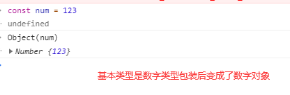

[TOC]
>[success] # 工具类型小方法
~~~
1.本章节代码通过整理30s 项目中数组篇章知识点，对涉及对象一些工具小方法记录
~~~
>[info] ## 是否为空对象
~~~
1.检查值是否为空对象/集合，没有可枚举的属性或任何不视为集合的类型就认为是空
~~~
[is-empty](https://www.30secondsofcode.org/js/s/is-empty)
>[danger] ##### 30s
~~~
1.'Object.keys' 仅仅是对象自己的属性，非原型链上的，并且也需要是可枚举类型
2.但是这种过于简单对 数字类型 和 布尔类型Object.keys 返回的是空数组，导致返回的是true
认为他们是空对象

log(Object.keys(123)) // []
~~~
~~~
const isEmpty = val => val == null || !(Object.keys(val) || val).length;
例子
isEmpty([]); // true
isEmpty({}); // true
isEmpty(''); // true
isEmpty([1, 2]); // false
isEmpty({ a: 1, b: 2 }); // false
isEmpty('text'); // false
isEmpty(123); // true - type is not considered a collection
isEmpty(true); // true - type is not considered a collectionconst 
~~~
>[info] ## 检测传递值是否为对象
~~~
1.检测传递值是否为对象
~~~
>[danger] ##### 30s
~~~
1.当以非构造函数形式被调用时，Object 的行为等同于 new Object()。
  1.1.如果给定值是 null 或 undefined，将会创建并返回一个空对象
  1.2.如果传进去的是一个基本类型的值，则会构造其包装类型的对象
  1.3.如果传进去的是引用类型的值，仍然会返回这个值，经他们复制的变量保有和源对象相同的引用地址
2.下面代码利用的就是1.3条如果是对象被Object 包裹后还是对象自己，这样进行比较便可知道传递的值是否
为对象
3.现在这个工具方法如果你传入的 null 或 undefined或者是function 我们都可以认为他是对象
~~~
[is-object](https://www.30secondsofcode.org/js/s/is-object)
* 如图解释1.2

~~~
const isObject = obj => obj === Object(obj);
例子
isObject([1, 2, 3, 4]); // true
isObject([]); // true
isObject(['Hello!']); // true
isObject({ a: 1 }); // true
isObject({}); // true
isObject(true); // false
log(isObject(x=>x)) // true
~~~
>[info] ## 使用 typeOf 检测传入值是否为对象
~~~
1.现在如果你传入的 null 或 undefined或者是function 不认为他是对象
~~~
[is-object-like](https://www.30secondsofcode.org/js/s/is-object-like)
>[danger] ##### 30s
~~~
1.使用typeof 注意因为 null 的typeof 是对象类型，因此下面方法给排除
~~~
~~~
const log = console.log

const isObjectLike = val => val !== null && typeof val === 'object';

isObjectLike({}); // true
isObjectLike([1, 2, 3]); // true
isObjectLike(x => x); // false
isObjectLike(null); // false
log(isObjectLike(undefined)) // false
~~~
>[info] ## 对象浅copy
[shallow-clone](https://www.30secondsofcode.org/js/s/shallow-clone)
~~~
const shallowClone = obj => Object.assign({}, obj);
例子
const a = { x: true, y: 1 };
const b = shallowClone(a); // a !== b
~~~
>[info] ## 判断一个对象是否用Object构造
~~~
1.判断一个对象是否从Object 创建的
~~~
>[danger] ##### 30s
~~~
1.一个知识点使用对象的'constructor' 属性看他的构造函数是否是和创建的构造函数是一个
这里要看是否是来自Object 因此和Object 做比较
~~~
~~~
const log = console.log

class User{
    name = 'w'
}

const  user = new User()

const isPlainObject = val =>
  !!val && typeof val === 'object' && val.constructor === Object;

log(isPlainObject(user)) // false  user 是来自User
isPlainObject({ a: 1 }); // true
~~~