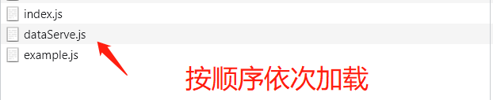

>[success] # AMD 模块化规范
~~~
1.AMD（Asynchronous Module Definition）是 RequireJS 在推广过程中对模块定义的规范化产出,。由于不是
JavaScript原生支持，使用AMD规范进行页面开发需要用到对应的库函数，也就是require.js（还有个js库：curl.js）

2.AMD这个规范约定每一个模块都必须通过 define 这个函数定义，默认可以接收两个参数，
也可以传递三个参数：
    2.1.第一个参数是模块的名字；
    2.2.第二个参数是一个数组，用于声明模块依赖项；
    2.3.第三个参数是一个函数，函数的参数与前面的依赖项一一对应，每一项分别为依赖项这个模块导出的成员，
        这个函数的作用可以以理解为为当前的这个模块提供一个私有的空间。如果需要在这个模块当中向外部
        导出一些成员，可以通过 return 实现
3.因此可以通过'Require.js' 来进行AMD这种模块化规范的开发实现
4.绝大多数第三方库都支持AMD规范，但是AMD使用起来相对复杂，如果项目中的模块划分的非常细致的话
，模块JS文件请求频繁
5.主要有两个Javascript库实现了AMD规范：require.js和curl.js。所以需要第三方的库配合define才好用
~~~
>[danger] ##### 案例
~~~
src
├── index.html
├── index.js
├── lib
│   └── require.js // 使用require.js 库
└── modules
    ├── dataServe.js
    └── example.js
~~~
* dataServe
~~~
// 导入example
define(['example'], function (example) {
    let msg = "data"
    function showMsg () {
        console.log(msg, example.getName());
    }
    return { showMsg }
})
~~~
* example.js
~~~
define(function () {
    let name = "w"
    function getName () { return name }
    return { getName }
})
~~~
* index.js
~~~
(function () {
    requirejs.config({
        paths: {
            example: './modules/example',
            dataServe: './modules/dataServe'
        }
    })

    requirejs(['dataServe'], function (d) {
        d.showMsg()
    })

})()
~~~
* index.html
~~~html
<!DOCTYPE html>
<html lang="en">
    <head>
        <meta charset="UTF-8" />
        <meta http-equiv="X-UA-Compatible" content="IE=edge" />
        <meta name="viewport" content="width=device-width, initial-scale=1.0" />
        <title>Document</title>
    </head>
    <body>
        
    </body>
</html>
~~~
>[danger] ##### 运行
~~~
1.上面代码通过模块化的形式，分为了'dataServe' 和 'example' 两个模块，其中'dataServe'  依赖了'example',
在最后整个页面使用的时候，script 标签只是引了'index.js'这个入口文件，相对以前的写法需要依次手动
引入'dataServe' 和 'example' 得到了简化
2.但实际运行的时候还是会加载'dataServe' 和 'example' ，内部帮助自动创建了'script ' ,因此像开头第四条
说的如果项目中的模块划分的非常细致的话，模块JS文件请求频繁，只是'require.js' 帮助我们根据依赖关系
自动创建了script 
3.AMD采用异步方式加载模块，模块的加载不影响它后面语句的运行。所有依赖这个模块的语句，
都定义在一个回调函数中，等到加载完成之后，这个回调函数才会运行，也就是说当所有'script ' 标签执行
完成后才运行回调函数逻辑
~~~
* 虽然页面上只有script index.js 引入但是实际加载'dataServe' 和 'example' 也会请求

>[danger] #### 优劣
~~~
 1.依赖前置：提前引入，文件开头把需要的模块一次性全部引入，后面直接使用

​ 2.前期消耗比较大，后期执行效率很高
~~~
>[info] ## 提前扩充
[JavaScript中的AMD和CMD模块化](http://caibaojian.com/toutiao/6090/)