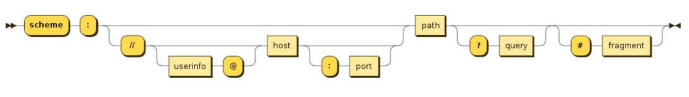

>[success] # BOM -- Location
1. **location**对象用于表示window上当前链接到的URL信息
1.1. **href**: 当前window对应的超链接URL, 整个URL；
1.2. **protocol**: 当前的协议；
1.3. **host**: 主机地址；
1.4. **hostname**: 主机地址(不带端口)；
1.5. **port**: 端口；
1.6. **pathname**: 路径；
1.7. **search**: 查询字符串；
1.8. **hash**: 哈希值；

* 方法
1.9. **assign**：赋值一个新的URL，并且跳转到该URL中；
1.10. **replace**：打开一个新的URL，并且跳转到该URL中（不同的是不会在浏览记录中留下之前的记录）；
1.11. ****reload****：重新加载页面，可以传入一个Boolean类型；