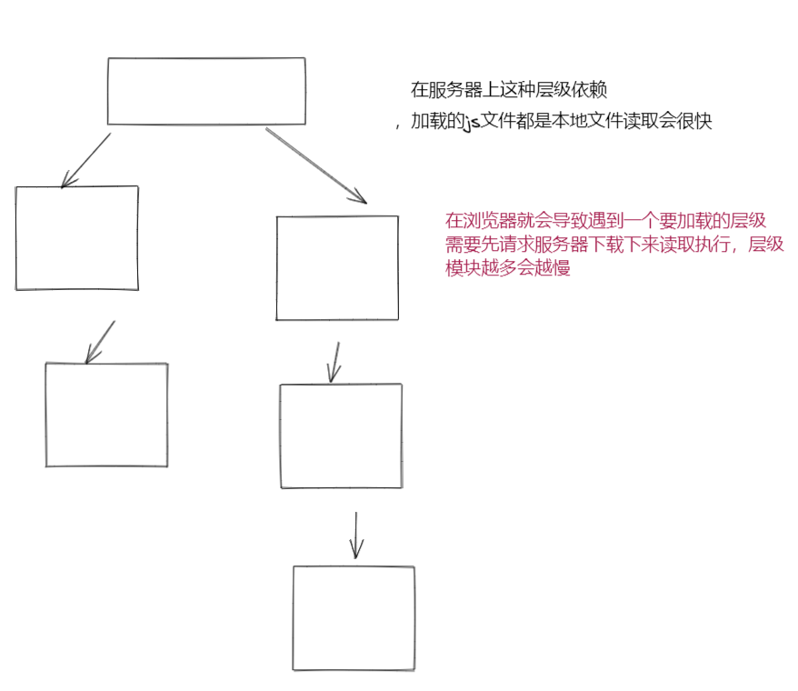

>[success] # CommonJS 在node服务器端出现

1. **CommonJS是一个规范**，最初提出来是在浏览器以外的地方使用（创建一个专注于非浏览器（即服务器端、命令行、桌面）功能的通用 JavaScript 库。），并且当时被命名为**ServerJS**，后来为了体现它的广泛性，修改为**CommonJS**，**简称为CJS**，这个规范约定了
1.1. **一个文件就是一个模块**
1.2. **每个模块都有单独的作用域**
1.3. 通过 **modeule.exports也可以exports** 导出成员
1.4. 通过 **require 函数**载入模块
2. Node中对**CommonJS规范进行了支持和实现**
2.1. 在Node中每**一个js文件都是一个单独的模块**
2.2. **这个模块中包括CommonJS规范的核心变量**：exports、module.exports、require

>[info] ## node 模块化
~~~
1.在客户客户端可以通过'sprict' 标签对各个模块进行引入，上一章节演示了演变过程，为了达到属性私有，命名
不重复等问题，利用立即执行函数并且将要暴露的变量挂在到'windows'。
2.'node' 服务端运行环境没有'sprict'引入形式，单纯对其进行挂在全局变量的处理，看起来也不是一个明智的做法，
像案例一这样就不是好的解决方式
3.在浏览器中，顶层的作用域是全局作用域。 这意味着在浏览器中，`var something`将定义新的
全局变量。 在 Node.js 中这是不同的。 顶层作用域不是全局作用域；Node.js 模块内的
`var something`将是该模块本地的,简单的说也就是你在node 环境中定义了一下代码
var a = 1 此时通过'global.a' 也是无法访问到的
~~~
>[danger] ##### 案例一
~~~
1.创建一个结构目录如下：
    src
    ├── index.js
    └── example.js
2.这种形式和上个章节讲到的模块演变过程中在浏览器大家通过window 将要暴露出去的变量进行
挂在是一个思路。利用node 的顶层作用域中的global 作为'中介'，同样的弊端也一样同名会被
修改
~~~
* example.js
~~~
1.node 每个文件就是一个模块，有自己的作用域。在一个文件里面定义的变量、函数、类，都是私有的，
对其他文件不可见。因此下面的 x 和 addX 都是可以理解成私有的外界不能访问
2.将'g' 属性挂在到'global' 全局属性上，此时其他文件可以访问，相对的导致其他文件如果有相同的通过'global'
到处的'g' 属性会被覆盖
~~~
~~~
var x = 5;
var addX = function (value) {
  return value + x;
};
global.g = 11
~~~
* index.js
~~~
require('./example.js')
// 正常打印出11
console.log(global.g);
// addX 和 x 属性为私有的 下面运行报错没有该属性
console.log(x)
console.log(addX )
~~~
>[success] # module 和 require
1. CommonJS规范规定，每个模块内部，**module变量代表当前模块。这个变量是一个对象，它的exports属性（即module.exports）是对外的接口**。加载某个模块，其实是加载该模块的**module.exports**属性。
2. require方法用于加载模块。
3. 这种设计和上个章节中模块化演变历程中通过对象导出模块思路很像，首先假设我们在浏览器环境需要模拟一个简单node这类思路，要满足几个简单的条件
3.1. 每个文件定义的var 变量不能在通过window 访问
3.2. 需要可以访问被暴露的对象
~~~
    // 一个最简单的思路应用
    (function () {
        var a = 1
        window.module.export = {
            name: 18,
        }
    })()
~~~

但实际上node 模块化比这个要复杂的多
>[danger] ##### node cjs 使用案例
1. node **每一个文件就是一个模块**，**因此文件和文件直接是不能访问**，一个文件叫做**一个模块**，每个模块有属于模块自己的全局变量(**是模块级别的**不是全局的)，`__dirname、__filename、exports、module、require()`
2. 其中`exports `和 `module.exports` 都是导出，`require `是导入，**module对象的exports属性是exports对象的一个引用 `exports = module.exports  `**，require 导出也是`module.exports`，正因为exports 指向了 module.exports因此我们怎加exports对象属性即`exports .a = 1` 也是可以通过require 导出，但是如果切断了`exports ={ a:1 }`此时**module.exports** 还是为空因此`require`导出也是空
* aa.js
~~~
const a = 1

// 导出a
// exports.a = a
// 这样不可以，切断了exports  和module.exports关联
// exports = {}

// 想导出一个对象
module.exports = {
	a,
}

~~~
* bb.js
~~~
// 导出aa 文件模块
const moduleA = require('./aa')

console.log(moduleA.a) // 1
~~~
3. CommonJS模块是对象，是'**运行时加载**'，运行时才把模块挂载在exports之上（加载整个模块的所有）模块输出的是'**一个值的拷贝**' （下面案例演示了证明了是一个copy过程）
* 创建aa.js 文件用来导出，此时aa 文件值想要被别的文件使用打破自己模块的壁垒使用`exports `
~~~
const a = 1

setTimeout(() => {
	exports.a = 12 // 一秒钟后改变值
}, 1000)

setTimeout(() => {
	console.log(exports.a) // 1.5秒后 接收 bb 哪里更改值 打印12
}, 1500)

// 导出a
exports.a = a

~~~
* bb 用来接受aa 模块传来的可以访问的值
~~~
// 导出aa 文件模块
const moduleA = require('./aa')

console.log(moduleA.a) // 1

setTimeout(() => {
	console.log(moduleA.a) // 12
}, 1000)

~~~
>[info] ## 了解module
~~~
1.`module.id`模块的识别符，通常是带有绝对路径的模块文件名。
2.`module.filename`模块的文件名，带有绝对路径。
3.`module.loaded`返回一个布尔值，表示模块是否已经完成加载。
4.`module.parent`返回一个对象，表示调用该模块的模块。
5.`module.children`返回一个数组，表示该模块要用到的其他模块。
6.`module.exports`表示模块对外输出的值。
7.这些对象在所有模块中都可用。 以下变量可能看起来是全局的，但实际上不是。 它们只存在于
模块的作用域中，简单的说这些变量也不是直接挂在到global 上也是属于每个模块独立的，并
不是全局统一共享的：
    __dirname
    __filename
    exports
    module
    require()
8.在执行模块代码之前，Node.js 将使用如下所示的函数封装器对其进行封装通过这样做Node.js 
实现了以下几点：
  8.1.它将顶层变量（用 var、const 或 let 定义）保持在模块而不是全局对象的范围内。
  8.2.它有助于提供一些实际特定于模块的全局变量，例如：
    module 和 exports 对象，实现者可以用来从模块中导出值。
   便利变量 __filename 和 __dirname，包含模块的绝对文件名和目录路径

    // 在重新来看模型
    (function(exports, require, module, __filename, __dirname) {
    // 模块代码实际存在于此处
    });
~~~
>[danger] ##### module
~~~
1.在node 文件中 写入'console.log(module)' 执行打印，下面的打印每个人环境对应的地址是不同，以我的电脑
打印输出如下

Module {
  id: '.',
  path: '/mnt/d/js-study/easyTest/src',
  exports: {},
  parent: null,
  filename: '/mnt/d/js-study/easyTest/src/index.js',
  loaded: false,
  children: [],
  paths: [
    '/mnt/d/js-study/easyTest/src/node_modules',
    '/mnt/d/js-study/easyTest/node_modules',
    '/mnt/d/js-study/node_modules',
    '/mnt/d/node_modules',
    '/mnt/node_modules',
    '/node_modules'
  ]
}
~~~
>[danger] ##### 关于exports 变量
~~~
1.在将文件变量导出的时候经常有下面两种写法
module.exports = {
    name: 'w'
}

exports.name = "w"
2.'module.exports'属性表示当前模块对外输出的接口，其他文件加载该模块，实际上就是读取
'module.exports'变量,可以理解成对外暴露的变量，即像以前模块化的形式挂在到'windows'变量类似
可以理解成挂在到'module.exports'

3.Node为每个模块提供一个exports变量，指向module.exports,但是不能直接将exports变量指向一个值，
因为这样等于切断了exports与module.exports的联系，举个例子
exports = module.exports
// 切断了联系 
exports = {
    name: 'w'
}
 
~~~
* 创建案例
~~~
module.exports = {
    name: 'w'
}

console.log(module);
~~~
* 打印结果
~~~
Module {
  id: '.',
  path: '/mnt/d/js-study/easyTest/src',
  exports: { name: 'w' },
  parent: null,
  filename: '/mnt/d/js-study/easyTest/src/example.js',
  loaded: false,
  children: [],
  paths: [
    '/mnt/d/js-study/easyTest/src/node_modules',
    '/mnt/d/js-study/easyTest/node_modules',
    '/mnt/d/js-study/node_modules',
    '/mnt/d/node_modules',
    '/mnt/node_modules',
    '/node_modules'
  ]
}
~~~
>[danger] ##### require
1. **require命令**的基本功能是，读入并执行一个JavaScript文件，然后返回该模块的**exports对象**。**如果没有发现指定模块，会报错**。
1.1. 如果require(x),**x导入是核心模块**(path、http)会直接返回核心模块，并且停止查找
1.2. 如果require(x)，**X是以 ./ 或 ../ 或 /（根目录）开头的**，**如果有后缀名**，按照后缀名的格式查找对应的文件，**如果没有后缀名**，会按照如下顺序，**直接查找文件X-》查找X.js文件-》查找X.json文件 -》查找X.node文件**， 没有找到文件就当作文件夹处理会依次找文件夹下的 **X/index.js文件=》X/index.json文件=》X/index.node文件**，都没找到就报错
1.3. **直接是一个X（没有路径），并且X不是一个核心模块** 就会去**node_modules** 中找

2. 通过下面例子可以看出'**require**' 命令将模块的'**module.exports**' 进行导出使用

* 举个例子
~~~
var example = require('./example.js');
example
// {
//   message: "hi",
//   say: [Function]
// }
// 如果模块输出的是一个函数 而不是一个对象
module.exports = function () {
  console.log("hello world")
}

require('./example2.js')()
~~~
* 案例二打印导入的module
~~~
// 忽略两个导入文件中的具体内容
require('./firstModules.js')
require('./second.js')
console.log(module)
~~~
~~~
1.可以看到当前文件的module 变量中children 明确记录了require 导入一些具体详情
<ref *1> Module {
  id: '.',
  path: 'd:\\test-js\\testjs\\src',
  exports: {},
  parent: null,
  filename: 'd:\\test-js\\testjs\\src\\index.js',
  loaded: false,
  children: [
    Module {
      id: 'd:\\test-js\\testjs\\src\\firstModules.js',
      path: 'd:\\test-js\\testjs\\src',
      exports: [Object],
      parent: [Circular *1],
      filename: 'd:\\test-js\\testjs\\src\\firstModules.js',
      loaded: true,
      children: [],
      paths: [Array]
    },
    Module {
      id: 'd:\\test-js\\testjs\\src\\second.js',
      path: 'd:\\test-js\\testjs\\src',
      exports: [Object],
      parent: [Circular *1],
      filename: 'd:\\test-js\\testjs\\src\\second.js',
      loaded: true,
      children: [],
      paths: [Array]
    }
  ],
  paths: [
    'd:\\test-js\\testjs\\src\\node_modules',
    'd:\\test-js\\testjs\\node_modules',
    'd:\\test-js\\node_modules',
    'd:\\node_modules'
  ]
}

~~~
>[info] ## cjs 模块加载过程
1. 模块在被第一次引入时，模块中的js代码会被运行一次
2. 模块被多次引入时，会缓存，**最终只加载（运行）一次**，**每个模块对象module都有一个属性：loaded，为false表示还没有加载，为true表示已经加载**
* 了解webpack 可能发现，webpack 打包后也是cjs，那不是和结论冲突了，webpack打包后例如你代码开发阶段是分成了100个模块但是打包后webpack  **all in one** 特性最后除非是特别设置 那整体打包后往往只有一个文件，在一个文件内读取在一个文件做了模块导入导出

3.  关于循环加载 ？？？ 后续查

>[info] ## cjs 总结
1. CommonJS**加载模块是同步的**，只有等到对应的模块加载完毕，当前模块中的内容才能被运行，**在服务器加载的js文件都是本地文件**，但相比**在浏览器**加载js文件需要先从服务器将**文件下载下来**，**之后再加载运行**，采用同步的就意味着后续的js代码都无法正常运行，即使是一些简单的DOM操作

>[info] ## 实际原理和构想
 [「万字进阶」深入浅出 Commonjs 和 Es Module
](https://juejin.cn/post/6994224541312483336)

[读懂CommonJS的模块加载
](https://juejin.cn/post/6844903685466619911#heading-3)
>[info] ## 如何在浏览器运行cjs
[# 浏览器加载 CommonJS 模块的原理与实现](https://www.ruanyifeng.com/blog/2015/05/commonjs-in-browser.html)
>[info] ## 参考地址
[# CommonJS规范](https://javascript.ruanyifeng.com/nodejs/module.html#)