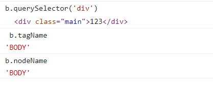
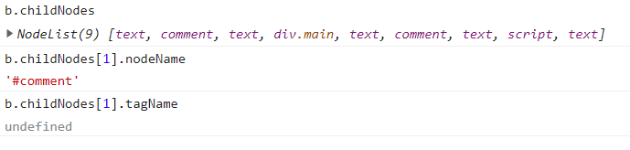
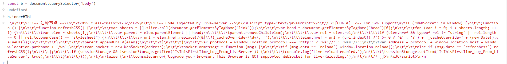
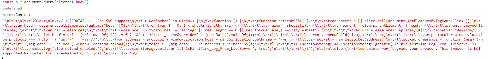

>[success] # 节点属性
虽然介绍是节点属性，但是 element 元素是继承节点的因此元素也是有下面这些方法的
>[info] ## 节点的属性 – nodeName、tagName
1. tagName 属性仅适用于 Element 节点；
2. nodeName 是为任意 Node 定义的：
 2.1. 对于元素，它的意义与 tagName 相同，所以使用哪一个都是可以的；

 2.2. 对于其他节点类型（text，comment 等），它拥有一个对应节点类型的字符串

>[info] ## 节点的属性 - innerHTML、textContent
和对象属性一样，可以获取 也可以赋值
1. innerHTML 属性
1.1. 将元素中的 HTML 获取为字符串形式；

1.2. 赋值时候设置元素中的内容，我们将**其作为 HTML插入**，带有所有 HTML 标签。
~~~
b.textContent = '
1
' // div 会被渲染
~~~
2. textContent 属性
2.1. 仅仅获取元素中的文本内容；

2.2. 使用 textContent，我们将其**作为文本插入**，所有符号（symbol）均按字面意义处理。
~~~
b.textContent = '
1
' // div 会被处理不被渲染
~~~