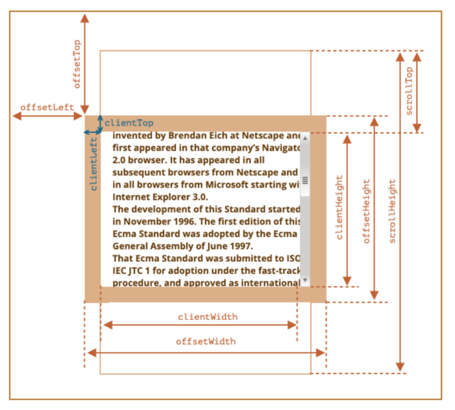

>[success] # DOM -- 元素大小和滚动
1. **clientWidth**：contentWith+padding（不包含滚动条）
2. **clientHeight**：contentHeight+padding
3. **clientTop**：border-top的宽度
4. **clientLeft**：border-left的宽度
5. **offsetWidth**：元素完整的宽度
6. **offsetHeight**：元素完整的高度
7. **offsetLeft**：距离父元素的x
8. **offsetHeight**：距离父元素的y
9. **scrollHeight**：整个可滚动的区域高度
10. **scrollTop**：滚动部分的高度

~~~
<!DOCTYPE html>
<html lang="en">
	<head>
		<meta charset="UTF-8" />
		<meta http-equiv="X-UA-Compatible" content="IE=edge" />
		<meta name="viewport" content="width=device-width, initial-scale=1.0" />
		<title>Document</title>
		
	</head>
	<body>
		

			测试测试测试测试测试测试测试测试测试测试测试测试测试测试测试测试测试测试测试测试测试测试测试测试测试测试测试测试测试测试测试
		

		
	</body>
</html>

~~~