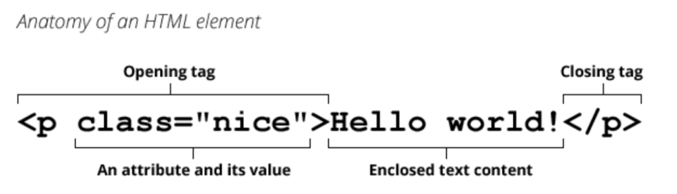
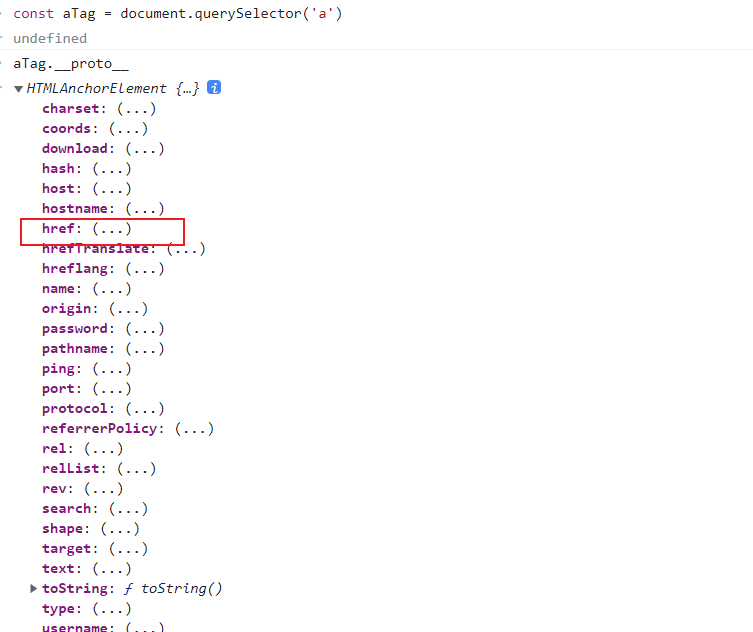
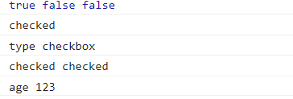
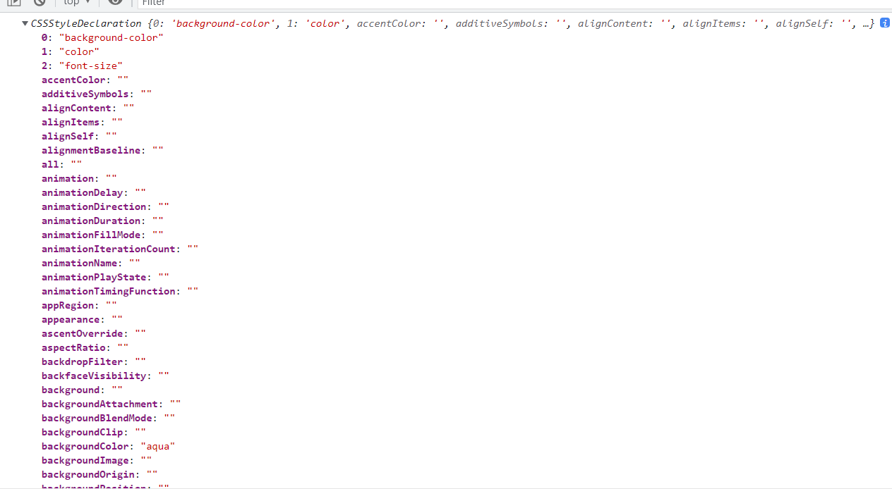
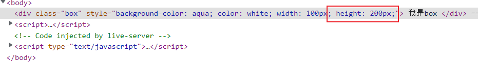
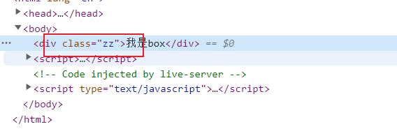

>[success] # DOM -- 元素属性 
1. 一个元素除了有开始标签、结束标签、内容之外，还有很多的属性（attribute）

这些属性分为两大类`标准属性` 和 `非标准属性`
* **标准attribute**：某些attribute属性是标准的，比如id、class、href、type、value等
* **非标准的attribute**：某些attribute属性是自定义的，比如abc、age、height等

**注**：主要区别在非标准属性是自己定义，而标准属性是天生自带的
~~~
 <a href="https://www.baidu.com" abc="zz">百度一下</a>
~~~
* 以上面为例子，其中`href` 是标准属性，`abc` 为非标准属性，标准属性在打印原型链时候就可以见到，非则不是，如图`a 标签元素类型原型链打印`

>[info] ## 获取属性
1. 这里获取属性指的是即获取`标准属性` 又 `非标准属性`都支持如下的方法:
 1.1. **elem.hasAttribute(name)** — 检查特性是否存在。
 1.2. **elem.getAttribute(name)** — 获取这个特性值。
 1.3. **elem.setAttribute(name, value)** — 设置这个特性值。
 1.4.  **elem.removeAttribute(name)** — 移除这个特性。
1.5. **attributes**：attr对象的集合，具有name、value属性；
2. attribute具备以下特征：它们的名字是**大小写不敏感**的（id 与 ID 相同）。它们的值总是**字符串类型**的。
* 获取**标准attribute** checed 时候打印是字符串
~~~
<!DOCTYPE html>
<html lang="en">
	<head>
		<meta charset="UTF-8" />
		<meta http-equiv="X-UA-Compatible" content="IE=edge" />
		<meta name="viewport" content="width=device-width, initial-scale=1.0" />
		<title>Document</title>
	</head>
	<body>
		<!-- age 是非标准属性  type checked是标准属性-->

		<input type="checkbox" checked="checked" age="123" />

		
	</body>
</html>

~~~

> [info] ## 获取标准属性
标准属性就是`元素属性对象上的属性`因此可以像对象一样直接`点` 取值，相比使用`getAttribute` 获取标准属性，好处是如果是布尔类型等属性会直接显示boolean 类型，修改也同理像使用对象一样进行修改属性
* 以上面例子
~~~
inputEl.checked // 获取是布尔类型
inputEl.checked = false
~~~
>[info] ## 修改样式
通过控制class 和 style 来修改 样式：
* 查看style
~~~
var boxEl = document.querySelector('.box')
console.log(boxEl.style)
~~~

* 获取某个元素 style 属性

1. 直接给style 进行属性赋值要**使用的驼峰格式**，如果将一个属性的值, 设置为**空的字符串**, 那么是使用默认值
~~~
<!DOCTYPE html>
<html lang="en">
	<head>
		<meta charset="UTF-8" />
		<meta http-equiv="X-UA-Compatible" content="IE=edge" />
		<meta name="viewport" content="width=device-width, initial-scale=1.0" />
		<title>Document</title>
	</head>
	<body>
		

			我是box
		

		
	</body>
</html>

~~~

* 如果使用`boxEl.style.cssText = 'font-size: 30px; color: red;'` **cssText** 会把style 所有属性都覆盖
2. **编辑 class** 需要使用`className` 属性但是这种修改会覆盖之前class
~~~
<!DOCTYPE html>
<html lang="en">
	<head>
		<meta charset="UTF-8" />
		<meta http-equiv="X-UA-Compatible" content="IE=edge" />
		<meta name="viewport" content="width=device-width, initial-scale=1.0" />
		<title>Document</title>
	</head>
	<body>
		
我是box

		
	</body>
</html>

~~~

 
使用其他方法：
* elem.classList.add (class) ：添加一个类
* elem.classList.remove(class)：添加/移除类。
* elem.classList.toggle(class) ：如果类不存在就添加类，存在就移除它。
* elem.classList.contains(class)：检查给定类，返回 true/false
~~~
<!DOCTYPE html>
<html lang="en">
	<head>
		<meta charset="UTF-8" />
		<meta http-equiv="X-UA-Compatible" content="IE=edge" />
		<meta name="viewport" content="width=device-width, initial-scale=1.0" />
		<title>Document</title>
		
	</head>
	<body>
		
我是box

		<button class="btn">切换</button>

		
	</body>
</html>

~~~
>[info] ## 关于dataset
~~~
<!DOCTYPE html>
<html lang="en">
<head>
  <meta charset="UTF-8">
  <meta http-equiv="X-UA-Compatible" content="IE=edge">
  <meta name="viewport" content="width=device-width, initial-scale=1.0">
  <title>Document</title>
</head>
<body>
  
  

  

</body>
</html>
~~~