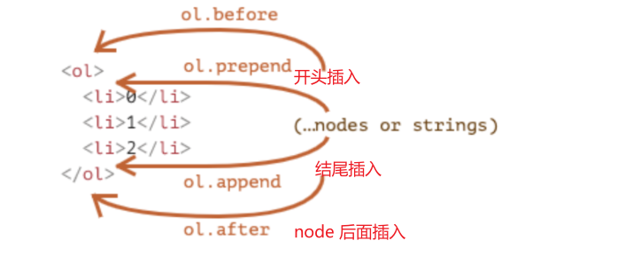
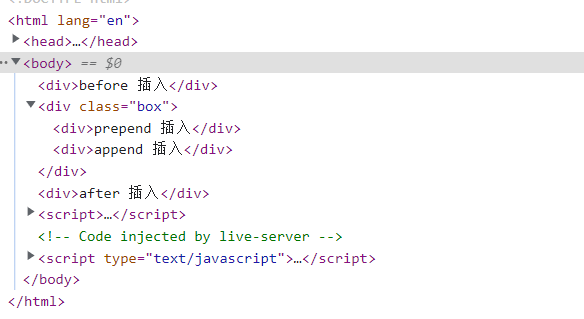

>[success] # 元素操作
* 新增元素：
1. 使用`document.write` 因为早期没有dom的时候使用的方案，将整体内容看作字符串，然后拼接到[关于原理可以查看](https://segmentfault.com/a/1190000007958530)，**缺陷**:如果是在页面加载完毕后,此时通过这种方式创建元素,那么页面上存在
的所有的内容清除
2.  `innerHTML`使用`元素对象.innerHTML="标签代码及内容"`例如
~~~
<body>
	

	
</body>
~~~
3. 使用 `createElement` 创建元素，`document.createElement("标签名字")` 但需要将创建元素插入到指定节点才能显示
>[info] ## 将元素插入方法
* 新功能api
1. **node.append(...nodes or strings)** —— 在 node **末尾 插入**节点或字符串，
2. **node.prepend(...nodes or strings)** —— 在 node **开头 插入**节点或字符串，
3. **node.before(...nodes or strings)** —— 在 node **前面 插入**节点或字符串，
4. **node.after(...nodes or strings)** —— 在 node **后面 插入**节点或字符串，
5. **node.replaceWith(...nodes or strings)** —— 将 node **替换**为给定的节点或字符串。

* 老功能api
1. **appendChild**    --- 追加子元素
2. **insertBefore**   --- 向前插入子元素
3. **parentElem.replaceChild(node, oldChild)** -- 在parentElem中，新元素替换之前的oldChild元素
* **注**：二者区别**parentNode.append()**可以同时传入多个节点或字符串，没有返回值；而 **parentNode.appendChild()** 只能传一个节点，且不直接支持传字符串，**append不返回任何值, appendChild返回Node对象**
>[danger] ##### 使用案例
~~~
<!DOCTYPE html>
<html lang="en">
	<head>
		<meta charset="UTF-8" />
		<meta http-equiv="X-UA-Compatible" content="IE=edge" />
		<meta name="viewport" content="width=device-width, initial-scale=1.0" />
		<title>Document</title>
		
	</head>
	<body>
		

		
	</body>
</html>

~~~

>[danger] ##### 删除节点
1. `node.remove`
2. 老方法**parentElem.removeChild(node)**-- 在parentElem中，移除某一个元素
>[danger] ##### cloneNode方法
1. 可以传入一个Boolean类型的值，来决定是否是深度克隆；
2. 深度克隆会克隆对应元素的子元素，否则不会
~~~
node.cloneNode(true)
~~~