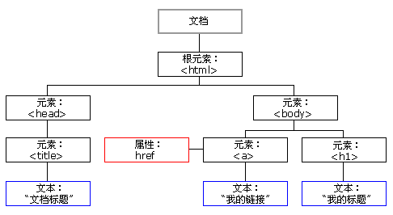
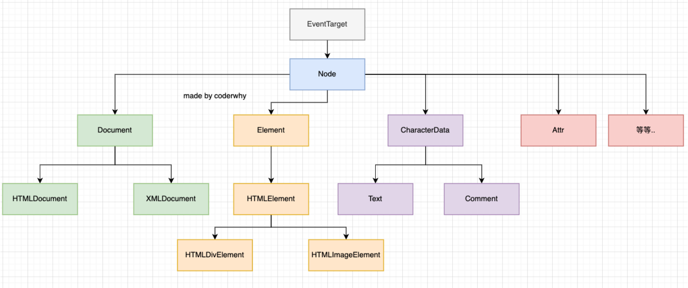
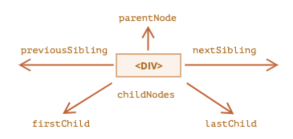
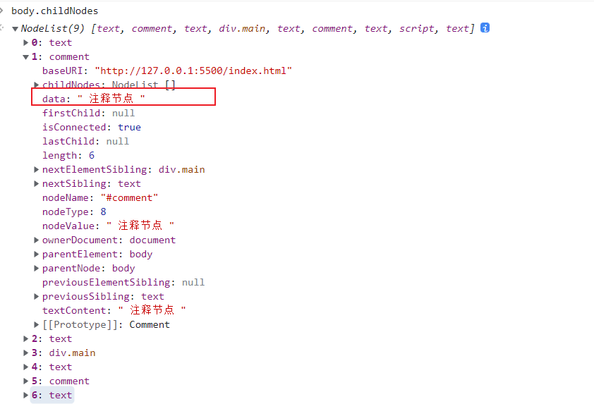
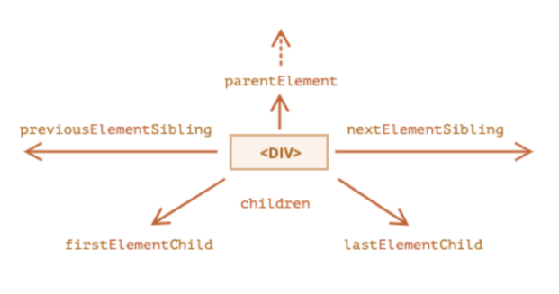
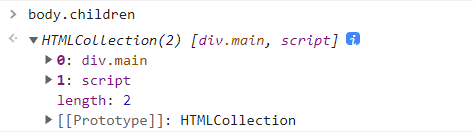

>[success] # 认识DOM
1. window的全局对象中除了JavaScript语法部分的Object、Array、Date等，还有**DOM文档对象模型**（Document Object Model），表示**页面所有的内容表示为可以修改的对象** 例如
*   JavaScript 能改变页面中的所有 HTML 元素
*   JavaScript 能改变页面中的所有 HTML 属性
*   JavaScript 能改变页面中的所有 CSS 样式
*   JavaScript 能删除已有的 HTML 元素和属性
*   JavaScript 能添加新的 HTML 元素和属性
*   JavaScript 能对页面中所有已有的 HTML 事件作出反应
*   JavaScript 能在页面中创建新的 HTML 事件
2. 为了可以通过**JavaScript**来进行**访问页面上元素进行操作**，**浏览器将我们编写在HTML中的每一个元素**（Element）都**抽象成了一个个对象**，举个例子
2.1. **document.documentElement** -- 对应的是html元素
2.2. **document.body** -- 对应的是body元素；
2.3. **document.head** -- 对应的是head元素
3. DOM是个缩写，全称是Document Object Model，被译为文档对象模型。

*   **D表示Document**，就是DOM将HTML页面解析为一个文档。同时提供了document对象。
*   **O表示Object**，就是DOM将HTML页面中每个元素解析为一个对象。
*   **M表示Model**，就是DOM中表示各个对象之间的关系。

>[info] ## DOM的作用

**DOM被设计用于解析HTML页面文档，方便JavaScript语言通过DOM访问和操作HTML页面中的内容。**

**DOM是由W3C组织定义标准规范，并且由各大浏览器厂商支持。严格意义上来讲，DOM并非属于** **JavaScript语言。**

**我们之所以可以在JavaScript语言中使用DOM，是因为各大测览器将DOM的标准规范内容封装成了** **JavaScript语言所支持的形式。**

**对DOM中的对象，我们只有调用的权限，没有修改的权限，也说明了这个问题。**

> **浏览器加载并运行HTML页面后，会创建DOM结构。由于DOM中的内容被封装成了JavaScript语言中的对象，所以我们可以使用JavaScript语言通过DOM结构来访问和操作HTML页面中的内容。**

>[info] ## DOM Tree
在html结构中，最终会形成一个**树结构**,因此在抽象成DOM对象的时候，它们也会形成一个树结构，我们称之为**DOM Tree**

>[info] ## DOM  对象关系
通过浏览器提供给我们的**DOM API**，我们可以对元素以及其中的内容做任何事情,**类型之间有如下的继承关系**

**Node是节点**，其中包含**不同类型的节点**，比如说**文本节点，注释节点** **Element只是Node节点的一种**除此之外还包括了 Document/Comment 之类的节点
**Element继承与Node**，可以调用Node的方法,不仅Element节点刚才其他节点也是一样
* 节点类型 可以通过`nodeType` 来查看当前节点类型
[类型可以查看MDN文档](https://developer.mozilla.org/zh-CN/docs/Web/API/Node/nodeType)
>[danger] ##### Node 节点之间的导航
如果我们获取到一个节点（Node）后，**可以根据这个节点去获取其他的节点，我们称之为节点之间的导航**

~~~
父节点：parentNode
前兄弟节点：previousSibling
后兄弟节点：nextSibling
子节点：childNodes
第一个子节点：firstChild
第二个子节点：lastChild
~~~
* 举个例子
~~~
<body>
	<!-- 注释节点 -->
	
123

</body>
~~~
* js 获取
~~~
const body = document.body // 获取对应的是body元素
body.childNodes // 获取body元素中所有节点
~~~

>[danger] ##### 元素（Element）节点之间的导航
如果我们获取到一个元素（Element）后，**可以根据这个元素去获取其他的元素，我们称之为元素之间的导航**

~~~
父元素：parentElement
前兄弟节点：previousElementSibling
后兄弟节点：nextElementSibling
子节点：children
第一个子节点：firstElementChild
第二个子节点：lastElementChild
~~~
* 举个例子
~~~
<body>
	<!-- 注释节点 -->
	
123

<script type="text/javascript"></script >

</body>
~~~
* js 获取
~~~
const body = document.body // 获取对应的是body元素
body.children// 获取body元素中所有元素节点
~~~
* 此时获取只有元素节点 没有类似注释节点等其他节点
