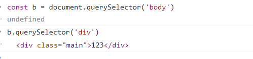

>[success] # DOM -- 获取元素
**元素element** 是 **Node 节点中的一个类型**，在获取元素节点时候，通过使用元素**节点之间的导航** 可以获取元素例如
~~~
<body>
	<!-- 注释节点 -->
	
123

       <script type="text/javascript"></script >

</body>
~~~
* 获取div元素节点
~~~
const body = document.body // 获取对应的是body元素
body.children[0]// 获取获取div元素节点
~~~
* 也可以通过其他方法，任意的获取到某一个元素
~~~
1.document.getElementsByName("name属性的值")           --- 操作name，返回数组
2.document.getElementsByClassName("类样式的名字")       --- 操作类样式的名字，返回数组
3.document.querySelector("选择器的名字");               --- 操作选择器的名字，返回元素对象
4.document.querySelectorAll("选择器的名字")             --- 操作选择器的名字，返回数组
5. document.getElementById('id')                                -- 返回元素对象
6. document.getElementsByTagName('tag')                -- 返回数组
~~~
* 注**querySelector，querySelectorAll，getElementsByTagName，getElementsByClassName**不仅通过`document` 调用,可以通过元素使用该属性989
