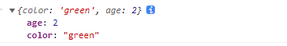
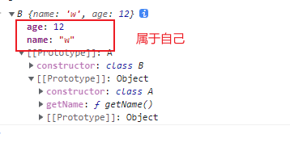
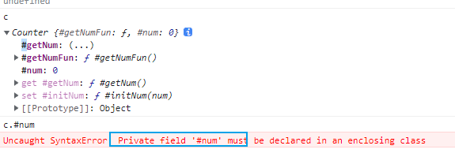

>[success] # ES13 -- at
1.  **at()** 方法接收一个整数值并返回该索引的项目，允许正数和负数。负整数从数组中的最后一个项目开始倒数。
2. **数组** 和**字符串**都可以使用自身 **at** 方法
>[danger] ##### 案例
* 原先获取元素
~~~
const arr = ['a', 'b', 'c', 'd'];

// 倒数第一个元素
console.log(arr[arr.length - 1]); // d

// 倒数第二个元素
console.log(arr[arr.length - 2]); // c

// 获取第一个
console.log(arr[1]); // c
~~~
* 通过at 获取
~~~
const arr = ['a', 'b', 'c', 'd'];
arr.at(-1) // d
arr.at(0) // a
~~~
>[success] # ES13 -- Object.hasOwn 
1. Object中新增了一个静态方法（类方法）`hasOwn(obj, propKey)`该方法用于判断一个对象中是否有某个自己的属
2. 在之前有个类似方法就是 `hasOwnProperty`这个方法是个**实例方法** 属于**Object.property** 原型链上，和ES13 新增的静态方法相比，
2.1. **防止对象内部有重写hasOwnProperty**
~~~
class Car {
  color = 'green';
  age = 2;
  
  // 你看这个方法就没有告诉我们这个类的对象是不是有某个属性
  hasOwnProperty() {
    return false;
  }
}

const car = new Car();

console.log(car.hasOwnProperty('age')); // false
console.log(car.hasOwnProperty('name')); // false
~~~
2.2. **对于隐式原型指向null的对象， hasOwnProperty无法进行判断**
* 因为没有冲Object 对象继承过来原型方法，因此调用会报错
~~~
const obj = Object.create(null);
obj.color = 'green';
obj.age = 2;

// TypeError: obj.hasOwnProperty is not a function
console.log(obj.hasOwnProperty('color'));
~~~

想不报错就需要利用call 去改变this 指向调用
~~~
Object.prototype.hasOwnProperty.call(obj, 'color')

~~~
相比之下ES13 增加的静态方法更容易 
~~~
Object.hasOwn(obj, 'color')
~~~
>[danger] ##### 案例
* 使用原来 **hasOwnProperty** 方法
~~~
class A {
	name = 'w'
	getName() {
		return this.name
	}
}

class B extends A {
	age = 12
}

const b = new B()

console.log(b.hasOwnProperty('name')) // true
console.log(b.hasOwnProperty('age')) // true
console.log(b.hasOwnProperty('getName')) // false
console.log(Object.prototype.hasOwnProperty(b, 'getName')) // false

~~~

* 使用静态方法 **Object.hasOwn**
~~~
class A {
	name = 'w'
	getName() {
		return this.name
	}
}

class B extends A {
	age = 12
}

const b = new B()

console.log(Object.hasOwn(b, 'name')) // true
console.log(Object.hasOwn(b, 'age')) // true
console.log(Object.hasOwn(b, 'getName')) // false
~~~
>[success] # ES13 - class
1. **Class Public Instance Fields** 公共实例字段,类的实例字段是在对应的构造函数运行之前添加的，所以你可以在构造函数中访问字段的值,相比以前只能在构造函数中定义属性，现在可以利用共有实例字段直接定义属性
~~~
class ClassWithInstanceField {
  instanceField = 'instance field';

  constructor() {
    console.log(this.instanceField);// 类的实例字段是在对应的构造函数运行之前添加的
    this.instanceField = 'new value';
  }
}

const instance = new ClassWithInstanceField(); // 输出 "instance field"
console.log(instance.instanceField); // "new value"
~~~
2. **Private static class fields and methods 静态私有字段和方法**,**Static class fields and methods 静态公共字段和方法**, js 也支持私有属性 方法等，用'#' 来修饰
~~~
class Counter {
	#num = 0 // 私有属性

	static #baseNum = 100 // 静态私有属性

	// 静态私有方法
	static getBaseNum() {
		return Counter.#baseNum
	}

	// 私有访问器方法
	get #getNum() {
		return this.#num
	}

	// 私有访问器方法
	set #initNum(num) {
		this.#num = num
	}

	// 私有方法
	#getNumFun() {
		return this.#num
	}
}
~~~

3. **Class Static Block 类静态初始化块**,只会在类被创造的时候执行一次
~~~
class Car {
	static colors = []
	num = 1
	static {
		// 这时候访问不到实例方法本质是undefined，只能访问静态属性方法
		console.log(this.num, 1111111)
	}

	static {
		this.colors.push('green')
	}
}
// 打印结果
undefined 1111111
~~~
* 修改访问静态属性
~~~
class Counter {
  static #baseNum = 100;

  static getDoubleBaseNum() {
    return this.#baseNum * 2;
  }

  static {
    this.#baseNum = 200;
  }
}

console.log(Counter.getDoubleBaseNum());  // 400

~~~
* 利用静态块访问私有属性
~~~
let getDPrivateField;

class D {
  #privateField;
  constructor(v) {
    this.#privateField = v;
  }
  static {
    getDPrivateField = (d) => d.#privateField;
  }
}

getDPrivateField(new D('private'));
// > private

~~~
>[success] # ES13 -- 使用in来判断某个对象是否拥有某个私有属性
1. `#a in obj`（注意，与公有方法不同，这个判断左侧不是字符串，公有方法的判断是`'a' in obj`）
~~~
class Car {
  #color;

  hasColor() {
    return #color in this;
  }
}

const car = new Car();
console.log(car.hasColor()); // true

#color in car  // 报错 只能在类中使用，类外in 是需要字符串
'#color' in car  // false 但是 字符串形式是检测不到私有属性
~~~

>[success] # ES13 - top  await
1. `wait`的时候有个很头疼的地方就是一定要在一个`async`的函数里面使用而不能在全局作用域里面使用
~~~
function setTimeoutAsync(timeout) {
  return new Promise((resolve) => {
    setTimeout(() => {
      resolve();
    }, timeout);
  });
}

// SyntaxError: await is only valid in async functions
await setTimeoutAsync(3000);
~~~
* 新版后
~~~
function setTimeoutAsync(timeout) {
  return new Promise((resolve) => {
    setTimeout(() => {
      resolve();
    }, timeout);
  })
}

// 慢慢地等时间流逝吧
await setTimeoutAsync(3000);
~~~