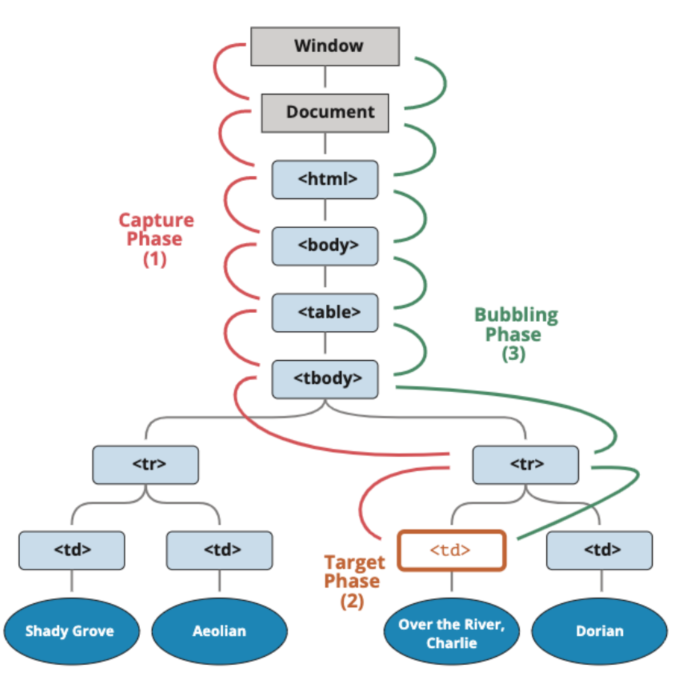
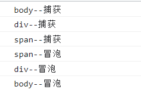

>[success] # Event -- 事件
1. 元素有一系列属性事件可以和用户进行交互例如是`onclick` 等，因此直接在dom上使用用法
~~~

点击

~~~
2. 因为这类事件是元素上的属性，因此也可以通过获取当前元素**事件属性**进行事件绑定
~~~

点击

~~~
 3. 第二种因为是对象属性赋值形式，因此同一个元素同一个事件进行赋值会导致后者盖住前者的事件例如
~~~

点击

~~~
因此需要使用**EventTarget中的addEventListener来监听**
~~~

点击

~~~
>[info] ## 常见的事件列表

 * **鼠标事件**：
1. **click** —— 当鼠标点击一个元素时（触摸屏设备会在点击时生成）。
2. **mouseover / mouseout** —— 当鼠标指针移入/离开一个元素时。
3. **mousedown / mouseup** —— 当在元素上按下/释放鼠标按钮时。
4. **mousemove** —— 当鼠标移动时。

* **键盘事件**：

1. **keydown 和 keyup** —— 当按下和松开一个按键时。

* **表单（form）元素事件**：

1. **submit** —— 当访问者提交了一个  时。

2. **focus** —— 当访问者聚焦于一个元素时，例如聚焦于一个 。

* **Document 事件**：

1. **DOMContentLoaded** —— 当 HTML 的加载和处理均完成，DOM 被完全构建完成时。

* **CSS 事件**：

1. **transitionend** —— 当一个 CSS 动画完成时。

>[success] # 事件冒泡和事件捕获
1. 事件是从**最内层向外**依次传递的顺序，这个顺序我们称之为**事件冒泡（Event Bubble）**
2.  事件是从**外层到内层**，这种称之为**事件捕获（Event Capture）**
* 注：**IE**采用了**事件冒泡**的方式，**Netscape**采用了**事件捕获**的方式，现在浏览器两种形式都支持默认是**事件冒泡**
3. 二者同时开启时候执行顺序
 3.1. 捕获阶段 =》到触发元素 =》 冒泡阶段

~~~
<!DOCTYPE html>
<html lang="en" style="height: 200%">
	<head>
		<meta charset="UTF-8" />
		<meta http-equiv="X-UA-Compatible" content="IE=edge" />
		<meta name="viewport" content="width=device-width, initial-scale=1.0" />
		<title>Document</title>
		
	</head>
	<body>
		

			点击
		

		
	</body>
</html>

~~~
>[success] # 事件委托
1. 基于**事件冒泡机**制，我们可以实现将子元素的事件委托给父级元素来进行处理，这便是**事件委托**。
2. 什么是事件冒泡,'https://segmentfault.com/a/1190000005654451' 简单的说,事件会从最内层的元素开始发生，一直向上传播，直到document对象
>[danger] ##### 分析
~~~
1.现在有一个列表如果我们在每个元素上都进行监听事件,那么绑定事件的数量和列表长度
一致,也就说列表长度1w 那么就要绑定1w事件
2.使用事件委托，可以通过将事件添加到它们的父节点，而将事件委托给父节点来触发处理函数,
这样的好处
 2.1.绑定子元素会绑定很多次的事件，而绑定父元素只需要一次绑定
 2.2.将事件委托给父节点，这样我们对子元素的增加和删除、移动等，都不需要重新进行事件绑定。
 2.3.用事件委托的方式，我们可以大量减少浏览器对元素的监听，也是在前端性能优化中比较简
单和基础的一个做法。
~~~
>[danger] ##### 注意在document.body上进行事件委托问题
~~~
需要注意的是，如果我们直接在document.body上进行事件委托，可能会带来额外的问题。
由于浏览器在进行页面渲染的时候会有合成的步骤，合成的过程会先将页面分成不同的合成层，
而用户与浏览器进行交互的时候需要接收事件。此时，浏览器会将页面上具有事件处理程序的区
域进行标记，被标记的区域会与主线程进行通信。

如果我们document.body上被绑定了事件，这时候整个页面都会被标记。即使我们的页面不关心
某些部分的用户交互，合成器线程也必须与主线程进行通信，并在每次事件发生时进行等待。这
种情况，我们可以使用passive: true选项来解决。
~~~
>[danger] ##### 新的思考
[vue 在 v-for 时给每项元素绑定事件需要用事件代理吗？为什么？](https://github.com/Advanced-Frontend/Daily-Interview-Question/issues/145)
[  vue是否需要事件委托？](https://forum.vuejs.org/t/is-event-delegation-necessary/3701/4)
[vue 事件委托的一个小案例,看评论](https://segmentfault.com/a/1190000011698763)

>[success] # 关于addEventListener/removeEventListener/dispatchEvent
1. 所有的节点、元素和`Window`都继承自**EventTarget**
2. **EventTarget**是一个DOM接口，主要用于添加、删除、派发Event事件
3. EventTarget常见的方法
3.1. **addEventListener**：注册某个事件类型以及事件处理函数；
3.2. **removeEventListener**：移除某个事件类型以及事件处理函数；
3.3. **dispatchEvent**：派发某个事件类型到EventTarget上；
~~~
<!DOCTYPE html>
<html lang="en">
<head>
  <meta charset="UTF-8">
  <meta http-equiv="X-UA-Compatible" content="IE=edge">
  <meta name="viewport" content="width=device-width, initial-scale=1.0">
  <title>Document</title>
</head>
<body>
  
  

</body>
</html>
~~~