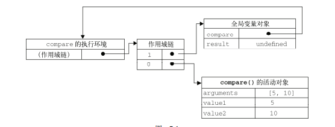
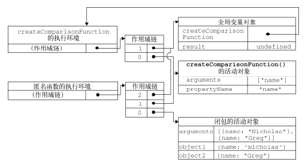

>[success] # 什么是闭包
~~~
1.用'js的秘密花园'解释闭包：当前作用域总是能够访问外部作用域中的变量，
  用'js高级程序语言设计'解释闭包：有权访问另一个函数作用域中的变量的函数
  用MDN：函数和对其周围状态（lexical environment，词法环境）的引用捆绑在一起构成闭包=
（closure）。也就是说，闭包可以让你从内部函数访问外部函数作用域。在 JavaScript 中，每当函数被创建
，就会在函数生成时生成闭包。
2.简单的总结两句话：
    闭包 (Closure)：函数和其周围的状态(词法环境)的引用捆绑在一起形成闭包。
    可以在另一个作用域中调用一个函数的内部函数并访问到该函数的作用域中的成员
3.'闭包的本质'：函数在执行的时候会放到一个执行栈上当函数执行完毕之后会从执行栈上移除，但是
   堆上的作用域成员因为被外部引用不能释放，因此内部函数依然可以访问外部函数的成员
4.最常见的闭包方式'函数嵌套函数 或者对象，让其达到值读取外层函数的变量值，进行一种数据缓存'
 4.1. 从广义的角度来说：JavaScript中的函数都是闭包；因为js函数都可以访问外部全局
作用域变量
 4.2.从狭义的角度来说：JavaScript中一个函数，如果访问了外层作用域的变量，那么它是一个闭包
~~~
>[danger] ##### 先知道作用域链
~~~
1.简单讲'js'的作用域链就是从内到外，就近原则
~~~
~~~
// 首先根据作用域链从内向外找，func2 中的
// 打印b和a先在func2中找没有，就在向外面一层
// 找到了因此打印 2,1
// func1 中打印的c报错，因为c 是在func2中，func1
// 中的c要遵守从内向外，他的内是func1没有c，在往外一层
// 全局也没有c
var a = 1
var func1 = function () {
    var b = 2
    var func2 = function () {
        var c = 3
        console.log(b) // 2
        console.log(a) // 1
    }
    func2()
    console.log(c) // 报错
}
func1()
~~~
>[danger] ##### 在知道一下变量的声明周期
~~~
1.首先全局变量的生命周期是永久的，触发人为去销毁全局变量，但函数内
的局部变量会随着函数调用完，就会将自己内部的变量销毁
2.下面代码其中'test' 就是典型的全局变量，也就是说全局会一直有一个'test'的
方法，'test()' 是函数的执行，当他结束了也就是这个的调用结束，js 就会把这个
调用的函数的'a'销毁，但注意这里指的是调用函数的'a',不是函数'test'的'a'
~~~
~~~
var test = function() {
    var a = 1 // 退出函数后局部变量被销毁
    console.log(a)
}
// 我执行完了我内部a做完事了被销毁了
test()
~~~
>[danger] ##### 举个例子解释闭包的本质

~~~
1.声明一个pay ，此时执行的函数once 返回的函数被外部成员声明的pay被引用了，因此不能释放，
现在{1} 因为被pay 引用不能释放，因此函数内部调用的done 同样也不能被释放， 形成下面的结果
第二次调用pay 是没有打印的，因为第一次已经改变了done的值，现在大家都没被释放，第二次用
的是done 改变后的值因此不会打印

~~~
~~~
// once
function once(fn) {
    let done = false
    return function () {
  // {1}
        if (!done) {
            done = true
            return fn.apply(this, arguments)
        }
    }
}
let pay = once(function (money) {
    console.log(`支付：${money} RMB`)
})
// 只会支付一次
pay(5)
pay(5)
~~~
>[danger] ##### 引用js高级程序语言设计中的例子说明
~~~
function compare(value1, value2){
 if (value1 < value2){
 return -1;
 } else if (value1 > value2){
 return 1;
 } else {
 return 0;
 }
} 
~~~

>[danger] ##### 知道上面这些来理解闭包
~~~
1.函数内部变量是无法在外部访问的（即全局变量和局部变量的区别），因此使用闭包的作用，
就具备实现了能在外部访问某个函数内部变量的功能，让这些内部变量的值始终可以保存在内存中
2.但是如果利用'作用域链'的特性，当访问一个变量时，代码解释器会首先在当前的作用域查找，
如果没找到，就去父级作用域去查找，直到找到该变量或者不存在父级作用域中
3.再来看下面案例 做一个假设如果fun2 和fun1中都没有a变量（防止误导下面代码都有但是目前是假设）
，fun2 首先看自己内部有没有 'a' 变量 =》再到fun1找=》再到全局，注意这个过程如果fun2 没有某个
变量他们去找fun1的 ，此时就像  用'js高级程序语言设计'解释闭包：有权访问另一个函数作用域中的变量的函数
4.闭包产生的本质就是：'当前环境中存在指向父级作用域的引用'
~~~
~~~
var a = 1;
function fun1() {
  var a = 2
 function fun2() {
    var a = 3;
    console.log(a);//3
 }

}
~~~
>[danger] ##### 遵循 只需要让父级作用域的引用存在即可
~~~
1.闭包实际只需要让父级作用域的引用存在即可
2.下面案例fun3 一直引用fun1的作用域 他们就形成闭包
3.不是非要遵循 函数内部return返回一个函数
~~~
~~~
var fun3;
function fun1() {
  var a = 2
  fun3 = function() {
    console.log(a);
  }
}
fun1();
fun3();
~~~
~~~
function a() {
    let x = 1
    a = function () {
        x += 1
        console.log(x)
    }
}

a() // 当a执行完后内部定义a = function(){} 因为没有let const var 等声明此时a已经定义在全局
a() // 2 重新定义的a 内部x 引用上级作用域即之前a中let x= 1 内存因为被新的a=function 占用未被释放
a() // 3 因此也形成闭包
~~~

>[danger] ##### 简单的闭包案例
~~~
1.刚才理论如果退出函数，应该内部局部变量会被销毁，但现在看来'num',
没有按照我们想的去重置，是因为'test'中的匿名函数在使用num，因此此时
的局部变量'num' 没有被销毁
2.可以看例子二，例子二中的'num' 是全局的，因此不会被销毁，也出现了例子
一的效果，现在可以抽象理解，闭包函数中，被使用的外部变量，相当于该调用
函数的"全局变量",正式因为如此就出现了案例一的效果
~~~
* 案例一
~~~
function test() {
    var num = 1
    return function(){
        console.log(++num)
    }
}
const useTest = test()
useTest() // 2
useTest() // 3
useTest() // 4
~~~
* 案例二
~~~
var num = 1
function  test() {
    console.log(++num)
}
test() // 2
test() // 3
test() // 4
~~~
>[danger] ##### 引用js高级程序语言设计中的例子说明
~~~
//创建函数
var compareNames = createComparisonFunction("name");
//调用函数
var result = compareNames({ name: "Nicholas" }, { name: "Greg" });
//解除对匿名函数的引用（以便释放内存）
compareNames = null; 
~~~

>[danger] ##### 简单的总结理解
~~~
/*
    1.在整个程序运行的时候，首先 js 会将这些定义的变量 函数 往上提
      其中 函数的优先大于变量的，提上去的这些是全局的不会被销毁
    2.当函数调用的时候 就会是栈的形式 先进后出，这些函数的调用都会被压进
      栈中依次执行
    3.正常函数定义 好了后 会有函数的调用，调用结束后调用这个函数 内部变量使用
      就结束了 是调用的不是  定义的
    4.闭包是啥，就是让函数这些内部原本执行调用后就要被销毁的变量像全局变量一样
      不被销毁
    
*/
2. 下面有两个案例分别为案例一和案例二，闭包是内部的作用域访问外部作用域，作用域是在编
译阶段，案例一内部函数嵌套函数符合在编译阶段，案例二回调函数虽然在内部但是在执行阶段
案例一典型的闭包案例，案例二在我目前的理解中不算闭包，通过控制台断点也可以观察到案例
一有closer闭包的标志，案列二没有
// 案例一
function test() {
    const a = { num: 1 }
    function innerTest() {
        ++a.num
        console.log(a.num)
    }
    innerTest()
}
test()

// 案例二

function test(callback) {
    const a  = 1
    callback && callback(1) // 被调用了结束了
}
test((num)=>{console.log(num)})
~~~
>[info] ## 转换闭包的思想

~~~
1.利用闭包的思想可以做一些相同重复有规律的封装成方法

~~~

>[danger] ##### 求某个数的平方或者立方 或者N次方

~~~
// 求某个数的平方或者立方 或者N次方

// --------------普通逻辑写法-------------
// 你要求那个我就写那个就完事了

const num1 = Math.pow(5, 2) // 5的平方
const num2 = Math.pow(10, 2) // 10的平方
const num3 = Math.pow(3, 3) // 3的三次方

// 寻找规律，如果是平方性质的其实第二个参数都是一样的
// 也可以理解成同开方的本质其实是第二个参数是一致的
// 如果在写的时候通过闭包的形式将 第二个参数进行保存，就可以复用

function makePower(power) {
    return function (x) {
        return Math.pow(x, power)
    }
}
const power2 = makePower(2)
const power3 = makePower(3)
const num4 = power2(2) // 4
const num5 = power2(3) // 9
console.log(num1)
console.log(num2)
console.log(num3)
console.log(num4)
console.log(num5)

~~~

>[danger] ##### 业绩奖金

~~~
// 第一个数是基本工资，第二个数是绩效工资
function makeSalary(x) {
    return function (y) {
        return x + y
    }
}
let salaryLevel1 = makeSalary(1500)
let salaryLevel2 = makeSalary(2500)
console.log(salaryLevel1(2000))
console.log(salaryLevel1(3000))
~~~