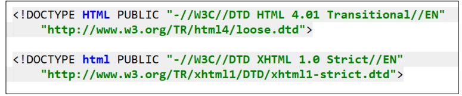

>[success] # HTML -- 补充
html 内容构成: 
~~~html
<!DOCTYPE html>
<html lang="en">
<head>
  <meta charset="UTF-8">
  <meta http-equiv="X-UA-Compatible" content="IE=edge">
  <meta name="viewport" content="width=device-width, initial-scale=1.0">
  <title>Document</title>
</head>
<body>
  
</body>
</html>
~~~
1. `<!DOCTYPE html>`，`DOCTYPE`  文档意思 `html` 类型因此 意思为，告诉浏览器当前页面是`HTML5页面`,这样浏览器就可以用，`HTML5的标准`去解析识别内容,因此需要放到文档最前面不能省略，如果省略会出现兼容性问题
 * HTML 4.01、XHTML 1.0 声明格式
 
2. `html` 表示文档的`根元素`，其他后续声明的元素都为`此元素的后代`
2.1. W3C标准建议为html元素增加一个`lang`属性,帮助语音合成工具确定要使用的发音,帮助翻译工具确定要使用的翻译规则,`lang="en"`表示文档为英文，`lang="zh-CN"`表示文档的语言是中文

3. `head`规定文档相关的`配置信息`,也称之为`元数据`,可配置的内容包含`文档的标题` `引用的文档样式` `脚本`
3.1. `meta元素` 中 `charset`  `用于设置网页的字符编码`，[关于字符编码](https://www.jianshu.com/p/899e749be47c)，计算机不能识别我们所日常看到字符，实际他解析式二进制`0101`这种形式，因此需要对应`0101` 要对应的正常字符类似对象的表达形式即下面例子，不同的字符集所对应的值解析也不同，因此会出现不同字符集乱码情况。
~~~
{
 0101:'z' //随意举得例子
}
~~~

4. `body`,你在浏览器窗口中看到的东西，也就是网页的具`体内容和结构`

>[danger] ##### 所有元素参考
[HTML 元素参考
](https://developer.mozilla.org/zh-CN/docs/Web/HTML/Element)

>[info] ## div 和 span 补充
* 早期是没有css，这个时候我们必须通过语义化元素来告知浏览器一段文字如何显示，随着语义化标签越来越多，样式和结构标签开始混乱，这时候出现了css，xss 可以给样式标签赋予样式达到效果，因此此时`html` 只负责结构即可，举个列子`h` 标签实际就是将其赋予了特定规则的`css`,理论上将`div`或者`span` 标签赋予同样的`css` 规则也可以达到`h` 标签的效果
* div、span来编写HTML结构所有的结构，样式都交给css来处理
* 但`div` 和 `span` 是无语义化的，虽然理论来说所有页面都仅仅只通过`div` 和 `span` 达到布局效果

>[info] ## HTML全局属性
[全局属性](https://developer.mozilla.org/zh-CN/docs/Web/HTML/Global_attributes)
 