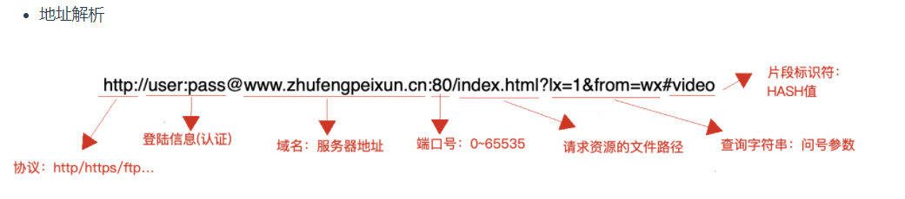
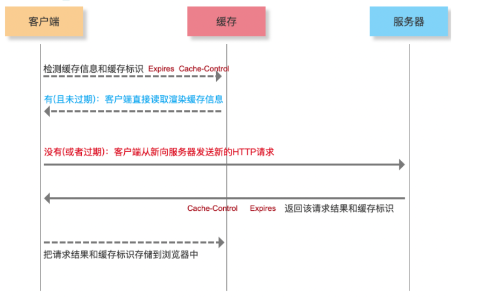
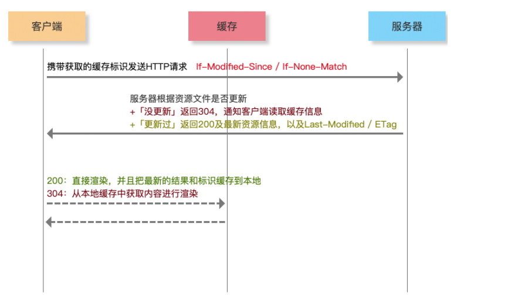
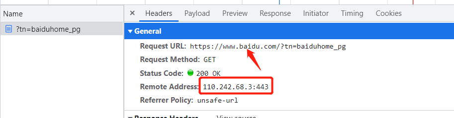
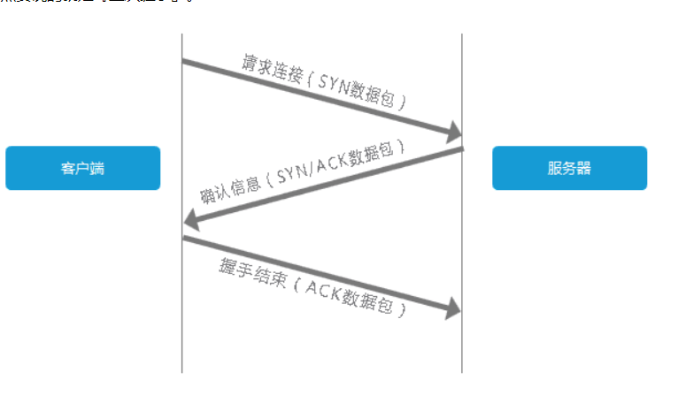
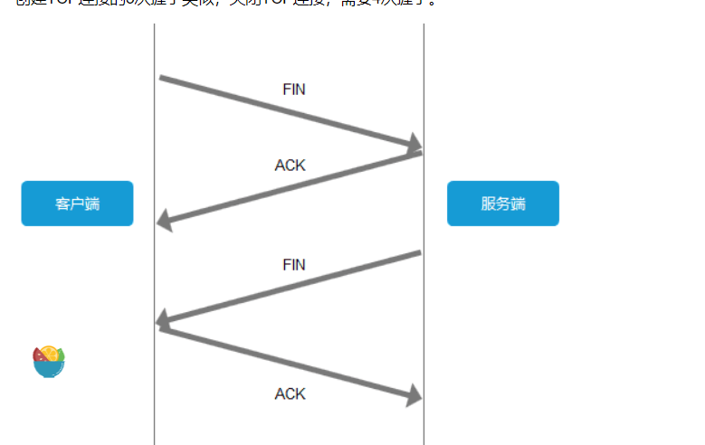

>[success] #  HTTP
~~~
1.作为前端，可能感觉和http没有多大关系，但实际在我的开发过程中，会发现比较有意思的一点，http真的
是无处不在，前后台的传参，请求，响应。这些都是依靠http
2.本章节可以理解是一个读书笔记，更多详细内容看参考文章
~~~
[本章节参考的文章来源](https://time.geekbang.org/column/article/97837)
>[info] ## 前端粗略理解
~~~
1.从输入URL到看到页面 经历七个步骤 分别是
 1.1.URL 解析
 1.2.缓存检查（强缓存/协商缓存304）
 1.3.DNS 解析
 1.4.TCP 的三次握手
 1.5.HTTP传输请求和响应
 1.6.TCP 的四次挥手
 1.7.渲染页面
~~~
>[danger] ##### URL 解析
~~~
1.浏览器会对我们输入的url进行解析，主要将其分为下部分：协议、网络地址(域名，端口号)、资源路径
  1.1.协议：HTTP / HTTPS（SSL）/ FTP（文件上传）等
  1.2.域名：顶级、一级、二级...
  1.3.端口号：0~65535  区分同一台服务器上的不同服务，HTTP:80  HTTPS:443  FTP:21  默认端口号是浏览器处理的
      举个例子有时候开发时候地址是 www.kaifa.cn:3000 这就是自定义3000接口访问
  1.4.在资源路径时候可以通过GET 传参 形式拼接可以实现两个页面之间的信息通信

2.URLEncode,网址中可能会包含非ASCII码形式的内容，比如中文。而直接把中文放到网址中请求是不允许的，
所以需要用URLEncoder编码地址
 2.1.原理：将需要转换的内容（ASCII码形式之外的内容），用十六进制表示法转换出来，并在之前加上%开头
 2.2.前端对其解码和编码可以采用的方法(encodeURI  decodeURI )/( encodeURIComponent decodeURIComponent)
 这两组的区别
  encodeURI方法不会对下列字符编码 ASCII字母 数字 ~!@#$&*()=:/,;?+'
  encodeURIComponent方法不会对下列字符编码 ASCII字母 数字 ~!*()'
 具体参考：https://www.zhihu.com/question/21861899
~~~
* 如图

 >[danger] ##### 缓存检查
~~~
1.强缓存,浏览器会根据response Header来判断是否对资源进行缓存，如果响应头中expires、pragma或者
cache-control字段，代表这是强缓存，浏览器就会把资源缓存在memory cache 或 disk cache中。
 1.1.Expires：缓存过期时间，用来指定资源到期的时间（HTTP/1.0）
 1.2.Cache-Control：cache-control: max-age=2592000第一次拿到资源后的2592000秒内（30天），再次发送
 请求，读取缓存中的信息（HTTP/1.1）
 1.3.两者同时存在的话，Cache-Control优先级高于Expires
 1.4.符合强缓存条件就直接返回状态码200
2.协商缓存就是强缓存失效后，浏览器携带缓存标识向服务器发送请求，由服务器根据缓存标识来决定是否使用缓
存的过程。
 2.1.协商缓存生效，返回304
 2.2.Last-Modified / If-Modified-Since 设置协商缓存
 2.3.If-Modified-Since则是客户端再次发起该请求时，携带上次请求返回的Last-Modified值，通过此字段值告诉服务
器该资源上次请求返回的最后被修改时间。服务器收到该请求，发现请求头含有If-Modified-Since字段，则会根据
If-Modified-Since的字段值与该资源在服务器的最后被修改时间做对比，若服务器的资源最后被修改时间大于
If-Modified-Since的字段值，则重新返回资源，状态码为200；否则则返回304，代表资源无更新，可继续使用缓
存文件。
 2.4.If-None-Match是客户端再次发起该请求时，携带上次请求返回的唯一标识Etag值，通过此字段值告诉服务器该
资源上次请求返回的唯一标识值。服务器收到该请求后，发现该请求头中含有If-None-Match，则会根据
If-None-Match的字段值与该资源在服务器的Etag值做对比，一致则返回304，代表资源无更新，继续使用缓存文件
不一致则重新返回资源文件，状态码为200。
3.缓存位置
  3.1.'Memory Cache' : 内存缓存
  3.2.'Disk Cache'：硬盘缓存
4.打开网页：查找 disk cache 中是否有匹配，如有则使用，如没有则发送网络请求
5.普通刷新 (F5)：因TAB没关闭，因此memory cache是可用的，会被优先使用，其次才是disk cache
6.强制刷新 (Ctrl + F5)：浏览器不使用缓存，因此发送的请求头部均带有 Cache-control: no-cache，服务器直接
返回 200 和最新内容
~~~
* 强缓存

* 协商缓存

[前端浏览器缓存知识梳理
](https://juejin.cn/post/6947936223126093861)
>[danger] ##### DNS 解析
~~~
1.DNS解析「域名解析」在DNS服务器上，基于域名找到服务器的外网IP，后面我就可以基于服务器的外网IP找
到服务器,如图百度为例，我们需要将购买的服务器ip和域名做关联此时才会根据域名找到ip，ip单独访问其实也可以
找到网站，但是相对ip这种数字域名这种形式更好被记住
2.查找顺序 '浏览器缓存→系统缓存→路由器缓存→ISP DNS 缓存→递归搜索'
  2.1.请求发起后，游览器首先会解析这个域名，首先它会查看本地硬盘的 hosts 文件，看看其中有没有和这个域名
对应的规则，如果有的话就直接使用 hosts 文件里面的 ip 地址。

  2.2.如果在本地的 hosts 文件没有能够找到对应的 ip 地址，浏览器会发出一个 DNS请求到本地DNS(域名分布系统)
服务器 。本地DNS服务器一般都是你的网络接入服务器商提供，比如中国电信，中国移动。

  2.3.查询你输入的网址的DNS请求到达本地DNS服务器之后，本地DNS服务器会首先查询它的缓存记录，如果缓存
中有此条记录，就可以直接返回结果，此过程是递归的方式进行查询。如果没有，本地DNS服务器还要向DNS根服
务器进行查询

  2.4.根DNS服务器没有记录具体的域名和IP地址的对应关系，而是告诉本地DNS服务器，你可以到域服务器上去继
续查询，并给出域服务器的地址。这种过程是迭代的过程

  2.5.本地DNS服务器继续向域服务器发出请求，在这个例子中，请求的对象是.com域服务器。.com域服务器收到请
求之后，也不会直接返回域名和IP地址的对应关系，而是告诉本地DNS服务器，你的域名的解析服务器的地址

  2.6.最后，本地DNS服务器向域名的解析服务器发出请求，这时就能收到一个域名和IP地址对应关系，本地DNS
服务器不仅要把IP地址返回给用户电脑，还要把这个对应关系保存在缓存中，以备下次别的用户查询时，可以直
接返回结果，加快网络访问。
3.因此我们可以修改电脑的host 让访问域名指向我们自己的开发服务器
~~~
* 域名对应ip

* 查看浏览器
[# 如何查看chrome浏览器的DNS缓存](https://www.jianshu.com/p/9e7aa4ec4b46)
>[danger] ##### TCP 的三次握手
~~~
1.客户端发送一个带有SYN标志的数据包给服务端，服务端收到后，回传一个带有SYN/ACK标志的数据包以示传
达确认信息，最后客户端再回传一个带ACK标志的数据包，代表握手结束，连接成功。

通俗化之后就是：

客户端：老弟我要跟你链接

服务端：好的，同意了

客户端：好嘞
2.三次握手完成，TCP客户端和服务器端成功地建立连接，可以开始传输数据了。

~~~

>[danger] ##### HTTP
~~~
1.建立TCP连接之后，发起HTTP请求，请求一般分为三部分

  1.1.请求方法URI协议/版本

  1.2.请求头(Request Header)

  1.3.请求正文
~~~
>[danger] ##### TCP 的四次挥手
~~~
1.为了避免服务器与客户端双方的资源占用和损耗，当双方没有请求或响应传递时，任意一方都可以发起关闭请求。
与创建TCP连接的3次握手类似，关闭TCP连接，需要四次挥手。
客户端：老弟，我这边没数据要传了，咱们关闭链接吧

服务端：好的，接收到了，我看看我这边还有没有要传的

服务端：我这边也没有了，关闭吧

客户端：好嘞
~~~

>[info] ## 参考
[从输入URL到浏览器显示页面发生了什么](https://www.cnblogs.com/yuanzhiguo/p/8119470.html)