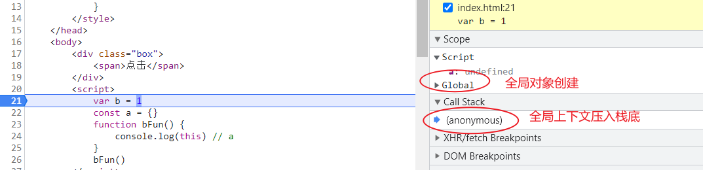
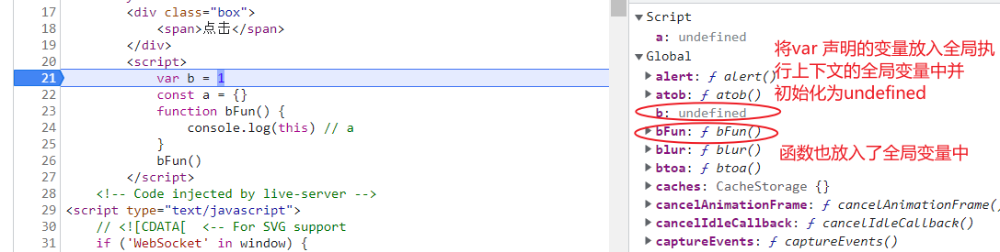
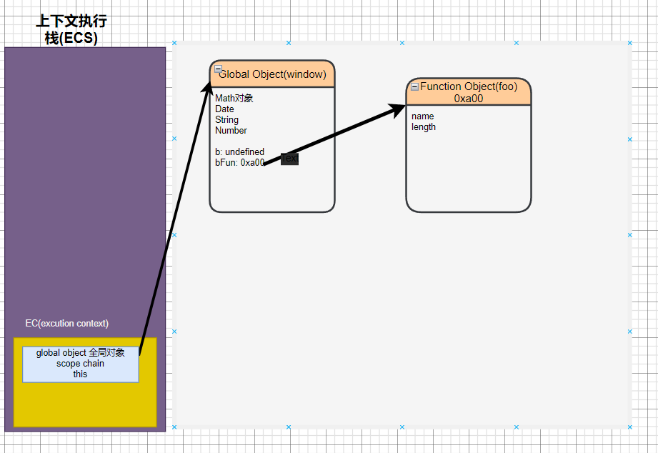
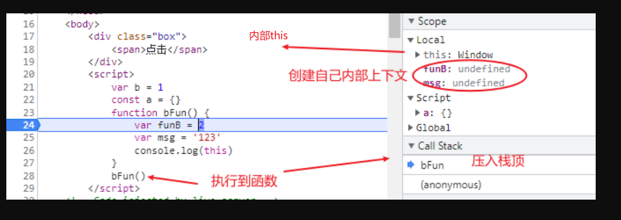
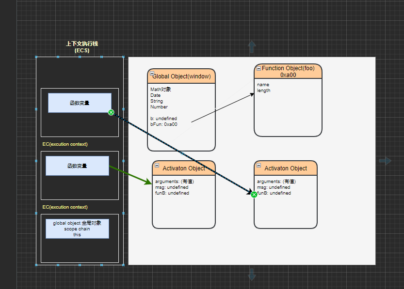
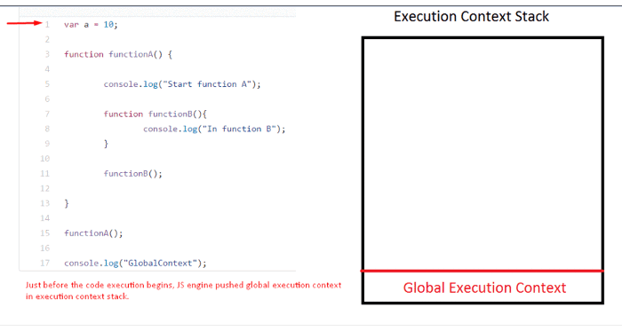

>[success] # 全局对象
1. **全局对象**提供在任何地方都可用的变量和函数。默认情况下，那些内置在语言或环境中的一些属性和方法放一个单独的内存中（Date、Array、String、Number、setTimeout、setInterval），例如浏览器的`window` 中就包含了内部提供一些方法，还有通过var/function声明的变量是直接存储到全局对象中

>[info] ##  globalThis
1.  **ES2020引入了 globalThis 对象**，它提供了跨环境访问全局对象的标准方法中提出要提供全局变量，简单说在浏览器中为`window`,在node环境中为`global`,但现在为统一目前已经指定了对应的标准，称之为**globalThis**
2. 在不同js 环境中总是存在不同全局变量标准，往往在**浏览器**中**window**或者 **frames**，在**WebWorkers**中**self**，在**Node** 中**global**
3. 下面代码在浏览器中打印你会得到**true**
4. 使用场景假设我们的环境是一个浏览器，我们将在这里使用 window。如果脚本可能在其他环境中运行，最好使用 **globalThis**
~~~
globalThis === window
~~~
* 参考
https://mathiasbynens.be/notes/globalthis
https://javascript.info/global-object
https://tc39.es/ecma262/multipage/global-object.html#sec-global-object
https://github.com/tc39/proposal-global
>[success] # Execution Contexts 执行上下文
1. 执行上下文(EC)被定义为执行 JavaScript 代码的环境。也就是我们代码都将在一个创建好的一个环境中执行，这个环境具备在特定时间代码可以访问的 this、变量、对象和函数的值。这类环境分为三种：
1.1. Global execution context **全局执行上下文**(GEC)
1.2. Functional execution context **函数执行上下文**(FEC）
1.3. Execution context inside **内部执行上下文** eval function
2. 
>[danger] ##### 全局执行上下文-- GEC
1. **GEC全局执行上下文**当打开页面时，首次加载一个Js文件或者运行一段Js代码， 则会在**全局代码执行之前,先创建一个全局的执行上下文**,并将这个全局执行上下文压入**执行环境栈**中 ，因此它**位于堆栈的底部**

2. 在这个js运行的生命周期中，【**GEC将只创建一次，只有一个**】，即一个程序中只**能存在一个全局执行上下文**， 只有页面**关闭**时才会释放掉。 
3. 刷新页面时，会把之前的上下文全都释放调，然后创建全新的上下文
4. 创建的全局上下文环境中将创建
4.1. **global object 全局对象(在不同环境中表现不同在浏览器中为window在node 中为global，当然在新es2020规范可以用globalThis代替)** 
4.2. **创建this**并将其绑定到**全局对象**
4.3. 将变量声明存储在内存堆和全局执行上下文中的变量中，初始值为`undefined`,**函数会提前声明**,这个过程也称之为变量的**作用域提升**
赋值
* **图解通过控制台分析**
~~~
var b = 1
const a = {}
function bFun() {
    console.log(this) // a
}
bFun()
~~~

* **通过画图图解过程**

>[danger] ##### 函数的上下文 -- FEC
1. **函数执行上下文FEC**,作用是为每个函数调用创建一个执行上下文。但它不是在声明函数时创建的，而是在**调用函数**时创建
2. 创建一个新的函数的上下文会被添加到执行**栈的顶部**
3. 这个私有上下文可以保护里面的私有变量和**外界互不干扰**
4. 即使是同一个函数但每一次被调用，都会创建一个**新的私有上下文**。
5. 每当一个函数执行完毕，则这个函数的私有执行上下文也将从**栈中弹出**，等到所有函数都运行完毕，要关闭页面的时候，全局上下文也将出栈释放，程序运行结束。
6. 只要当前上下文中的某些内容，被当前上下文以外的东西占用，那么当前上下文是不能被释放的**闭包**
7. 调用过程，在创建函数上下文过程中，默认情况下，JS 引擎会在本地执行上下文中创建一个 **arguments** 对象和一个**this对象**，函数内部预期的键值对参数存储在 arguments 对象中。它还有一个名为 length 的默认属性，用于计算该函数有多少个参数。当函数的参数为​​空时，参数对象默认为长度：0。根据调用函数的方式，函数执行上下文中的this对象会发生变化。如果使用对象引用来调用它，则 this 的值设置为该对象。否则，此变量的值将设置为**gloab**对象或严格模式下为**undefined**。
* **控制台图解**

* **画图图解**
* 静态图原因，想表达是，每次执行函数时候都会创建一个新的函数上下文，其实当执行第一次函数时候执行完会被弹出栈，并不会像下图在栈中压住两个函数，当函数从栈中弹出时候，在**堆**中区域函数也不会立刻清楚而是等待js的垃圾回收
~~~
var b = 1
const a = {}
function bFun() {
   var funB = 2
   var msg = '123'
   console.log(this)
}
bFun()
bFun()
~~~

* 动态图

>[danger] ##### eval
1. JS 引擎遇到**eval()**函数时，就会构造一个执行上下文并将其推送到调用堆栈中。它评估作为参数传递的字符串
>[info] ## 总结
1. 代码执行所在的执行上下文，或者代码执行所处的作用域， 在JS代码执行中， 为了区分全局和函数执行所处的不同的作用域（目的是为了区分每个执行上下文中代码的独立性），包括创**建变 量对象、建立作用域链、确定 this 的指向等**

>[info] ## 参考
https://www.javascripttutorial.net/javascript-execution-context/
https://blog.sessionstack.com/how-javascript-works-the-this-variable-and-the-execution-context-12d8f04a40d3
https://codeburst.io/js-demystified-04-execution-context-97dea52c8ac6