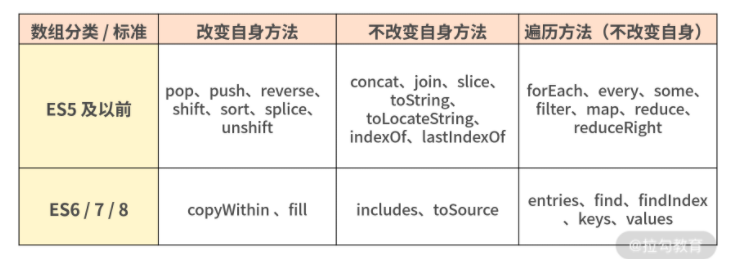

>[success] # JS -- 数组30s小文章
~~~
1.文章所有内容来自30s 数组章节内容整理
2.建议先读文章再来看下面总结方法
~~~
[如果你想知道具体细节我超级推荐你看这个](https://www.30secondsofcode.org/js/t/array/e/11)

>[success] # 数组文章节选
[内容来自JavaScript 核心原理精讲](https://kaiwu.lagou.com/course/courseInfo.htm?courseId=601#/detail/pc?id=6180)
~~~
1.所有插入元素的方法，比如 push、unshift 一律返回数组新的长度；
2.所有删除元素的方法，比如 pop、shift、splice 一律返回删除的元素，或
者返回删除的多个元素组成的数组；
3.部分遍历方法，比如 forEach、every、some、filter、map、find、
findIndex，它们都包含 function(value,index,array){} 和 thisArg 这样两个形
参。
~~~
