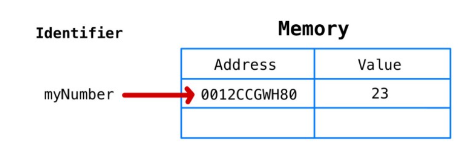
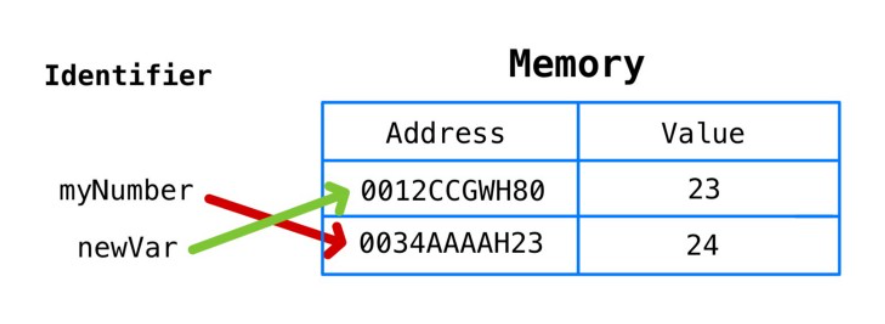
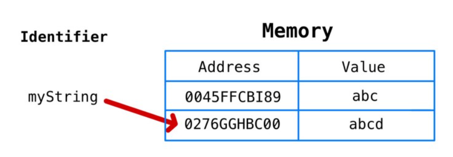
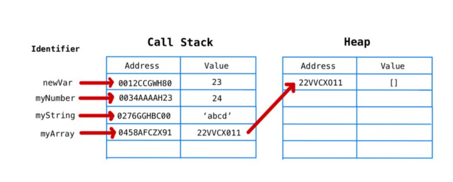
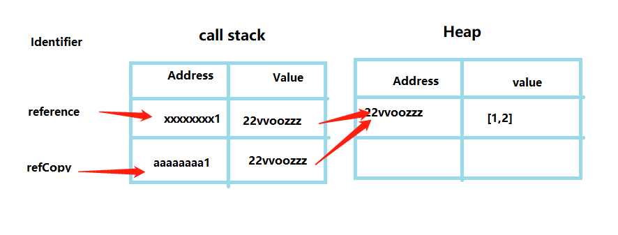
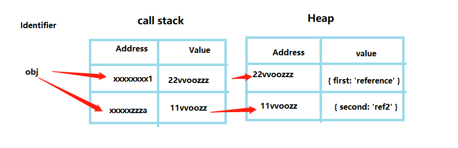
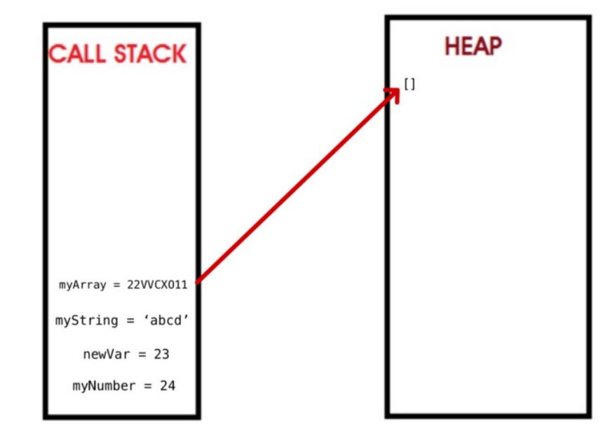
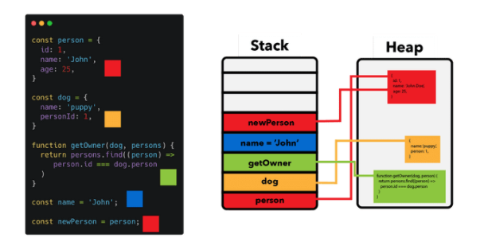

>[success] # JS中的堆(Heap)栈(Stack)内存

1. 原始类型占据的空间是在栈内存中分配的；
2.  对象类型占据的空间是在堆内存中分配的
~~~
1.JavaScript 中,创建变量、函数等行为的时候JS 引擎会为此分配内存，并在不再需要时释放它，每一次
它们都会经历三个阶段'分配内存 -- 使用内存 -- 释放内存'
 1.1.'分配内存':JavaScript 为我们解决了这个问题：它为我们创建的对象分配我们需要的内存。
 1.2.'使用内存':使用内存是我们在代码中明确做的事情读取和写入内存只不过是读取或写入变量。
 1.3.'释放内存':这一步也由 JavaScript 引擎处理。一旦分配的内存被释放，它就可以用于新的目的。
简单的说JS引擎会分配内存并在我们不再需要时将其释放
2.关于储存的位置JavaScript 引擎有两个地方可以存储数据'堆'和'栈'
~~~
>[info] ## 栈 -- Stack
~~~
1.栈内存由操作系统直接管理，所以栈内存的大小也由操作系统决定是 
2.像`string`、`number`、`bigint`、`boolean`、`undefined`、`null`和`symbol`指向对象和函数的引用(内存地址)，
这些数据有一个共同点。这些数据生成对应的值大小是固定的，并且这些值的大小在编译时就可以知道，并且
会为这些不会改变的每个值分配固定数量的内存（在执行之前分配内存的过程称为静态内存分配）
3.虽然`typeof null`返回的是`'object'`，但是`null`不是对象
4.栈它具有以下特点：
 4.1.操作数据快，因为是在栈顶操作
 4.2.数据必须是静态的，数据大小在编译时是已知的
 4.3.栈的内存管理简单，且由操作系统完成
 4.4.栈大小有限，可能发生栈溢出（Stack Overflow）

~~~
>[danger] ##### 关于赋值
~~~
1.'let myNumber = 23' 赋值过程经历三个步骤 储存的空间都在栈中
 1.1.为变量创建一个唯一标识符（'myNumber'）。
 1.2.在内存中分配一个地址（将在运行时分配）。
 1.3.在分配的地址 (23) 中存储一个值。
~~~
* 如图在栈中有个变量声明myNumber 他的值是23

~~~
// 根据打印结果可以看出虽然myNumber 赋值给 newVar 但 当给myNumbe 加 1的时候并没有影响newVar 
// 说明栈基本类型赋值时候是重新开辟了空间
let myNumber = 23
let newVar = myNumber
myNumber = myNumber + 1
console.log(myNumber ) // 24
console.log(newVar  )  // 23
~~~
* 如图 myNumber 虽然赋值给了newVar 但是newVar 依旧在栈中新开辟了自己的空间记录自己

~~~
// js中的原始数据类型，因此将分配新的内存地址，abcd存储在那里，并将mystring指向这个新的内存地址
let myString = 'abc'
myString = myString + 'd'
~~~
* 当我们给之前变量重新赋值时候如图并不是在之前基础上的地址直接加上'd' 而是开辟了新的地址

>[danger] ##### 总结
~~~
1.思考"let myString = 'abc' ;myString = myString + 'd' " 为什么是新开辟地址，在开篇说过栈中的数据
有一个共同点。这些数据的大小是固定的，如果从原来的'abc' 内存大小直接变成'abcd' 完全不符合这点
相反却变成了动态内存，因此在栈中的每一次变化都是一次新的空间开辟
~~~
>[info] ## 堆
~~~
1.堆是用于存储 JavaScript 对象和函数的数据与栈不同，引擎不会为这些对象分配固定数量的内存。
程序需要使用指针在堆中查找数据，特点
 1.1.操作速度慢，但容量大
 1.2.可以将动态大小的数据存储在此处
 1.3.堆在应用程序的线程之间共享
 1.4.因为堆的动态特性，堆管理起来比较困难
 1.5.值大小没有限制
~~~
>[danger]  ##### 关于赋值
~~~
1.'let myArray= []' 赋值过程经历四个步骤对 象的引用地址在栈中，数据存在堆中
 1.1.为变量创建一个唯一标识符（'myArray'）。
 1.2.分配内存中的地址（在运行时分配）。
 1.3.在分配的内存地址指向堆（在运行时分配）
 1.4.在内存地址指向的堆中储存一个空数组[],这个空间是动态的
~~~
* 如图 myArray 变量声明的表示符号指向栈中一个地址这个地址对应栈中的value 实际是对象堆的内存地址

~~~
let myArray= []
myArray.push("first")
myArray.push("second")
myArray.push("third")
myArray.push("fourth")
~~~
* 当变量赋值给另一个变量的时候内存地址指向其实是同一个
~~~
const reference = [1];
const refCopy = reference;
reference.push(2);
~~~

* 当变量重新赋值时候改变的是内存地址指向
~~~
let obj = { first: 'reference' };  
obj = { second: 'ref2' }
~~~

>[info] ## 总结
~~~
1.简单通过模型来看堆栈中的关系如图
~~~

>[info] ## 参考文章
[在 Javascript 中解释值与引用
](https://codeburst.io/explaining-value-vs-reference-in-javascript-647a975e12a0)
[# JavaScript 内存详解 & 分析指南](https://developers.weixin.qq.com/community/minigame/article/doc/000e641c5f0d1862cb8bdbe0c58c13)
[# JavaScript's Memory Management Explained](https://felixgerschau.com/javascript-memory-management/#conclusion)
[# JavaScript 的内存模型](https://medium.com/@ethannam/javascripts-memory-model-7c972cd2c239)
[# V8中的JavaScript的内存管理与垃圾回收](https://cdmana.com/2021/09/20210912121834535c.html)
[javascript-fundamentals-call-stack-and-memory-heap](https://medium.com/@allansendagi/javascript-fundamentals-call-stack-and-memory-heap-401eb8713204)
[memory-life-cycle-heap-stack-javascript/](https://blog.alexdevero.com/memory-life-cycle-heap-stack-javascript/)
https://www.javascripttutorial.net/javascript-call-stack/