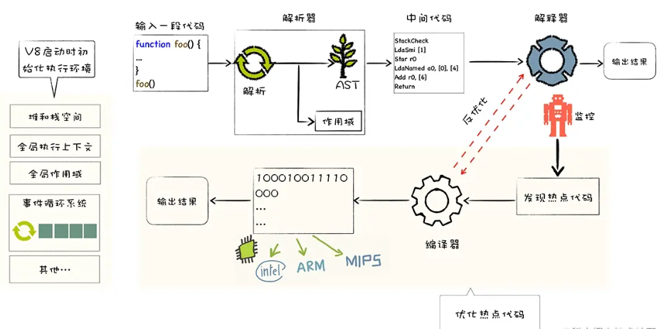

>[success] # JavaScript代码的执行
1. js 是通过浏览器的js引擎进行执行，现阶段最流行的引擎就是V8引擎
2. V8是用**C ++**编写的Google开源高性能JavaScript和WebAssembly引擎，它用于**Chrome和Node.js**等
3. 它实现ECMAScript和WebAssembly，并在Windows 7或更高版本，macOS 10.12+和使用x64，IA-32，ARM或MIPS处理器的Linux系统上运行
4. V8可以独立运行，也可以嵌入到任何C ++应用程序。最后可以将字节码编译为CPU可以直接执行的机器码

>[info] ## v8 中的一些模块
1. **Parse**模块会将JavaScript代码转换成**AST**（抽象语法树），这是因为解释器并**不直接认识JavaScript代码**；如果函数没有被调用，那么是不会被转换成AST的；
 * **参考**：Parse的V8官方文档：https://v8.dev/blog/scanner

2. **Ignition**是一个解释器，会将**AST转换成ByteCode**（字节码），同时会收集TurboFan优化所需要的信息（比如函数参数的类型信息，有了类型才能进行真实的运算）；如果函数只调用一次，Ignition会解释执行ByteCode；

 * **参考**： Ignition的V8官方文档：https://v8.dev/blog/ignition-interpreter

3. **TurboFan是一个编译器**，可以将字节码编译为**CPU可以直接执行的机器码** 如果一个函数被多次调用，那么就会被标记为热点函数，那么就会经过TurboFan转换成优化的机器码，提高代码的执行性能；但是，机器码实际上也会被还原为ByteCode，这是因为如果后续执行函数的过程中，类型发生了变化（比如sum函数原来执行的是number类型，后来执行变成了string类型），之前优化的机器码并不能正确的处理运算，就会逆向的转换成字节码；

 * **参考**：  TurboFan的V8官方文档：https://v8.dev/blog/turbofan-jit
>[success] # JS -- 执行过程
~~~
1.V8 引擎为例，在 V8 引擎中 JavaScript 代码的运行过程主要分成三个阶段
 1.1.'语法分析阶段': 该阶段会对代码进行语法分析，检查是否有语法错误（SyntaxError），
如果发现语法错误，会在控制台抛出异常并终止执行。
 1.2.'编译阶段': 该阶段会进行执行上下文（Execution Context）的创建，包括创建变量对象、
建立作用域链、确定 this 的指向等。每进入一个不同的运行环境时，V8 引擎都会创建一个新
的执行上下文。
 1.3.'执行阶段': 将编译阶段中创建的执行上下文压入调用栈，并成为正在运行的执行上下文，
代码执行结束后，将其弹出调用栈。
~~~
>[info] ## 语法分析阶段
~~~
1.当语法错误的时候。控制台出现'SyntaxError' 就是在这个阶段，这个阶段分析该js脚本代码块的
语法是否正确，如果出现不正确，就抛出'SyntaxError'并且停止，该js代码块的执行，然后继续查
找并加载下一个代码块，如果正确就进入下一个阶段'预编译阶段'
2.这个阶段会经历 过程'通过词法分析 -> 语法分析 -> 语法树'
 2.1.'词法分析'，它读取字符流（我们的代码）并使用定义的规则将它们组合成标记（token）
 此外，它将删除空格字符，注释等。最后，整个代码字符串将被拆分为一个标记列表。
 2.2.'语法分析':将在词法分析后获取一个简单的标记列表，并语法分析阶段会把一个令牌流转换成
 抽象语法树（AST） 的形式。 验证语言语法并抛出语法错误（如果发生这种情况)
3.下面案例通过'espree' JavaScript 解析器 展示词法语法
~~~
>[danger] ##### 案例espree
~~~
import * as espree from 'espree'

// 词法分析
const tokens = espree.tokenize('function a(){}', { ecmaVersion: 6 })
console.log(tokens)

// ast 语法树生成
const ast = espree.parse('function a(){}')
console.log(ast)
~~~
* 词法输出
~~~
[
  Token { type: 'Keyword', value: 'function', start: 0, end: 8 },
  Token { type: 'Identifier', value: 'a', start: 9, end: 10 },
  Token { type: 'Punctuator', value: '(', start: 10, end: 11 },
  Token { type: 'Punctuator', value: ')', start: 11, end: 12 },
  Token { type: 'Punctuator', value: '{', start: 12, end: 13 },
  Token { type: 'Punctuator', value: '}', start: 13, end: 14 }
]
~~~
* ast 语法树
~~~
{
    "type":"Program",
    "start":0,
    "end":14,
    "body":[
        {
            "type":"FunctionDeclaration",
            "start":0,
            "end":14,
            "id":{
                "type":"Identifier",
                "start":9,
                "end":10,
                "name":"a"
            },
            "params":[

            ],
            "body":{
                "type":"BlockStatement",
                "start":12,
                "end":14,
                "body":[

                ]
            },
            "expression":false,
            "generator":false
        }
    ],
    "sourceType":"script"
}
~~~
>[danger] ##### 总结
~~~
1. 词法分析=》
   ast语法树=》
   编译阶段(
      1.执行上下文EC,js运行环境 全局上下文EC(G)/函数上下文EC(fn)/eval执行函数上下文/EC(Block)块级上下文
      2.创建变量
      3.建立作用域链
      4.确定this指向
      5.变量提升)=》
    执行阶段
~~~
>[danger] ##### 参考文章
[JavaScript解释器
](https://javascript.ruanyifeng.com/advanced/interpreter.html)
[前端进阶之 JS 抽象语法树
](https://juejin.cn/post/6844903650670673933#heading-2)
[一日一练-JS AST抽象语法树
](https://jobbym.github.io/2018/12/12/%E4%B8%80%E6%97%A5%E4%B8%80%E7%BB%83-JS-AST%E6%8A%BD%E8%B1%A1%E8%AF%AD%E6%B3%95%E6%A0%91/)
>[info] ## JavaScript执行上下文和执行栈
[JS引擎线程的执行过程的三个阶段
](https://juejin.cn/post/6844903788629721096)
