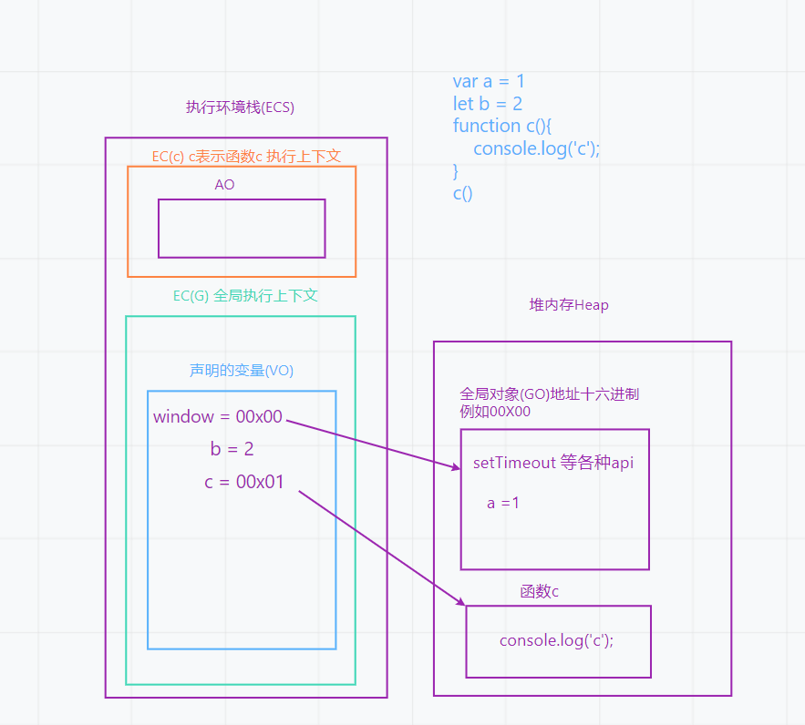
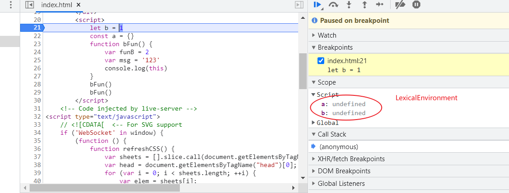

>[success] # es3
1. 在ES3 规范中你会看到 **VO / AO / GO** 这几个名词，上个章节中讲了关于三种执行上下文他们会各自产生属于自己代码环境上下文，这三个名词是它们在当前上下文中，用来存储声明的变量的地方出
 1.1. **GO（Global Object）全局对象（具体上个章节介绍了）**,浏览器把内置的一些属性和方法放一个单独的内存中，堆内存（Heap）,**window** 指向 **GO**对象,全局上下文中，基于**var/function**声明的变量是直接存储到GO对象上,也就是说**function 和 var**声明的变量都是挂在到 '**window**' 上的
 1.2. 变量对象**VO(Variable Object)**： 存放当前执行上下文中创建的变量和值，VO 就是变量对象,简单地说就是**变量对象**就是用来储存当前上下文创建的**创建的变量**
1.3. **活动对象AO(Activation Object)**， 函数私有上下文中的变量对象,在**函数执行上下文FEC中**，因为私有变量对象 AO是要保存**当前私有上下文中所有的变量**，而一个函数内的变量包括：**形参变量、局部变量、自身函数对象引用量、arguments、this**。 为了保存这些变量，所以特意创建了一个对象，称它为**AO**，它在创建函数的过程中，函数内部的代码不管对还是错我都可以成功加载到页面中，因为我们还没有调用执行它，也就是我们声明一个函数时，你又**没有调用它**，那么它就失去了它的作用，相当于内部储**存一堆字符串**
这样也就可以更好理解下面这段代码，执行结果报错b is not defined 因为此时 b在函数AO中执行完毕即销毁
~~~
 function a(){ var b = 12 }
 a()
  b
~~~
>[danger] ##### 形象图解
1. 在`es3` 时候没有 let 和 const ，但 var 和 function 声明变量都挂在到window 上，因此全局上下文中Vo 即为 GO，函数中上下文变量位置为AO

>[danger] ##### 案例根据vo/go 分析

~~~
 console.log(a) 
~~~
上面代码执行结果'**Uncaught ReferenceError: a is not defined**'首先会到VO查找，看是否为全局变量，如果不是，则再去**GO**中找，看是否为全局对象的一个属性，如果还不是，则报错`console.log(window.a)`; 直接去GO中查找是否存在a这个成员，如果没有则不会报错，值是**undefined**
>[info] ## 参考
https://www.freecodecamp.org/news/execution-context-how-javascript-works-behind-the-scenes/
>[success] # es6
1. 新的ES规范开始增加了**Lexical Environment**概念，这个概念中规定每段代码都有属于自己的**Lexical Environment**，这个环境中规定了两个重要点
 1.1. **Environment record**（环境记录） -- 记录了在该 lexical environment 中被创建的标识符与变量的映射，简单理解就是所在环境记录类似VO/AO 即所在位置变量存储环境
 1.2.**Reference to outer lexical environment** -- 外部环境，就例如函数中使用了全局变量这个属性来自外部值
2. **Environment record** 环境分为五大类
    2.1. **Declarative Environment Records**：记录`var`、`const`、`let`、`class`、`import`、`function`等声明
    2.2. **Object Environment Records**：与某一对象相绑定，其会记录该对象中具有**string**标识符的属性，非 string 标识符的属性不会被记录。Object environment records 为`with`语句所创建
    2.3. **Global Environment Records**：类似于 declarative environment records 与 object environment records 的结合，在包含顶层声明的同时还包含 global object 的属性；
    2.4. **Function Environment Records**：为 declarative environment records 的子类，用于函数的顶层，如果该函数非箭头函数则提供`this`的绑定，如果该函数还引用了`super`则提供`super`方法的绑定；
    2.5. **Module Environment Records**：为 declarative environment records 的子类，用于 ES module 的顶层，除去常量和变量的声明，还包含不可变的 import 的绑定，该绑定提供了到另一 environment records 的间接访问。
3. 词法种类还分为三类`LexicalEnvironment`/`VariableEnvironment`/`PrivateEnvironment`, LexicalEnvironment 中记录`let`、`const`等声明，VariableEnvironment 则仅处理`VariableStatements`即`var`声明,私有变量对应`PrivateEnvironment`
* **图解**

>[danger] ##### 构成结果
* 根据上面概念 一段代码将会变成一个树形结构
~~~
// global environment
let a = 1;
const b = 2;
function f(arg1) {
  let c = arg1;
  var d = 3;
}
f(a);

~~~
~~~
GEC = {
  lexicalEnvironment: {
    environmentRecord: {
      type: "Global",
      declarativeRecord: {
        type: "Declarative",
        a: <uninitialized>,
      	b: <uninitialized>,
      	f: <function>
      },
      objectRecord: {
      	type: "Object",
      	Infinity: +∞,
      	isFinite: <function>
      }
    },
    refToOuter: null
  }
}

~~~
* 函数被调用时候结构
~~~
FEC = {
  lexicalEnvironment: {
    environmentRecord: {
      type: "Function",
      Arguments: {0: 1, length: 1},
      c: <uninitialized>,
      this: <Global Object>
    },
    refToOuter: GEC // global execution context
  },
  variableEnvironment: {
    environmentRecord: {
      type: "Function",
      d: undefined,
      this: <Global Object>
    },
    refToOuter: GEC // global execution context
  }
}

~~~
>[info] ## 参考
https://blog.csdn.net/qq_35368183/article/details/103888311
[# JavaScript execution context — from compiling to execution (part 1-4 推荐都读)](https://cabulous.medium.com/javascript-execution-context-part-1-from-compiling-to-execution-84c11c0660f5)
https://www.atatus.com/blog/javascript-execution-context/
https://blog.openreplay.com/explaining-javascript-s-execution-context-and-stack
https://javascript.info/closure
https://www.codingem.com/javascript-closures/
https://borderlessengineer.com/how-js-works-lexical-environment/
https://github.com/lizhongzhen11/lizz-blog/issues/49
https://2ality.com/2019/07/global-scope.html

