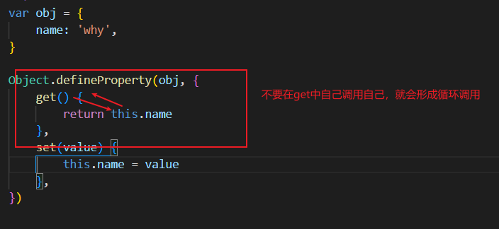

[TOC]
>[success] # 读取属性特性 Object.getOwnPropertyDescriptor()
[关于getOwnPropertyDescriptor更多详情查看mdn这里不展开讲解](https://developer.mozilla.org/zh-CN/docs/Web/JavaScript/Reference/Global_Objects/Object/getOwnPropertyDescriptor)
~~~
1.在了解这部分之前要先知道个属性'getOwnPropertyDescriptor'
2.引用一下mdn里对这个属性的介绍：
    'Object.getOwnPropertyDescriptor()' 方法返回指定对象上一个自有属性对应的属性描述符。
   （自有属性指的是直接赋予该对象的属性，不需要从原型链上进行查找的属性）
~~~
>[danger] ##### 通过代码来看访问器属性
~~~
1.在 'js-对象到底是什么'章节中我们讨论了'js这种基于原型创建对象'和'基于类创建对象'的语言一些差异，
其中提到了'js对象中的属性'：'非只是简单的名称和值,JavaScript 用一组特征（attribute）来描述属性（property）'
~~~
* 通过代码来看js 属性到底都有什么（这里直接就引用了winter老师的代码）
~~~
var o = { a: 1 };
o.b = 2;
//a和b皆为数据属性
Object.getOwnPropertyDescriptor(o,"a") // {value: 1, writable: true, enumerable: true, configurable: true}
Object.getOwnPropertyDescriptor(o,"b") // {value: 2, writable: true, enumerable: true, configurable: true}
~~~
* 通过代码做个简单的总结
~~~
1.我们可以简单理解：'实际上 JavaScript 对象的运行时是一个属性的集合',我们通过代码形式抽象的理解，
当然下面的代码只是为了理解抽象出来的结果，而不是实际正确的用法，此时我们可以把上面o中的a看成
    var o = {a: {value: 1, writable: true, enumerable: true, configurable: true}}
运行的时候找的是'o.a.value'再依次来看这些属性的其他配置
    
~~~
>[success] # 知识扩展 -- Object.defineProperty
参考资料:
[MDN](https://developer.mozilla.org/zh-CN/docs/Web/JavaScript/Reference/Global_Objects/Object/defineProperty)
~~~
1.Object.defineProperty() 方法会直接在一个对象上定义一个新属性，或者修改
一个对象的现有属性， 并返回这个对象。

2.Object.defineProperty(obj, prop, descriptor) 有三个参数分别是：
    3.1.'obj'要在其上定义属性的对象。
    3.2.'prop'要定义或修改的属性的名称。
    3.3.'descriptor'将被定义或修改的属性描述符。
~~~

>[info] ##  具体展开说明
~~~
1.数据描述符和存取描述符。数据描述符是一个具有值的属性，该值可能是可写的，
  也可能不是可写的。存取描述符是由getter-setter函数对描述的属性。描述符必须是
  这两种形式之一；不能同时是两者

2.是个对象里面有六个属性，'configurable','enumerable','value','writable','get','set':
    2.1.'configurable' -- 当且仅当该属性的 configurable 为 true 时，该属性描述符才能
      够被改变，同时该属性也能从对应的对象上被删除。默认为 false。

    2.2.'enumerable' -- 当且仅当该属性的'enumerable'为true时，该属性才能够出现
      在对象的枚举属性中。默认为 false。

    2.3.'value' -- 该属性对应的值。可以是任何有效的 JavaScript 值（数值，对象，函数等）。
      默认为 'undefined'。

    2.4.'writable' -- 当且仅当该属性的'writable'为true时，'value'才能被[赋值运算符]

    2.5.'get' -- 一个给属性提供 'getter' 的方法，如果没有 'getter' 则为 'undefined'。
      当访问该属性时，该方法会被执行，方法执行时没有参数传入，但是会传入'this'对象
    （由于继承关系，这里的'this'并不一定是定义该属性的对象）。默认为'undefined'
    
    2.6.'set' --一个给属性提供 'setter' 的方法，如果没有 'setter' 则为 'undefined'。当属性值修
      改时，触发执行该方法。该方法将接受唯一参数，即该属性新的参数值。默认为'undefined'
~~~
>[danger] ##### 对enumerable-- 是否可枚举 详细讲解
~~~
1. enumerable定义了对象的属性是否可以在 for...in 循环和 Object.keys() 中被枚举。
~~~
~~~
const obj = {name:'wang',age:27}

Object.defineProperty(obj,'name',{
    enumerable:true
})

Object.defineProperty(obj,'age',{
    enumerable:false
})

for(var item in obj){
    console.log(item)
}
打印结果：
name
~~~
>[danger] ##### 对value 和 Writable -- 属性值和是否可以写 详细讲解
~~~
1. 'vaule' 可以重新定义该属性的值，可以是任何有效的 JavaScript 值（数值，对象，函数等）。
      默认为 'undefined'。
2.'Writable'  是否可以对值重新赋值运算,true 可以 false 不可以
~~~
~~~
const obj = {name:'wang',age:27}

Object.defineProperty(obj,'name',{
    writable:true,
    value:'c'
})

Object.defineProperty(obj,'age',{
    writable:false,
    value:18
})

obj.name = '重新赋值'
obj.age = 0 // 会已经报错不能重新赋值
console.log(obj.name) // 打印结果：重新赋值
console.log(obj.age) // 异常了

~~~
>[danger] ##### 对configurable -- 修改属性 详细讲解
~~~
1.具体可以看'MDN' 中的详解，简单的说就是如果配置为false，则其他配置不可以进行第二次配
值，也无法给属性赋值，简单可以理解成锁
2.'configurable'特性表示对象的属性是否可以被删除，以及除value和writable特性外的其他特性是
否可以被修改，详解看案例二
~~~
* 案例选自MDN
~~~
var o = {};
// Object.defineProperty(o, "a", { get : function(){return 1;},
//     configurable : false } );

// throws a TypeError
Object.defineProperty(o, "a", {configurable : true});
// throws a TypeError
Object.defineProperty(o, "a", {enumerable : true});
// throws a TypeError (set was undefined previously) 
Object.defineProperty(o, "a", {set : function(){}});
// throws a TypeError (even though the new get does exactly the same thing) 
Object.defineProperty(o, "a", {get : function(){return 1;}});
// throws a TypeError
Object.defineProperty(o, "a", {value : 12});

console.log(o.a); // logs 1
delete o.a; // Nothing happens
console.log(o.a); // logs 1

// 例子二
var o = {a:'1'};

Object.defineProperty(o, "a", {value : 12,configurable : false });

o.a = 19
console.log(o.a); // 19
~~~
>[danger] ##### 属性的默认值到底什么时候生效(重要)
* 案例选MDN
~~~js
var o = {};

o.a = 1;
// 等同于 :
Object.defineProperty(o, "a", {
  value : 1,
  writable : true,
  configurable : true,
  enumerable : true
});

// 另一方面，
Object.defineProperty(o, "a", { value : 1 });
// 等同于 :
Object.defineProperty(o, "a", {
  value : 1,
  writable : false,
  configurable : false,
  enumerable : false
});
o.a = 0 // 报错
~~~
>[danger] ##### get 和 set -- 取值和赋值
* MDN 案例
~~~js
function Archiver() {
  var temperature = null;
  var archive = [];

  Object.defineProperty(this, 'temperature', {
    get: function() {
      console.log('get!');
      return temperature;
    },
    set: function(value) {
      temperature = value;
      archive.push({ val: temperature });
    }
  });

  this.getArchive = function() { return archive; };
}

var arc = new Archiver();
arc.temperature; // 'get!'
arc.temperature = 11;
arc.temperature = 13;
arc.getArchive(); // [{ val: 11 }, { val: 13 }]
~~~

或

~~~js
var pattern = {
    get: function () {
        return 'I alway return this string,whatever you have assigned';
    },
    set: function () {
        this.myname = 'this is my name string';
    }
};

function TestDefineSetAndGet() {
    Object.defineProperty(this, 'myproperty', pattern);
}

var instance = new TestDefineSetAndGet();
instance.myproperty = 'test';

// 'I alway return this string,whatever you have assigned'
console.log(instance.myproperty);
// 'this is my name string'
console.log(instance.myname);继承属性
~~~

* 说明

>[info] ## get /set /value 不能共存
~~~
1. 首先get /set 就是实现value，因此可以推论出本身就不能共存，实际效果如下表
~~~

|  | configurable     |  enumerable  |value |writable |get |  set  |     
| --- |--- | --- | --- |--- | --- |--- |
|数据描述符   |   Yes	  |   Yes	   |  Yes	   |   Yes|   No| No|
|存取描述符 |  Yes| Yes|  No|No|  Yes| Yes|   
>[danger] ##### 定义多个属性 Object.defineProperties()

>[danger] ##### es6 class 创建出来的get set 是不能被枚举的
[文章参考](https://2ality.com/2015/10/enumerability-es6.html)
~~~
class Test {
    constructor() {
        this._name = 'w'
    }

    get name() {
        return this._name
    }
    set name(val) {
        this._name = val
    }
}
const test = new Test()
console.log(Object.keys(test)) //[ '_name' ]

~~~