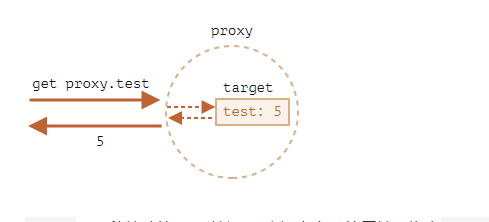

[TOC]
>[success] # 监听对象
1. 我们希望监听这个对象中的属性被设置或获取的过程，我们可以通过之前的属性描述符中的存储属性描述符来做 也就是利用 **Object.defineProperty**
2. 虽然**Object.defineProperty**能监听拦截属性变化，但是其本质是为了直接在一个对象上定义新的属性或修改现有属性，并且如果想让每个属性都要被监听到需要利用循环，甚至多层嵌套对象需要递归，如新增属性、删除属性也都不会触发到监听响应

~~~
const a = {
	name: 'w',
	age: 12,
}

Object.keys(a).forEach((key) => {
	let value = a[key]
	Object.defineProperty(a, key, {
		set(newVal) {
			console.log('拦截到')
			Object[key] = value
		},
		get() {
			console.log('get')
			return value
		},
	})
})

a.name = 12
~~~

>[success] # Proxy 使用
1.  ES6 增加了 **Proxy** 是真正意义上代理它可以监听一个对象的相关操作，然后创建一个对象的代理，之后对**该对象的所有操作**，都通过**代理对象来完成**，代理对象可以**监听我们想要对原对象进行哪些操作**
2.  **Proxy**进行拦截这个拦截实际是处理程序挂钩 JavaScript 的'**内部方法**'（关于内部方法可以查看代理和发射章节）
3. **new Proxy**对象，并且传入需要侦听的对象以及**一个处理对象**，可以称之为**handler** `const p = new Proxy(target, handler) `
3.1. **target**要使用 **Proxy** 包装的目标对象（可以是任何类型的对象，包括**原生数组，函数，甚至另一个代理**）
3.2. **handler** 一个通常以**函数作为属性的对象**，各属性中的**函数分别定义了在执行各种操作时代理 对象的行为**（即案例中的**p**对象）
3.3. **handler 作为拦截对象其中属性如下**，这里这是特意将**Reflect**做对比形成这种**key value形式方便对比**
~~~
proxy = new Proxy({}, {
  apply: Reflect.apply,
  construct: Reflect.construct,
  defineProperty: Reflect.defineProperty,
  getOwnPropertyDescriptor: Reflect.getOwnPropertyDescriptor,
  deleteProperty: Reflect.deleteProperty,
  getPrototypeOf: Reflect.getPrototypeOf,
  setPrototypeOf: Reflect.setPrototypeOf,
  isExtensible: Reflect.isExtensible,
  preventExtensions: Reflect.preventExtensions,
  get: Reflect.get,
  set: Reflect.set,
  has: Reflect.has,
  ownKeys: Reflect.ownKeys,
});
~~~

4. 总结：**Proxy**用于修改某些操作的默认行为，等同于在语言层面做出修改，所以属于一种“**元编程**”（meta programming），即对编程语言进行编程。**Proxy**可以理解成，在目标对象之前架设一层“**拦截**”，**外界对该对象的访问，都必须先通过这层拦截，因此提供了一种机制**，可以对外界的访问进行过滤和改写。
>[info] ## 代理和被代理对象关系
1. 当对象被代理时候，修改代理对象和被代理对象，如果没有代理配置的代理 即没有配置**trap** ，由于没有配置，所有操作proxy都转发到target，下面案例进行配置时候写入操作**proxy.test** 和读取**proxy.test** ，其实触发的都目标值'**target**'

* 如图

* 代码
~~~

let target = {}
let proxy = new Proxy(target, {}) // empty handler

proxy.test = 5
console.log(target.test) // 5
console.log(proxy.test) // 5

target.test = 10
console.log(target.test) // 10
console.log(proxy.test) // 10
~~~
2. 当代理对象配置了**trap**，对于对象上的大多数操作，在 JavaScript 规范中有一个所谓的“内部方法”，它描述了它在最底层的工作方式。例如\[\[ Get \]\] ，读取属性的内部方法，\[\[ Set \]\] ，写入属性的内部方法，等等。这些方法只在规范中使用，我们不能直接通过名称调用它们。通过proxy 去操作这些内部方法

* 虽然Proxy 代理了对象，但是配置**trap** 没有对代理对象拦截后在进行修改，就不会影响被代理对象数据，但实际情况都是会去更改被代理对象，往往是双向改变，下面案例就没有对拦截后的被代理对象修改因此二者看起来本质是不想关的，但如果 `target[key] = newValue
` 二者是相互的
~~~
const obj = {
	height: 1.88,
}

// 1.创建一个Proxy对象
const objProxy = new Proxy(obj, {
	set: function (target, key, newValue) {
		// console.log(`监听: 监听${key}的设置值: `, newValue)
		// 如果这里不跟目标对象做联动赋值 其改变代理对象不会影响被代理对象
		// target[key] = newValue
		return true
	},
	get: function (target, key) {
		// console.log(`监听: 监听${key}的获取`)
		return 1
	},
})

obj.age = 122
objProxy.age = 1555
console.log(objProxy.age) // 1
console.log(obj.age) // 122
obj.zzzz = 1000
console.log(objProxy.zzzz) // 1

~~~
>[info] ## 配置代理配置
~~~
1.配置其实就是针对'内置插槽' 进行代理配置
2.以set 案例做详细说明，犹豫proxy 中的代理陷阱参数本质和reflect 都是一一对应，对参数具体内容不做解释，只是对应
案例
~~~
* 对象代理配置
~~~
   const obj = {
      
      height: 1.88
    }

    // 1.创建一个Proxy对象
    const objProxy = new Proxy(obj, {
      set: function(target, key, newValue) {
        console.log(`监听: 监听${key}的设置值: `, newValue)
        target[key] = newValue
      },
      get: function(target, key) {
        console.log(`监听: 监听${key}的获取`)
        return target[key]
      },

      deleteProperty: function(target, key) {
        console.log(`监听: 监听删除${key}属性`)
        delete obj.name
      },

      has: function(target, key) {
        console.log(`监听: 监听in判断 ${key}属性`)
        return key in target
      }
    })
~~~
* 函数代理配置
~~~

    function foo(num1, num2) {
      console.log(this, num1, num2)
    }

    const fooProxy = new Proxy(foo, {
      apply: function(target, thisArg, otherArgs) {
        console.log("监听执行了apply操作")
        target.apply(thisArg, otherArgs)
      },
      construct: function(target, otherArray) {
        console.log("监听执行了new操作")
        console.log(target, otherArray)
        return new target(...otherArray)
      }
    })

    // fooProxy.apply("abc", [111, 222])
    new fooProxy("aaa", "bbb")
~~~
>[danger] ##### set
~~~
1.const p = new Proxy(target, {
  set: function(target, property, value, receiver) {
  }
});
 1.1.target– 是目标对象，作为第一个参数传递给的对象new Proxy，
 1.2.property– 属性名称，
 1.3.value- 设置的值
 1.4.receiver– 设置值的this指向，receiver就是this在它的调用中使用的对象。通常这是proxy对象本身

2.通过下面案例可以发现 代理陷阱种 set方法需要有返回值，如果是true则表示赋值成功，Reflect.set 接受的
参数和代理陷阱中set 参数一样，而且返回值是boolean 其实proxy 的代理陷阱和 reflect 是配套

new Proxy(numbers, {
    // (*)
    set(target, prop, val) {
        // to intercept property writing
        if (typeof val == 'number') {
            return Reflect.set(target, prop, val) // Reflect.set(...arguments);
        } else {
            return false
        }
    },
})
~~~
* 案例
~~~
let numbers = []

let pNumbers = new Proxy(numbers, {
    // (*)
    set(target, prop, val) {
        // to intercept property writing
        if (typeof val == 'number') {
            target[prop] = val
            return true
        } else {
            return false
        }
    },
})

pNumbers.push(1)
pNumbers.push(2)
console.log(numbers) // [ 1, 2 ]
console.log(pNumbers) // [ 1, 2 ]
pNumbers.push('1') // 添加失败
~~~
>[danger] ##### get
~~~
1.拦截是获取属性值其中
 1.1.访问属性: proxy[foo]和 proxy.bar
 1.2.Reflect.get()
~~~
~~~
let numbers = [0, 1, 2]

numbers = new Proxy(numbers, {
    get(target, prop, receiver) {
        if (prop in target) {
            return Reflect.get(target, prop, receiver) // Reflect.get(...arguments);
        } else {
            return 0 // default value
        }
    },
})
console.log(numbers[1]) // 1
console.log(numbers[100]) // 0
~~~
>[danger] ##### has
~~~
1.has 陷阱拦截 是in ，但是不是for in ，像下面案例只拦截是Proxy 对象
~~~
~~~
var obj = { a: 10 }
var p = new Proxy(obj, {
    has: function (target, key) {
        if (key === 'a') return false
        return Reflect.set(target, key)
    },
})

console.log('a' in p) // false
console.log('a' in obj) // true

for (let key in p) { 
    console.log(key) // a
}

~~~
>[danger] ##### deleteProperty
~~~
1.deleteProperty 拦截 是 delete
~~~
~~~
var obj = { a: 10, b: 10 }
var p = new Proxy(obj, {
    deleteProperty: function (target, key) {
        if (key === 'a') return false
        return Reflect.deleteProperty(target, key)
    },
})
// 因为设置deleteProperty 所以不能删除

delete p.a
console.log(p) // { a: 10, b: 10 }

console.log(obj) // { a: 10, b: 10 }

// 只是给proxy 做了设置因此目标对象还是可以删除
delete obj.a
console.log(p) // { b: 10 }
console.log(obj) // { b: 10 }
~~~
>[danger] ##### getPrototypeOf
~~~
1.是对'[[GetPrototypeOf]]' 的拦截，其中有五种形式都可以对其触发
  1.1.Object.getPrototypeOf()
  1.2.Reflect.getPrototypeOf()
  1.3.__proto__
  1.4.Object.prototype.isPrototypeOf()
  1.5.instanceof
~~~
~~~
var obj = {};
var p = new Proxy(obj, {
    getPrototypeOf(target) {
        return Array.prototype;
    }
});
console.log(
    Object.getPrototypeOf(p) === Array.prototype,  // true
    Reflect.getPrototypeOf(p) === Array.prototype, // true
    p.__proto__ === Array.prototype,               // true
    Array.prototype.isPrototypeOf(p),              // true
    p instanceof Array                             // true
);
~~~
>[danger] ##### setPrototypeOf
~~~
1.可以拦截方法
 1.1.Object.setPrototypeOf()
 1.2.Reflect.setPrototypeOf()
2.可以用了禁止更改对象的原型
~~~
~~~
var p = new Proxy(
    {},
    {
        setPrototypeOf: function (target, prototype) {
            return false
        },
    }
)
Object.setPrototypeOf(p1, Array.prototype) // throws a TypeError
Reflect.setPrototypeOf(p1, Array.prototype) // returns false
~~~

>[danger] ##### 标记文章
https://www.digitalocean.com/community/tutorials/js-proxy-traps
https://blog.sessionstack.com/how-javascript-works-proxy-and-reflect-11748452c695
https://www.keithcirkel.co.uk/metaprogramming-in-es6-part-3-proxies/
https://blog.greenroots.info/metaprogramming-an-introduction-to-javascriptes6-proxy
https://javascript.info/proxy#proxy
https://es6.ruanyifeng.com/#docs/proxy
https://developer.mozilla.org/zh-CN/docs/Web/JavaScript/Reference/Global_Objects/Proxy/Proxy/ownKeys

* # reflect-metadata
https://www.jianshu.com/p/8fffb94b9978
https://juejin.cn/post/7060687817097084935#heading-0
https://medium.com/jspoint/introduction-to-reflect-metadata-package-and-its-ecmascript-proposal-8798405d7d88