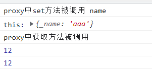
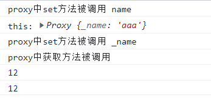

>[success] # Proxy 和 Reflect 结合使用
1. Proxy 劫持对象类似set这类配置项，方法应当返回一个布尔值，返回`true`代表属性设置成功，Reflect 调用set 方法是自带返回值成功`true `失败 `false`
~~~
const obj = {
	age: 18,
}

const objProxy = new Proxy(obj, {
	set: function (target, key, newValue, receiver) {
		// target[key] = newValue // 采用传统形式 没有异常返回失败返回值
		// Reflect.set方法有返回Boolean值, 可以判断本次操作是否成功
		return Reflect.set(target, key, newValue)
	},
	get: function (target, key, receiver) {},
})
~~~
2. `Reflect ` 和 `Proxy  的劫持对象设置参数` 参数都是一一对应，并且其中`Reflect.get(target, propertyKey[, receiver])`,`Reflect.set(target, propertyKey, value[, receiver])` 对应`proxy` 中的`handler.get(target, property, receiver)`，`handler.set(target, property, value, receiver)`,其中二者中`receiver` 要做特别说明，在`Reflect`调用`get` 和`set`时候如果`target` 即目标对象具有`getter `和`setter` ，参数`receiver` 可以决定他们**this**指向的的`receiver`如果我们的源对象（obj）有setter、getter的访问器属性，那么可以通过receiver来改变里面的**this**

* 举个例子，下面**obj**  是一个具备`getter `和`setter` 的对象，通过**Reflect.set 去指定了receiver 后**此时setter 中的**this**指向了**receiver 参数代表的对象obj1**，如果没有指定的话`getter `和`setter` 的**对象中this指向的是其target**即下面案例中的**obj**
~~~
const obj = {
	_name: 'aaa',
	set name(newValue) {
		console.log('this:', this) // this: {_name: 'bbb'}
		this._name = newValue
	},
	get name() {
		return this._name
	},
}

const obj1 = {
	_name: 'bbb',
}

Reflect.set(obj, 'name', '更新', obj1)
console.log(obj1._name) // 更新
console.log(obj._name) // aaa
~~~

* **额外补充说明**，属性想被 proxy 劫持，需要proxy 生成的代理对象调用后才能触发
~~~
const obj1 = {
	name: 'bbb',
}

const proxyObj = new Proxy(obj1, {
	get(target, key, receiver) {
		console.log('触发')
		return Reflect.get(target, key)
	},
})

obj1.name // 不会触发代理对象中get 劫持
proxyObj.name // 会触发
~~~
* 使用 Proxy 和 Reflect 配合使用并且代理对象中有`getter`和`setter`没有绑定**receiver**，下面案例中，当进触发了`getter`和`setter`中 **this**是其本身即**this._name = newValue** 调用 可看作是**obj ._name = newValue**上面说过不是代理对象调用是不会触发劫持，因此**set **只触发一次
~~~
const obj = {
	_name: 'aaa',
	set name(newValue) {
		console.log('this:', this)
		this._name = newValue
	},
	get name() {
		return this._name
	},
}

const objProxy = new Proxy(obj, {
	set: function (target, key, newValue, receiver) {
		console.log('proxy中set方法被调用', key)
		return Reflect.set(target, key, newValue)
	},
	get: function (target, key, receiver) {
		console.log('proxy中获取方法被调用')
		return Reflect.get(target, key)
	},
})
objProxy.name = 12
// objProxy._name = 18
console.log(objProxy._name)

console.log(obj._name)
~~~
* 没绑定时候set 只触发一次因为 没有触发代理对象中的劫持
 
* 如果你期望代理对象中`getter`和`setter` 中的this 也要进入代理对象劫持，就需要使用**receiver**，大部分情况下Proxy的`handler.get(target, property, receiver)`，`handler.set(target, property, value, receiver)`的**receiver** 都是代理对象，在利用**Reflect** 去传递 就可以做到拦截到`getter`和`setter` 中的拦截触发
~~~
const obj = {
	_name: 'aaa',
	set name(newValue) {
		console.log('this:', this)
		this._name = newValue
	},
	get name() {
		return this._name
	},
}

const objProxy = new Proxy(obj, {
	set: function (target, key, newValue, receiver) {
		console.log('proxy中set方法被调用', key)
		return Reflect.set(target, key, newValue, receiver)
	},
	get: function (target, key, receiver) {
		console.log('proxy中获取方法被调用')
		return Reflect.get(target, key, receiver)
	},
})
objProxy.name = 12
// objProxy._name = 18
console.log(objProxy._name)

console.log(obj._name)
~~~
* 当使用了get 和 set 时候 在使用代理利用**receiver** 后此时 set 会触发两次，如下此时this 是代理对象**this._name** 会再次触发代理对象因此set 会触发两次
~~~
set name(newValue) {
	console.log('this:', this) // 代理对象
	this._name = newValue
}
~~~

>[danger] ##### 说明
https://developer.mozilla.org/zh-CN/docs/Web/JavaScript/Reference/Global_Objects/Proxy/Proxy/set
最初被调用的对象。通常是 proxy 本身，但 handler 的 set 方法也有可能在原型链上，或以其他方式被间接地调用（因此不一定是 proxy 本身）。

**备注：** 假设有一段代码执行`obj.name = "jen"`，`obj`不是一个 proxy，且自身不含`name`属性，但是它的原型链上有一个 proxy，那么，那个 proxy 的`set()`处理器会被调用，而此时，`obj`会作为 receiver 参数传进来。

>[info] ## 标记
https://juejin.cn/post/7080916820353351688 需要再看这个文章在思考一下