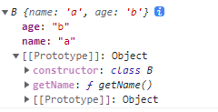

[TOC]
>[success] # Reflect 使用
~~~
1.Object.getOwnPropertyNames(Reflect) 获取到'Reflect' 上的属性，因为这些属性都是
不可枚举的因此没有使用'Object.keys' 来获取，一共获取了13个静态方法
['defineProperty', 'deleteProperty', 'apply', 'construct', 'get', 'getOwnPropertyDescriptor', 'getPrototypeOf', 'has', 'isExtensible', 'ownKeys', 'preventExtensions', 'set', 'setPrototypeOf']

2.十三个静态方法具体使用规则
Reflect.apply(target, thisArg, args)
Reflect.construct(target, args)
Reflect.get(target, name, receiver)
Reflect.set(target, name, value, receiver)
Reflect.defineProperty(target, name, desc)
Reflect.deleteProperty(target, name)
Reflect.has(target, name)
Reflect.ownKeys(target)
Reflect.isExtensible(target)
Reflect.preventExtensions(target)
Reflect.getOwnPropertyDescriptor(target, name)
Reflect.getPrototypeOf(target)
Reflect.setPrototypeOf(target, prototype)
~~~
>[danger] ##### 为什么要有Reflect
1. 这是因为在早期的ECMA规范中没有考虑到这种对 对象本身 的操作如何设计会更加规范，所以将这些API放到了Object上面
2. 是Object作为一个构造函数，这些操作实际上放到它身上并不合适
3. 还包含一些类似于 in、delete操作符，让JS看起来是会有一些奇怪的
4. 在ES6中新增了Reflect，让我们这些操作都集中到了Reflect对象上
>[danger] ##### Reflect.apply -- 函数内置插槽
~~~
1.Reflect.apply 实际对应'[[call]]' 这个内部插槽，他的用法等同于es5时期'Function.prototype.apply.call',
本意是如果自定义的function 的apply方法被重写，那么可以采用使用'Function.prototype.apply.call'的形式
来实现自定义function触发的是未被重写时候的'apply' 方法，首先需要拆分理解一下'Function.prototype.apply.call'
为什么等同函数自己调用'apply', 'apply(thisArg, [argsArray])' 接受两个参数分别是'函数运行时使用的 this 值',
和'传给参数的函数但需要是数组'，'call' 与之不同点是他'传给函数参数需要拆分'，那此时'Function.prototype.apply'
是一个整体但这个函数需要两个参数，此时call 传递给函数参数位置即确定为apply需要的参数，
call('-------' ,指向函数的this,和函数参数数组),此时是'Function.prototype.apply'调用想让指定到我们自定义函数
此时就需要对call的第一个参数this 去指定call(自定义函数this ,apply指向函数的this,apply函数参数数组)
整体就变成了'自定义函数.apply(apply函数this,参数)'

2.es5 那种绕的写法，对比'Reflect.apply'做的是同样事相对就更容易理解 ，'Reflect.apply(target, thisArg, args)'
即'target目标函数','thisArg target函数调用时绑定的this对象','args target函数调用时传入参数是个数组'

3.如果参数列表为null或undefined，即下面'getName.apply 第二个参数'和'Reflect.apply' 第三个参数，其中
'Reflect.apply' 会报错，如下。
getName.apply(null, null) // 正常执行
Reflect.apply(getName, null, null) // TypeError 异常
Reflect.apply(getName, null, "") // TypeError 异常
Reflect.apply(getName, null) // TypeError 异常
但目标函数确实没有参数使用'Reflect.apply' 需要Reflect.apply(getName, null, {})/Reflect.apply(getName, null, [])  来解决

~~~
* 案例说明
~~~

const obj = { f: 'w' }

var f = 'windows'
function getName(age) {
    console.log(age, this.f)
}

getName(12)
getName.apply(obj, [12])
Reflect.apply(getName, null, [12])
Reflect.apply(getName, obj, [12])
Function.prototype.apply.call(getName, obj, [12])
// 打印结果
12 'windows'
12 'w'
12 'windows'
12 'w'
12 'w'
~~~
>[danger] ##### Reflect.construct -- 函数内置插槽
~~~
1.'Reflect.construct(target, argumentsList, [, newTarget])'
  1.1.target- 代表目标构造函数的第一个参数
  1.2.argumentsList- 第二个参数，代表目标构造函数的参数，类数组格式
  1.3.newTarget- 作为新创建对象的原型对象的constructor属性，可以选不填默认是target。

2.对应的内部插槽'[[constructor]]',等同于'var obj = new Foo(...args)'

3.和'Reflect.apply' 一样如果不需要对目标函数传参那么需要传一个空对象，否则报错
Reflect.constructor(target, null) // TypeError 异常
Reflect.constructor(target) // TypeError 异常
Reflect.constructor(target, {}) // 不传参
Reflect.constructor(target, []) // 不传参

4.案例二可以看出当使用了第三个参数可以改变对象，[[Prototype]] 指向即改变'__proto__',此时创建
出来的对象构造函数指向了第三个参数，等同于之前

// 生成一个对象[[Prototype]] 指向指向OtherClass.prototype
var obj2 = Object.create(OtherClass.prototype);
// 将target函数this 指向新对象的
OneClass.apply(obj2, args);
只是这种创建其实'OneClass.apply' 激活的是内部插槽'[[Call]]' 只是将this 从windows 指向了我们期望的对象
上，虽然效果一样但是这种创建的'new.target' 为undefined
~~~
* 案例
~~~

class A {
    constructor(age) {
        this.age = age
    }
    getAge() {
        return this.ages
    }
}
const newA = new A(...[10]) // 因为Reflect 第二个参数是伪数组所以为了使用new 更接近使用数组结构
const reflectA = Reflect.construct(A, [10])
~~~
* 改变生成对象原型链指向
~~~
class A {
    name = 'a'
    age = 'b'
    getAge() {}
}

class B {
    zz = 12
    getName() {}
}

const b = Reflect.construct(A, {}, B)
console.log(b instanceof A) // false
console.log(b instanceof B) // true
~~~
* 如图

>[danger] ##### Reflect.defineProperty 
~~~
1.'Reflect.defineProperty(target, propertyKey, attributes)' 使用的内部插槽'[[DefineOwnProperty]]'
  1.1.target目标对象。
  1.2.propertyKey要定义或修改的属性的名称。
  1.3.attributes要定义或修改的属性的描述。
2.等同于'Object.defineProperty(obj, prop, descriptor)',二者不同点Reflect方法返回布尔值 true（成功）/false（失败）
Object返回的是目标对象
 ~~~
* 案例
~~~
function MyDate() {
  /*…*/
}

// 旧写法
Object.defineProperty(MyDate, 'now', {
  value: () => Date.now()
});

// 新写法
Reflect.defineProperty(MyDate, 'now', {
  value: () => Date.now()
});
~~~
>[danger] ##### Reflect.deleteProperty
~~~
1.对应的内部插槽'[[Delete]]' 方法等同于delete obj[name]，用于删除对象的属性,方法的第一个参数不是对象，会报错
'Reflect.deleteProperty(target, propertyKey)'
~~~
~~~
var obj = { x: 1, y: 2 };
Reflect.deleteProperty(obj, "x"); // true
obj; // { y: 2 }

var arr = [1, 2, 3, 4, 5];
Reflect.deleteProperty(arr, "3"); // true
arr; // [1, 2, 3, , 5]

// 如果属性不存在，返回 true
Reflect.deleteProperty({}, "foo"); // true

// 如果属性不可配置，返回 false
Reflect.deleteProperty(Object.freeze({foo: 1}), "foo"); // false

~~~
>[danger] ##### Reflect.has
~~~
1.Reflect.has方法检查target对象或其原型上的propertyKey属性是否存在。这与in操作符完全相同。如果找到属性，
则返回true，否则返回false,对应内部插槽'[[HasProperty]]'
~~~
* 案例
~~~
'assign' in Object // true

// 新写法
Reflect.has(Object, 'assign') // true
~~~
>[danger] ##### Reflect.ownKeys
~~~
1.'Reflect.ownKeys' 使用的内部插槽 '[[OwnPropertyKeys]]' ,方法返回一个由目标对象自身的属性键组成的数组。
它的返回值等同于Object.getOwnPropertyNames(target).concat(Object.getOwnPropertySymbols(target))。
即自身所有属性(包含可枚举不可枚举和symbol 属性)
~~~
* 案例
~~~

const sy = Symbol('a')

class A {
    name = 123;
    [sy] = 145
    getName() {}
}

class B extends A {}
const b = new B()

// 打印结果
[ 'name', 'sy' ]

~~~
>[danger] ##### Reflect.preventExtensions
~~~
1.'Reflect.preventExtensions(target)' target 必须是一个对象如果是非对象会异常报错，对应的内部插
槽'[[PreventExtensions]]'，让对象方法不可以进行扩展，返回一个 Boolean 值表明目标对象是否成功被设置为不可扩展
2.对应的方法，Object.preventExtensions() 方法， 不同点是它对非对象的 target 参数将被强制转换为对象。
~~~
* 案例
~~~
const aa = { name: 1 }
Reflect.preventExtensions(aa)
aa.age = 1
aa.name = 2
// 打印结果
{name:2} // age 属性并没有被添加进去
~~~
>[danger] ##### Reflect.isExtensible
~~~
1.'Reflect.isExtensible(target)' target 必须是一个对象如果是非对象会异常报错，对应的内部插
槽'[[IsExtensible]]'，检查对象是否可以进行扩展，返回一个 Boolean 值表明目标对象是否可扩展
2.对应的方法，Object.isExtensible() 方法， 不同点是它对非对象的 target 参数将被强制转换为对象。
~~~
* 案例
~~~
const aa = { name: 1 }
Reflect.preventExtensions(aa)
console.log(Reflect.isExtensible(aa)) // false
~~~
>[danger] ##### Reflect.getOwnPropertyDescriptor
~~~
1.'Reflect.getOwnPropertyDescriptor(target, propertyKey)'trget 必须是一个对象如果是非对象会异常报错，对应的内部插
槽'[[GetOwnProperty]]',返回属性的描述符，并且方法返回目标对象的非继承属性的属性描述符即非'[[Prototype]](__proto)'
上的属性
2.对应的方法，Object.getOwnPropertyDescriptor() 方法， 不同点是它对非对象的 target 参数将被强制转换为对象。
~~~

* 案例
~~~
Reflect.getOwnPropertyDescriptor({x: "hello"}, "x");
// {value: "hello", writable: true, enumerable: true, configurable: true}

Reflect.getOwnPropertyDescriptor({x: "hello"}, "y");
// undefined

Reflect.getOwnPropertyDescriptor([], "length");
// {value: 0, writable: true, enumerable: false, configurable: false}

// ------------------------------ 非继承属性 ---------------------------------------
const sy = Symbol('a')

class A {
    name = 123;
    [sy] = 145
    getName() {}
}

class B extends A {
    getAge() {}
}
const b = new B()
console.log(Reflect.getOwnPropertyDescriptor(b, 'getName'))
console.log(Reflect.getOwnPropertyDescriptor(b, 'getAge'))
console.log(Reflect.getOwnPropertyDescriptor(b, 'name'))

// // 打印结果：
// undefined
// undefined
// { value: 123, writable: true, enumerable: true, configurable: true }
~~~
>[danger] ##### Reflect.getPrototypeOf
~~~
1.静态方法 Reflect.getPrototypeOf(target) 与 Object.getPrototypeOf() 方法几乎是一样的。都是返回指定对象的原型
（即内部的 [[Prototype]] 属性的值）。如果目标没有原型，则返回null。Reflect 要求target 必须是对象，Object则不用
会自动进行拆箱转换
~~~
* 案例
~~~
Reflect.getPrototypeOf( null) // TypeError: Reflect.getPrototypeOf called on non-object

Reflect.getPrototypeOf( 'hello') // TypeError: Reflect.getPrototypeOf called on non-object

Reflect.getPrototypeOf( {})  // Object {constructor: Object(), __defineGetter__: ƒ, …} 
~~~
>[danger] ##### Reflect.setPrototypeOf
~~~
1.'Reflect.setPrototypeOf(target, prototype)',返回一个 Boolean 值表明是否原型已经成功设置,内部的 [[Prototype]] 属性值
对应' Object.setPrototypeOf() '
~~~
* 案例
~~~
const object1 = {};

console.log(Reflect.setPrototypeOf(object1, Object.prototype));
// expected output: true

console.log(Reflect.setPrototypeOf(object1, null));
// expected output: true

const object2 = {};

console.log(Reflect.setPrototypeOf(Object.freeze(object2), null));
// expected output: false
~~~
>[danger] ##### Reflect.get(target, name, receiver)
~~~
1.'Reflect.get(target, propertyKey, [, receiver])'方法与从 对象 (target[propertyKey]) 中读取属性类似，但它是通过一
个函数执行来操作的。如果具有名称propertyKey的属性是中的getter函数，则receiver参数则被当做 this。
如果缺少receiver，则this是target，注意案例二这类改变this 只能是getter函数的

2.调用 reflect.get() 类似于 target[propertykey] 表达式，因为它也搜索 target 原型上的属性值。如果目标上不存在属性，
则返回 undefined。

~~~
* 案例 1 
~~~
var computer1 = {
    processor: "Intel",
    brand: "Dell",
    operatingSystem: "windows 7"
};

console.log(computer1);
Reflect.get(computer1, "processor"); // computer1.processor 等同
console.log(computer1.processor);
~~~
* 案例二
~~~
const dinoComputer = {
    processor: "Intel",
    brand: "Dell",
    operatingSystem: "windows 7"
};

Reflect.defineProperty(dinoComputer, "computerDetails", {
    get: function() { 
        return new String().concat(`*********Computer Details********\r\n`,
                                   `****Processor: ${this.processor}***********\r\n`,
                                   `****Brand: ${this.brand}*****************\r\n`,
                                   `****Operating System: ${this.operatingSystem}*\r\n`);
    }
});

console.log(dinoComputer);

let oldComputer = Reflect.get(dinoComputer, "computerDetails", 
{ processor: "AMD K62", 
  brand: "Clone", 
  operatingSystem: "Windows XP" });

console.log(oldComputer);
~~~
>[danger] ##### Reflect.set
~~~
1.'Reflect.set(target, propertyKey, value[, receiver])' 等同于'target[propertyKey] = value'
~~~
>[info] ## 参考文章
[JavaScript Reflection and Reflect API
](https://www.codeproject.com/Articles/5275933/JavaScript-Reflection-and-Reflect-API#get)
[【译】JavaScript元编程之——Reflect API简介
](https://juejin.cn/post/7060056954130923528#heading-17)
[Metaprogramming in ES6: Part 2 - Reflect](https://www.keithcirkel.co.uk/metaprogramming-in-es6-part-2-reflect/)
