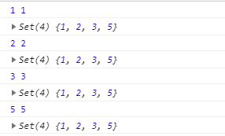

[TOC]
>[success] # Set -- 存储任何类型的唯一值

~~~
1. Set 对象允许你存储任何类型的唯一值，无论是原始值或者是对象引用。
2. Set对象是值的集合，你可以按照插入的顺序迭代它的元素。 Set中的元素
只会出现一次，即 Set 中的元素是唯一的.
3.原理：Set 的内部比较使用的是'Object.is'，所以是可以判断类型的也就是说
即使存储的值是NaN，但是要注意的'Object.is' 是区分'+0'和'-0',但在'set' 是不区分的
~~~
>[info] ## Set 使用
~~~
1.'Set' 是构造函数，因此创建的时候需要'new' 一个实例
~~~
>[danger] ##### 创建Set并添加值
* 第一种使用add 方法添加
~~~
1.下面案例解释'key'和'key1'的疑惑即使向key 和 key1 他们赋值虽然都是'{}'
但要注意他们的内存地址是不一样，因此其实两个是就好比是双胞胎看起来
一样实际是两个人
2.通过add 两次'key1' 最后结果只有一个'key1'可以看出'Set' 具有去重的效果（数组和字符串）
3.用下面的key 或者key1 放入set ，set不会释放掉key，所以当使用完想完全
释放可能需要将key = null 也可以用下面的WeakSet，会自动释放
~~~
~~~
const key = {}
const key1 = {}
console.log(Object.is(key,key1)) // false
const set = new Set()
set.add('5')
set.add(5)
set.add(key)
set.add(key1)
set.add(key1)
console.log(set) // Set {"5", 5,{},{}}
~~~
* 通过构造函数传值赋值
~~~
1.'Set' 的构造函数可以接受所有可迭代对象作为参数例如，'数组'、'set集合'、'Map集合'，正是因为是
可迭代对象因此普通的Object 是不能作为构造函数传值赋值，可以使用'Object.entries' 将对象转换成
可迭代对象
~~~
~~~
// 数组
const array = [1,1,2,3,5]
const set = new Set(array)

// Set 集合
const set1 = new Set(set)

// Map 对象
const map = new Map()
map.set("name",'wang')
map.set("age",'17')
const set2 = new Set(map)

console.log(set,set1,set2)
// 打印结果：
Set(4) {1, 2, 3, 5} 
Set(4) {1, 2, 3, 5} 
Set(2) {["name","wang"], ["age","17"]}

// 用Object.entries转换对象为可迭代对象
const set = new Set(Object.entries({name:'w',age:16}))  
console.log(set)
~~~
>[danger] ##### 获取集合Set 长度 -- size
~~~
// 数组
const array = [1,1,2,3,5]
const set = new Set(array)

console.log(set.size) // 4
~~~
>[danger] ##### 判断当前值是否存在集合/删除集合中的元素 -- has/delets、clear
~~~
// 数组
const array = [1,1,2,3,5]
const set = new Set(array)
console.log(set.has(1)) // true
set.delete(1)
console.log(set.has(1)) // false

// 全部删除
set.clear()
console.log(set.has(2))// false
~~~
>[danger] ##### 遍历操作
~~~
1.这里要注意下，由于 Set 结构没有键名，只有键值（或者说键名和键值是同一个值）
，所以keys方法和values方法的行为完全一致
2.下面案例的第一个循环'set' 实例，虽然set 的keys 和 values 是一样的但是，其中循环
set实例打印打的其实是'values' 也就是说循环实例 和循环 values 是一样的
    Set.prototype.keys()：返回键名的遍历器
    Set.prototype.values()：返回键值的遍历器
    Set.prototype.entries()：返回键值对的遍历器
    Set.prototype.forEach()：使用回调函数遍历每个成员
~~~
~~~
// 数组
const array = [1,1,2,3,5]
const set = new Set(array)

console.log(set.values()) // SetIterator {1, 2, 3, 5}
console.log(set.keys()) // SetIterator {1, 2, 3, 5}
console.log(set.entries()) // SetIterator {1 => 1, 2 => 2, 3 => 3, 5 => 5}

for (let item of set) {
    console.log(item);
}
for (let item of set.values()) {
    console.log(item);
}
for (let item of set.keys()) {
    console.log(item);
}

for(let item of set.entries()){
    console.log(item)
}

// 打印结果前三个循环结果是一样的：
1
2
3
5
// 最后一个循环结果：
 [1, 1]
 [2, 2]
 [3, 3]
 [5, 5]
~~~
>[danger] ##### 使用forEach
~~~
1.'Set' 和数组一样也可以使用'forEach',也是回调接受三个参数分别是：
    1.1.元素的值
    1.2.元素的索引
    1.3.正在遍历的集合对象
2.对上面要解释一下其中1.1 和 1.2 由于集合对象中没有索引(keys)，
所以前两个参数都是Set中元素的值(values)
~~~
~~~
// 数组
const array = [1,1,2,3,5]
const set = new Set(array)

set.forEach((key,value,currentObj)=>{
    console.log(key,value)
    console.log(currentObj)
})
~~~
* 打印结果

>[danger] ##### Set 不能像数组一样通过脚标取值
~~~
1.集合对象中没有索引，因此不能像数组一样脚标取值
~~~
>[danger] ##### 通过转换成数组解决上面的问题
~~~
// 数组
const array = [1,1,2,3,5]
const set = new Set(array)
      setArray = [...set]
      setArray1 = [...new Set(array)]
console.log(setArray,setArray1) // [1,2,3,5]
~~~
>[danger] ##### 并集（Union）、交集（Intersect）和差集（Difference）**

~~~
let a = new Set([1, 2, 3]);
let b = new Set([4, 3, 2]);

// 并集
let union = new Set([...a, ...b]);
// Set {1, 2, 3, 4}

// 交集
let intersect = new Set([...a].filter(x => b.has(x)));
// set {2, 3}

// 差集
let difference = new Set([...a].filter(x => !b.has(x)));
// Set {1}
~~~
>[info]## WeakSet
~~~
1.WeakSet 和Set 不同只有以下方法：
    WeakSet.prototype.add(value)：向 WeakSet 实例添加一个新成员。
    WeakSet.prototype.delete(value)：清除 WeakSet 实例的指定成员。
    WeakSet.prototype.has(value)：返回一个布尔值，表示某个值是否在

2.也就是说WeakSet  不能循环 没有keys 和 values 属性，因为WeakSet只是对对象的弱引用，
如果我们遍历获取到其中的元素，那么有可能造成对象不能正常的销毁

3.WeakSet 的成员只能是对象，而不能是其他类型的值

4.WeakSet 对象中存储的对象值都是被弱引用的, 如果没有其他的变量或属性
引用这个对象值, 则这个对象值会被当成垃圾回收掉. 正因为这样, WeakSet 
对象是无法被枚举的, 没有办法拿到它包含的所有元素.
~~~
>[danger] ##### 创建一个WeakSet
* WeakSet 的成员只能是对象，而不能是其他类型的值
~~~
const ws = new WeakSet();
ws.add(1)
// TypeError: Invalid value used in weak set
ws.add(Symbol())
// TypeError: invalid value used in weak set
~~~
* 正常创建
~~~
const a = [[1, 2], [3, 4]];
const ws = new WeakSet(a);
// WeakSet {[1, 2], [3, 4]}
~~~
>[danger] ##### set 当然也可以链式
~~~
const s = new Set()

s.add(1).add(2).add(3).add(4).add(2)
~~~

