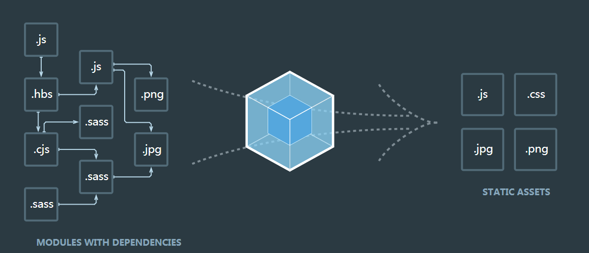

[TOC]

>[success] #  常见的静态资源
~~~
1.JS：    .js  .jsx  .coffee  .ts（TypeScript  类 C# 语言）
2.CSS：    css  .less   .sass  .scss
3.Images：.jpg   .png   .gif   .bmp   .svg
4.Fonts:   .svg   .ttf   .eot   .woff   .woff2
5.模板文件: .ejs   .jade  .vue【这是在webpack中定义组件的方式，推荐这么用】
~~~
>[success] # 网页中静态资源过多问题
~~~
1. 网页加载速度慢， 因为 我们要发起很多的二次请求；
2. 要处理错综复杂的依赖关系
~~~
>[success] # 解决资源过多
~~~
1. 合并、压缩、精灵图、图片的Base64编码
2. 可以使用requireJS、也可以使用webpack可以解决各个包之间的复杂依赖关系；
~~~
>[success] # 什么是 -- webPack 
* 根据官网图片最简单的理解就是将各种依赖文件最后分为四大块

~~~
1.webpack的理念就是一切皆模块化，把一堆的css文件和js文件放在一个总的
入口文件，通过require引入，剩下的事情webpack会处理，包括所有模块的
前后依赖关系，打包、压缩、合并成一个js文件，公共代码抽离成一个js文
件、某些自己指定的js单独打包，模块可以是css/js/imsge/font等等
2.WebPack可以看做是模块打包机：它做的事情是，分析你的项目结构，找
到JavaScript模块以及其它的一些浏览器不能直接运行的拓展语言（Scss，
TypeScript等），并将其转换和打包为合适的格式供浏览器使用
~~~
>[success] # webpack的基本能力：处理依赖、模块化、打包
~~~
1.依赖管理：方便引用第三方模块，让模块更容易复用、避免全局注入导致的
冲突、避免重复加载或者加载不必要的模块
2.合并代码：把各个分散的模块集中打包成大文件，减少HTTP的链接的请求
次数，配合uglify.js可以减少、优化代码的体积
3.各种插件：babel把ES6+转化为ES5-，eslint可以检查编译时的各种错误
~~~
>[success] # 和之前比有了他的好处
~~~
以前操作：index.html里面有一大堆的css和js文件，如a.js   b.js     c.js等等
（1）a.js要用到b.js里面的一个函数，则a.js要放在b.js后面
（2）c.js要用到a.js里面的一个函数，则c.js要放在a.js后面
（3）b.js又要用到某个js文件里面的函数，则b.js就要放在其后面
如果有N多个js文件，需要手动处理他们的关系，即容易出错。

使用webPack:
1.webpack的理念就是一切皆模块化，把一堆的css文件和js文件放在一个总
的入口文件，通过require引入，剩下的事情webpack会处理，包括所有模块
的前后依赖关系，打包、压缩、合并成一个js文件，公共代码抽离成一个js
文件、某些自己指定的js单独打包，模块可以是css/js/imsge/font等等。
~~~
>[success] # 简单的总结
~~~
1.以前我们会引入大量的js，css，一些src路径请求，当我们使用webpack后
，可以把这些全部统一压缩，减少服务器的请求
2.我们可以利用webpack的模块化开发，让前端也可以进行模块化开发
3.随着JavaScript开发变得越来越复杂，依赖项管理也变得越来越麻烦。重构也会受到损害:为了保持负载链的正确顺序，我们要思考新的依赖应该怎么
储存起来
~~~
 