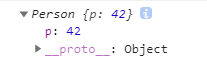
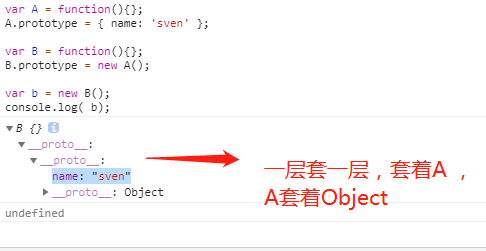

>[info] ## Js 中的原型继承
~~~
1.自定义函数时（箭头函数除外）也会默认生成，生成的显式原型对象只有一个属性 constructor ，
该属性指向函数自身。通常配合 new 关键字一起使用
2.这里解释一下'prototype(显式原型)'、"__proto__(隐式原型)"
 2.1.'prototype' 是函数的属性，指向该构造函数的原型对象,首先函数也是一个对象，因此函数也可以定义属性
    像第一条说的除了箭头函数，其他的函数都会默认生成一个显示原型对象，也就是key 为'prototype',并且对
    应的value 是一个对象，这个对象默认包含一个constructor 属性指向的是函数自身
  2.2.'__proto__'是对象的属性，指向该对象的构造函数的原型对象,这个是浏览器厂商提出的下面有具体解释
3.'prototype'放公用属性方法，'__proto__'告诉你可以去那里找公用属性和方法
~~~
* 2.1 说明
~~~
function test(){}
Object.getOwnPropertyNames(test)
// 打印结果
["length", "name", "arguments", "caller", "prototype"]
~~~
~~~
function fn() {} 
fn.prototype.constructor === fn // true
~~~
* 一下内容来源 javasprict 设计模式与开发实践
~~~
1.js 是通过原型链相互继承的，因此需要遵守以下规则：
 1.1 所有的数据都是对象
 1.2 要得到一个对象，不是通过实例化类，而是找到一个对象作为原型并克隆他
 1.3 对象会记住它的原型
 1.4 如果对象无法响应某个请求，它会把这个请求委托给它自己的原型
~~~
>[danger] ##### 解释 --  所有的数据都是对象
~~~
1.在js 中这句话不是完全对的，除了undefined ，所有数据都是对象
~~~
>[danger] ##### 解释 --  要得到一个对象，不是通过实例化类，而是找到一个对象作为原型并克隆他
~~~
1.下面的案例当使用new 的时候会调用，此时的函数不是普通函数，而是变成了构造
器，先克隆Object.prototype对象，在进行其他操作

2.可以利用getPrototypeOf 来看当前实例对象的原型
~~~
~~~
function Person(name) {
    this.name = name
}

Person.prototype.getName=function(){
    return this.name
}

var a = new Person('sven')
console.log(Object.getPrototypeOf(a) === Person.prototype) // true
~~~
>[danger] ##### 解释 -- 对象会记住它的原型
~~~
1.原型就是对象的属性，包括被称为隐式原型的 proto 属性和被称为显式原型的 prototype 属性
2.浏览器厂商为我们增加'__proto__' 属性，通过这个属性我们可以看到当前对象继承
的原型举个例子
var a = new Object()
console.log(a.__proto__ === Object.prototype) // true 对象指向了他的原型
3.通过下面代码弄清一个概念，首先创建了一个'DoSomething',并且给'DoSomething'的原型链赋值属性'name'，
打印他的原型链，发现name 和构造函数'constructor' 属于'DoSomething'自己的，通过 '__proto__'可以看到当前
'DoSomething'继承的原型'Object'，通过new创建的'doSomething' 对象同理
~~~
* 解释第一条
~~~
1.当创建对象 a 时，a 的隐式原型会指向构造函数 Object() 的显式原型
~~~
~~~
var a = {}
a.__proto__ === Object.prototype // true
var b= new Object()
b.__proto__ === a.__proto__ // true

~~~
* 通过其他例子来理解
~~~
function DoSomething(){}
console.log( DoSomething.prototype );

DoSomething.prototype.name = 'wang'
// {
//     name: "wang",  ------------> name 属性是DoSomething自己的所以不是从他的copy原型来的，因此不再__proto__
//     constructor: ƒ DoSomething(),
//     __proto__: {    -----------------> 这里的原型链指向的是Object，这证明最开始说的'Object'就是所有对象的原型'
//         constructor: ƒ Object(),
//         hasOwnProperty: ƒ hasOwnProperty(),
//         isPrototypeOf: ƒ isPrototypeOf(),
//         propertyIsEnumerable: ƒ propertyIsEnumerable(),
//         toLocaleString: ƒ toLocaleString(),
//         toString: ƒ toString(),
//         valueOf: ƒ valueOf()
//     }
// }

const doSomething = new DoSomething()
doSomething.age = 17
console.log( doSomething) 
// {
//     age: 17, ---------》 age 属性是doSomething 的因此不再__proto__
//     __proto__: { ---------》doSomething 是从DoSomething克隆来的因此一层原型链指向是DoSomething
//         name: "wang",
//         constructor: ƒ DoSomething(),
//         __proto__: { -----------------》DoSomething 是从Object 来的因此第二层是在Object
//             constructor: ƒ Object(),
//             hasOwnProperty: ƒ hasOwnProperty(),
//             isPrototypeOf: ƒ isPrototypeOf(),
//             propertyIsEnumerable: ƒ propertyIsEnumerable(),
//             toLocaleString: ƒ toLocaleString(),
//             toString: ƒ toString(),
//             valueOf: ƒ valueOf()
//         }
//     }
// }
~~~

>[danger] ##### 解释 -- 如果对象无法响应某个请求，它会把这个请求委托给它自己的原型
~~~
1.虽然JavaScript的对象最初都是由Object.prototype对象克隆而来的，但对象构造器的原型
并不仅限于Object.prototype上，而是可以动态指向其他对象。这样一来，当对象a需要借用
对象b的能力时，可以有选择性地把对象a的构造器的原型指向对象b，从而达到继承的效果。
下面的代码原型继承方式
    1.1.首先，尝试遍历对象a中的所有属性，但没有找到name这个属性。
    1.2.查找name属性的这个请求被委托给对象a的构造器的原型，它被a.__proto__
    记录着并且指向A.prototype，而A.prototype被设置为对象obj。
    1.3.在对象obj中找到了name属性，并返回它的值。
~~~
~~~
var obj = { name: 'sven' };

var A = function(){};
A.prototype = obj;

var a = new A();
console.log( a.name ); 
~~~
~~~
1.当我们期望得到一个'类'继承自另外一个'类'的效果时，往往会用下面的代码来模拟实现：
    1.1 首先，尝试遍历对象b中的所有属性，但没有找到name这个属性。
    1.2 查找name属性的请求被委托给对象b的构造器的原型，它被b.__proto__ 记录着并且
    指向B.prototype，而B.prototype被设置为一个通过new A()创建出来的对象。
    1.3 在该对象中依然没有找到name属性，于是请求被继续委托给这个对象构造器的原型A.prototype。
    1.4在A.prototype中找到了name属性，并返回它的值。
~~~
~~~
var A = function(){};
A.prototype = { name: 'sven' };

var B = function(){};
B.prototype = new A();

var b = new B();
console.log( b.name ); 
~~~
>[danger] ##### Object.create -- 克隆原型
[MDN -- Object.create](https://developer.mozilla.org/zh-CN/docs/Web/JavaScript/Reference/Global_Objects/Object/create)
~~~
1.我们之前说了'js是基于原型'创建对象，只要我们能复制一个对象创建一个新的变向就相当于创建了一个对象，
这里js也提供了一个方法'Object.create'
~~~
* 简单理解
~~~
1.ECMAScript 5 中引入了一个新方法：Object.create()。可以调用这个方法来创建一个新对象。新对象的原型就是调
用 create 方法时传入的第一个参数
2.相比js 本身'{}'创建对象是一次性，改变了后续的引用都会变，相比以前通过构造函数方式也好，通过闭包的
方式也好，无非都是想让对象可以在同一复制出来多个，现在'Object.create' 就完全可以做到了

~~~
~~~
function Person( name ){
    this.name = name;
};

Person.prototype.getName = function(){
    return this.name;
};

// 这里让o2对象的原型链指向了Person，并且给o2对象自己添加了个属性p
/*
    下面的写法等同于
    const o2 = new Object()
    o2.__proto__ = Person.prototype
    o2.p = 42
    所以o2只是继承了Person.prototype原型链但是没有基础他的name属性
    因此o2是没有name属性的
*/
o2 = Object.create(Person.prototype, {
    p: {
        value: 42, 
        writable: true,
        enumerable: true,
        configurable: true 
    } 
});
// 打印结果如图一
console.log(o2)

const per = new Person()
o3 = Object.create(per, {
    p: {
        value: 42, 
        writable: true,
        enumerable: true,
        configurable: true 
    } 
});
// 打印结果如图一
console.log(o3)
~~~
* 图一

>[info] ## 图形化理解

>[info] ## 参考
[参考文章推荐](https://juejin.im/post/5d622f14f265da03a1486408#heading-0)
[参考文章推荐](https://juejin.im/post/5cc99fdfe51d453b440236c3)
[具有参考的文章](https://www.zhihu.com/question/34183746)
[MDN关于继承和原型链解释强烈推荐必读](https://developer.mozilla.org/zh-CN/docs/Web/JavaScript/Inheritance_and_the_prototype_chain)> 