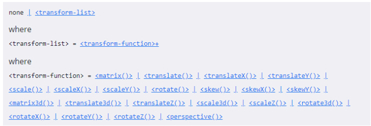
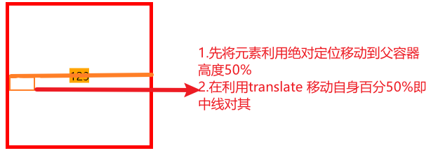
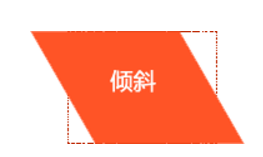

[TOC]
>[success] #  transform
CSS **transform**属性允许对某一个元素进行某些形变, 包括**旋转，缩放，倾斜或平移**等，其中**行内级元素不能进行形变**

>[danger] ##### 使用
* 提供了一些css 函数来进行使用
   * 平移：**translate(x, y)**
   * 缩放：**scale(x, y)**
   * 旋转：**rotate(deg)**
   * 倾斜：**skew(deg, deg)**
   

>[info] ## 具体函数说明
* **transform** 可以设置多个函数组合用空格隔开，举个例子
~~~
 transform: translate(-50%,-50%) scale(0.5) rotate(45deg);
~~~
>[danger] ##### translate(x, y) -- 平移
函数中只有一个值时设置**x**轴上的位移，第二个值时设置**x轴和y轴**上的位移
* 可以使用 translate 做块的**水平和垂直居中**，设思想如图，为什么不能设置margin-top:50% 原因是因为margin-top 百分比相对于宽度并不是高度

~~~
<!DOCTYPE html>
<html lang="en">
<head>
  <meta charset="UTF-8">
  <meta http-equiv="X-UA-Compatible" content="IE=edge">
  <meta name="viewport" content="width=device-width, initial-scale=1.0">
  <title>Document</title>
  
</head>
<body>
  
  

    
123

  

</body>
</html>
~~~
>[danger] #####  scale - 缩放 
* 一个值时，设置x轴上的缩放,二个值时，设置x轴和y轴上的缩放,其中大于1时 为放大，小于1时为缩小
~~~
transform: scale(2,2); // x y 轴放大两倍
~~~
>[danger] ##### rotate -- 旋转
* 可以对元素进行旋转，默认以元素中心为旋转点，正值为顺时针，负值为逆时针；
~~~

transform:rotate(45deg);  // 解释：单位是 deg 度数 ，即为45°意思
~~~
>[danger] ##### transform-origin -- 形变的原点
 设置一个值时候是设置x轴的原点，设置两个值时候 是分别x，y轴原点，参数可以是`left, center, right, top, bottom`其中之一关键字，也可以是百分比或者数值(从左上角开始计算)
~~~
 div{transform-origin: left top;transform: rotate(45deg); }  /* 改变元素原点到左上角，然后进行顺时旋转45度 */  
 div{transform-origin: 10px 10px;transform: rotate(45deg); }  /* 改变元素原点到x 为10  y 为10，然后进行顺时旋转45度 */ 
~~~
>[danger] ##### skew -- 倾斜
函数定义了一个元素在二维平面上的倾斜转换，其中一个值时候表示x轴上的倾斜，两个值时候表示x轴和y轴上的倾斜，正数表示顺时针，负数表示逆时针
~~~
transform:skew(30deg,0deg);
~~~
