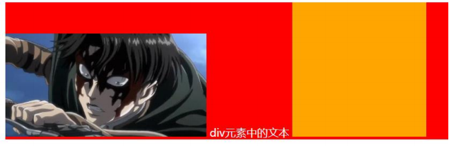
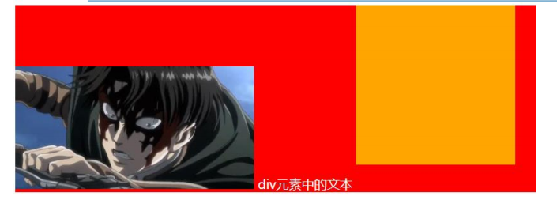
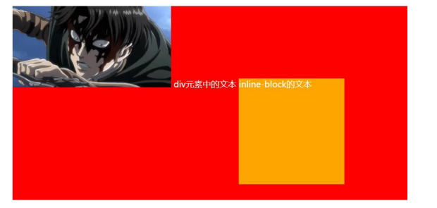
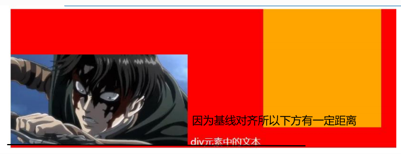
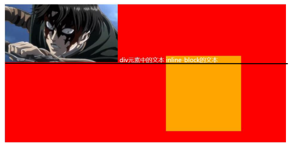

>[success] # vertical-align
1. 当元素有图片，有文字时

2. 有图片，有文字，有inline-block（比图片要大）

3. 有图片，有文字，有inline-block（比图片要大）而且设置了margin-bottom

4.有图片、文字、inline-block（比图片要大）而且设置了margin-bottom并且有文字

出现上面这四种情况原因都是因为默认基线(baseline)对其

* 因为基线对齐所以行内块有文字时候效果

>[danger] ##### vertical-align\-- 行内块元素垂直对齐

~~~
1.vertical-align : baseline |top |middle |bottom 
解释：
    baseline -- 基线对齐
    top -- 顶部对齐
    middle -- 垂直居中
    bottom -- 底部对齐
2.图片和文字对齐
3.去除图片底侧空白缝隙，在低版本浏览器img的底线会和父级盒子的基线对齐。 
这样会造成一个问题，就是图片底侧会有一个空白缝隙。解决办法：给img 
vertical-align:middle | top 或者 给img 添加 display：block; 转换为块级元素就不会存在问题了。

~~~

*   常见图片和文字默认基线对齐  
    
*   为了让文字在图片居中对齐，给图片设置vertical-align  
    

~~~
<!DOCTYPE html>
<html lang="en">
<head>
    <meta charset="UTF-8">
    <title>Title</title>
    
</head>
<body>
    

         222
    

</body>
</html>
~~~
>[danger] #####  解决图片下边缘的间隙方法

1. vertical-align设置成top/middle/bottom

2. 将图片设置为block元素,行内和行内块会基线对其