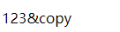

>[success] # 伪元素
* **伪元素**是一个附加至选择器末的关键词，允许你对被选择元素的特定部分修改样式
>[danger] ##### 伪元素 - ::before和::after
1. 伪元素`::before`和`::after`添加的内容默认是**inline元素**；这个两个伪元素的content属性，表示伪元素的内容,设置:before和:after时必须设置其content属性，否则伪元素就不起作用。

~~~
<!DOCTYPE html>
<html lang="en">
    <head>
        <meta charset="UTF-8" />
        <meta http-equiv="X-UA-Compatible" content="IE=edge" />
        <meta name="viewport" content="width=device-width, initial-scale=1.0" />
        <title>Document</title>
        
    </head>
    <body>
        

        
123

    </body>
</html>
~~~
* 效果图

2. 插入图片
~~~
.item::after {
    content: url('地址');
}
~~~
3. 因为默认是行内元素，因此设置宽高需要转换为行内块元素
~~~
 .item::after {
    content: '';
    display: inline-block;
    width: 20px;
    height: 20px;
}
~~~