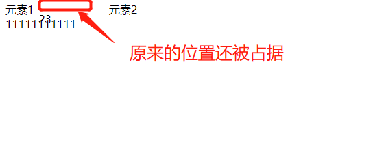
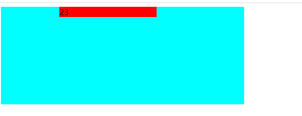
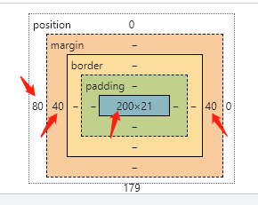
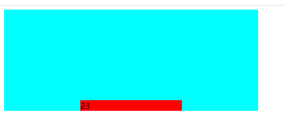
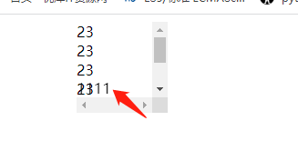

[TOC]
>[success] # css 定位

>[danger]  ##### relative 相对定位
1. 使用相对定位，位置从自身出发。
2. 还占据原来的位置。
3. 行内元素使用相对定位不能转行内块
4. left、right、top、bottom用来设置元素的具体位置
5. 定位参照对象是元素自己原来的位置

~~~ html
<!DOCTYPE html>
<html lang="en">
<head>
	<meta charset="UTF-8">
	<meta http-equiv="X-UA-Compatible" content="IE=edge">
	<meta name="viewport" content="width=device-width, initial-scale=1.0">
	<title>Document</title>
	
</head>
<body>
	

		元素1
		
23

		
元素2

	

	
11111111111

</body>
</html>
~~~
>[danger] ##### 固定定位 -- fixed
1. 固定定位之后，不占据原来的位置（脱标）  
2. 元素使用固定定位之后 ,定位参照对象是视口(即可视区域), 当画布滚动时，固定不动
3. 元素使用固定定位之后，会转化为行内块

>[danger] ##### absolute --  绝对定位

1. 元素使用绝对定位之后不占据原来的位置（脱标）
2. 元素使用绝对定位，位置是从浏览器出发。
3. 嵌套的盒子，父盒子没有使用定位，子盒子绝对定位，子盒子位置是从浏览器出发。
4. 嵌套的盒子，父盒子使用定位，子盒子绝对定位，子盒子位置是从父元素位置出发。
5. 给行内元素使用绝对定位之后，转换为行内块。（不推荐使用，推荐使用display:inline-block;）

注：因此才会出现`子绝父相`,但是实际上来说父元素也可以是其他定位元素例如`绝对定位`，只是相对来说`子绝父相`更常见
* 关于绝对定位宽度 和 高度
1. 定位参照对象的宽度 = left + right + margin-left + margin-right + 绝对定位元素的实际占用宽度
2. 定位参照对象的高度 = top + bottom + margin-top + margin-bottom + 绝对定位元素的实际占用高度
~~~ html
<!DOCTYPE html>
<html lang="en">
<head>
	<meta charset="UTF-8">
	<meta http-equiv="X-UA-Compatible" content="IE=edge">
	<meta name="viewport" content="width=device-width, initial-scale=1.0">
	<title>Document</title>
	
</head>
<body>
	

		
23

	

</body>
</html>
~~~

`margin:0 auto` 只能让标准流的盒子居中对齐,现在绝对定位已经脱离标准盒子，此时想定位就可以利用上面的公式，只要去设置left: 0、right: 0、top: 0、bottom: 0、margin: auto 和盒子具体宽度，对应调整这些属性即可控制居中位置

~~~
<!DOCTYPE html>
<html lang="en">
<head>
	<meta charset="UTF-8">
	<meta http-equiv="X-UA-Compatible" content="IE=edge">
	<meta name="viewport" content="width=device-width, initial-scale=1.0">
	<title>Document</title>
	
</head>
<body>
	

		
23

	

</body>
</html>
~~~
>[success] # 粘性定位 - sticky
1. 可以看做是相对定位和固定定位的结合体
2. 它允许被定位的元素表现得像相对定位一样，直到它滚动到某个阈值点(top,bottom.left.right)
3. 当达到这个阈值点时, 就会变成固定定位
4. sticky是相对于最近的滚动祖先包含视口的(the nearest ancestor scroll container’s scrollport ) 如图

~~~
<!DOCTYPE html>
<html lang="en">
<head>
	<meta charset="UTF-8">
	<meta http-equiv="X-UA-Compatible" content="IE=edge">
	<meta name="viewport" content="width=device-width, initial-scale=1.0">
	<title>Document</title>
	
</head>
<body>
	

		
23

		
23

		
23

		
23

	
		
23

		
23

		
1111

	

</body>
</html>
~~~