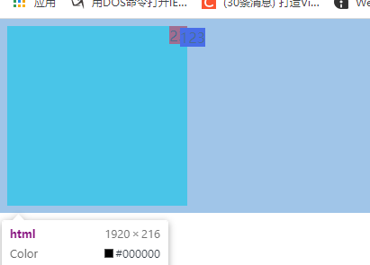
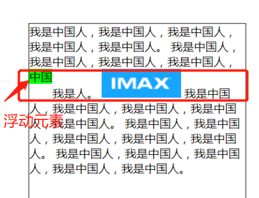
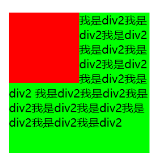

>[success] # 浮动
1. 绝对定位、浮动都会让元素**脱离标准流**，以达到灵活布局的效果

>[danger] ##### 特点
1. 朝着向左或向右方向移动，直到自己的边界**紧贴着包含块（一般是父元素）或者其他浮动元素的边界为止**
* 这里说明以下是对`absolute` 做了定位 要不他不受限于`紧贴着包含块（一般是父元素）`  这个限制，红色浮动部分最大边界是父元素边界

~~~
<!DOCTYPE html>
<html lang="en">
<head>
	<meta charset="UTF-8">
	<meta http-equiv="X-UA-Compatible" content="IE=edge">
	<meta name="viewport" content="width=device-width, initial-scale=1.0">
	<title>Document</title>
	
</head>
<body>
	

		
23

		
123

	

</body>
</html>
~~~
2. 如果一个元素浮动，另一个浮动元素已经在那个位置了，后浮动的元素将紧贴着前一个浮动元素（左浮找左浮，右浮找右浮）
3. 如果水平方向剩余的空间不够显示浮动元素，浮动元素将向下移动，直到有充足的空间为止
4. 行内级元素、inline-block元素浮动后，其顶部将与所在行的顶部对齐

5. 浮动元素不能与行内级内容层叠，行内级内容将会被浮动元素环绕

