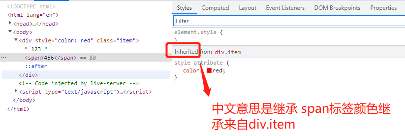

>[success] ## **继承性**

#### **特点**

~~~
继承性发生的前提是包含（嵌套关系）
   ★文字颜色可以继承
   ★文字大小可以继承
   ★字体可以继续
   ★字体粗细可以继承
   ★文字风格可以继承
   ★行高可以继承
~~~

#### **特殊情况**

~~~
h系列不能继承文字大小。
a标签不能继承文字颜色。
~~~
~~~html

    123
    456

~~~
