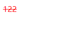

>[success] # css -- 颜色补充
* **RGB颜色**：
1.RGB是一种色彩空间，通过R（red，红色）、G（green，绿色）、B（blue，蓝色）三原色来组成了不同的颜色；通过调整这三个颜色不同的比例，可以组合成其他的颜色；
2.RGB各个原色的取值范围是 **0~255**
~~~

~~~
* 颜色的表现形式除了通过**关键字**，**rgb**，也可通过**十六进制表现**，首先rgb 是十进制的表现形式，其实就是将十进制转换为十六进制即为十六进制表现形式，以下面为例：十进制64对应十六进制是40，因此转换为**646464**，如果转换十六进制两个为一组且有重复即可缩写例如`0088ff` 可以缩写 `08f`
~~~
color:rgb(64,64,64);
color: #404040;
~~~

>[info] ## color -- 设置是前景色
* `background-color` 设置背景色，相对来说`color` 设置前景色举个例子
~~~
<!DOCTYPE html>
<html lang="en">
    <head>
        <meta charset="UTF-8" />
        <title>Document</title>
        
    </head>
    <body>
        
122

    </body>
</html>

~~~
* 不仅仅是文字变红，文字上个划线一样也变红
