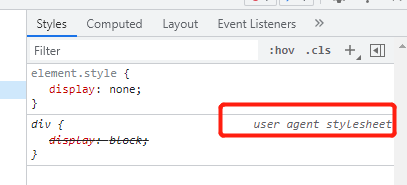
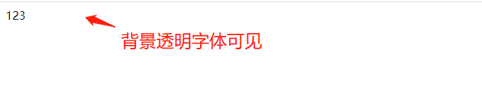
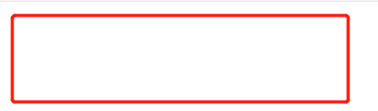

>[success] # css 元素隐藏

1. **display设置为none**，元素不显示出来, 并且也不占据位置, 不占据任何空间(和不存在一样);
~~~

123

~~~
* 浏览器原本对div 的样式为`block` ,当设置`none` 权重覆盖自然隐藏

2. **visibility设置为hidden**，设置为hidden, 虽然元素不可见, 但是会占据元素应该占据的空间
3. **rgba设置颜色, 将a的值设置为0**，rgba的a设置的是alpha值, 可以设置透明度, 不影响子元素;
* 此时虽然设置背景色为黑色但是，透明度为0 因此背景是不可见的但是里面文字可见

~~~

123

~~~
* 此时设置了字体透明，虽然不影响子元素但是因为继承关系span包裹的字符也透明了

~~~

123555

~~~
4. **opacity设置透明度, 设置为0**，设置整个元素的透明度, 会影响所有的子元素;
* 所有元素全部透明，并且如果里面有图片也会透明
~~~

123

~~~
