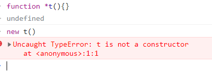
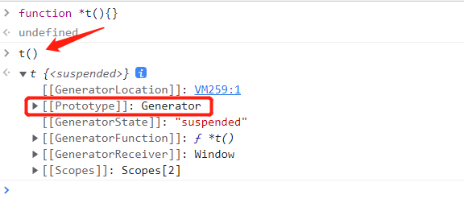
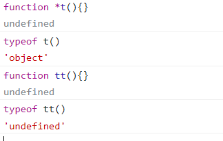
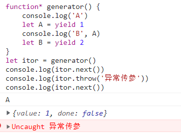

>[success] # 生成器
1. 生成器是ES6中新增的一种函数控制、使用的方案，它可以让我们更加灵活的控制函数什么时候继续执行、暂停执行等
2. 生成器对象是由一个 **generator function** 返回的，并且它符合可迭代协议和迭代器协议。因此生成器对象既是**迭代器，也是可迭代对象**
>[info] ##  **generator function** -- 生成器函数
1. 生成器函数需要在function的后面加一个符号：\*
2. 生成器函数可以通过yield关键字来控制函数的执行流程
3. 生成器函数的返回值是一个Generator（生成器）,生成器可以理解成一个特殊的**迭代器**
4. 调用一个生成器函数并不会马上执行它里面的语句，而是返回一个这个**生成器的 迭代器 （iterator ）对象**。当这个迭代器的** next() 方法被首次（后续）调用时**，其内的语句会执行到第一个 **（后续）出现yield的位置为止**，**yield 后紧跟迭代器要返回的值**。**yield 关键词最后返回一个迭代器对象，该对象有 value 和 done 两个属性**

>[danger] ##### 生成一个生成器
1. 当是函数的时候需要在方法名前加'*' 来表示当前函数是生成器
2. 当是函数表达式的时候在function 和小括号中间添加一个'*'
3. 下面案例中当生成器函数执行返回了一个具备**next 方法的**，**迭代器 （iterator ）对象**（当调用next 时候 返回结构{done: false, value: 1}），**迭代器 （iterator ）对象**中**yield 返回值即为value**

~~~
/*
	生成器函数: 
	1.function后面会跟上符号: *
	2.代码的执行可以被yield控制
	3.生成器函数默认在执行时, 返回一个生成器对象
		* 要想执行函数内部的代码, 需要生成器对象, 调用它的next操作
		* 当遇到yield时, 就会中断执行
*/
function  *createIterator() { // function* createIterator 星号也可以在function后面0
    yield 1
    yield 2
}
// 返回的是一个迭代器 解释了生成器返回迭代器对象
let iteratorr = createIterator()
console.log(iteratorr.next()) // {done: false, value: 1}
console.log(iteratorr.next()) // {done: false, value: 2}
console.log(iteratorr.next()) // {done: true, value: undefined}
~~~
* 表达式
~~~
// 生成器
let createIterator = function  *() {
    yield 1
}
~~~
4. 内部调用return 会提前终止
~~~
function* generator() {
	yield 1
	return 15
	yield 2
}
let itor = generator()
console.log(itor.next())
console.log(itor.next())
console.log(itor.next())
// 打印结果：
{ value: 1, done: false }
{ value: 15, done: true } // done 为true 结束了
{ value: undefined, done: true } // done 为true 结束了
~~~
>[danger] ##### 生成器函数特点
~~~
1.function* 函数名字(){}  创建生成器函数(generator function)，它返回一个Generator 对
象,因此这类 函数名的函数不能使用new，而是 类似工厂模式效果通过调用函数直接生成
对象
2.如图直接虽然是函数形式调用但是返回的是对象
function* generator() {
    console.log('OK');
}
const itor  = generator()
console.log(itor instanceof generator); //true
console.log(({}).toString.call(itor)); //"[object Generator]" 
3.因为生成器创建一个迭代器对象，对象是原型链指向了他构造函数的原型链，因此如下
  generator.prototype.__proto__===GeneratorFunction.prototype
      + next
      + return
      + throw
      + Symbol.toStringTag : 'Generator' 
    GeneratorFunction.prototype.__proto__===?.prototype
      + Symbol.iterator
即生成的迭代器对象具备 next  return throw 方法,在迭代器章节介绍了return 作用
~~~
* 不能new 实列

* 返回是对象

* type of 判读类型 tt() 执行后没有返回值，t()执行后是迭代器对象

>[danger] ##### yield
~~~
1. yield 可以返回任何值或者表达式
2. 每遇到一个 'yield'的语句循环都会停止，每次需要调用迭代器的next()方法
才会进入下一个'yield'语句
3.'yield'关键字只能在生成器内部使用
~~~
* 可以配合循环使用
~~~
// 生成器函数
function  *createIterator(items) {
   for(let i=0;i<items.length;i++){
       yield items[i]
   }
}
let iteratorr = createIterator([1,2])
console.log(iteratorr.next()) // {done: false, value: 1}
console.log(iteratorr.next()) // {done: false, value: 2}
console.log(iteratorr.next()) // {done: true, value: undefined}
~~~
* 对第三条的说明下面代码会报错
~~~
function  *createIterator(items) {
    items.forEach(function (item) {
        yield item
    })
}
~~~
>[danger] ##### 对象方法使用
1. **return**传值后这个生成器函数就会结束，之后调用**next不会继续生成值了**
~~~
function* generator() {
    console.log('A');
    yield 1;
    console.log('B');
    yield 2;
    console.log('C');
    yield 3;
    console.log('D');
    return 4;
}
let itor = generator(); 

/* 
console.log(itor.next()); //{value: 1, done: false}
console.log(itor.return('RETURN')); //{value: 'RETURN', done: true} // 如果不传参value 是对应值
console.log(itor.return()); //{value: undefined, done: true} // 如果不传参value 是undefined
console.log(itor.throw('xxx')); //直接抛出异常信息，没有返回值，后续的代码都不能执行了 
*/

// 执行NEXT方法，可以让GENERATOR函数中的代码执行；每一次执行NEXT，遇到YEILD则结束；
// 返回结果是具备DONE/VALUE的对象，并且VALUE值是YEILD后面的值；
console.log(itor.next()); //输出’A‘  {value: 1, done: false}
console.log(itor.next()); //输出’B‘  {value: 2, done: false}
console.log(itor.next()); //输出’C‘  {value: 3, done: false}
console.log(itor.next()); //输出’D‘  {value: 4, done: true}
console.log(itor.next()); //{value: undefined, done: true} 
~~~
2. 关于 throw，抛出异常后我们可以在生成器函数中捕获异常
~~~
function* generator() {
	try {
		console.log('A')
		let A = yield 1
		console.log('B', A)
		let B = yield 2
		console.log('C', B)
	} catch (e) {
		console.log(e, '异常') // 异常传参 异常
	}
}
let itor = generator()
console.log(itor.next()) //{value: 1, done: false}
console.log(itor.throw('异常传参')) //{value: undefined, done: true}
console.log(itor.next()) //{value: undefined, done: true}
~~~
* catch语句中不能继续yield新的值了，但是可以在catch语句外使用yield继续中断函数的执行
~~~
function* generator() {
	try {
		console.log('A')
		let A = yield 1
		console.log('B', A)
		let B = yield 2
		console.log('C', B)
	} catch (e) {
		console.log(e, '异常') // 异常传参 异常
	}
	yield 3
	yield 4
}
let itor = generator()
console.log(itor.next()) //{value: 1, done: false}
console.log(itor.throw('异常传参')) //{ value: 3, done: false }
console.log(itor.next()) //{ value: 4, done: false }
console.log(itor.next()) //{value: undefined, done: true}
console.log(itor.next()) //{value: undefined, done: true}
~~~
* 没有在内部捕获异常

3. next 传参，我们在调用next函数的时候，可以给它传递参数，那么这个参数会作为上一个yield语句的返回值
~~~
function* generator() {
    console.log('A');
    let A = yield 1;
    console.log('B', A);
    let B = yield 2;
    console.log('C', B);
}
let itor = generator();
console.log(itor.next()); //{value: 1, done: false}
// 每一次NEXT传递的值「第一次传递的值没用」：都是作为上一次YEILD的返回结果
console.log(itor.next(100)); //{value: 2, done: false}
console.log(itor.next(200)); //{value: undefined, done: true} 

// 打印结果：
A
{ value: 1, done: false }
B 100
{ value: 2, done: false }
C 200
{ value: undefined, done: true }
~~~
* yield 是返回一个迭代器
~~~
function* generator1() {
    yield 1;
    yield 2;
}
function* generator2() {
    yield 3;
    yield generator1();
    yield 4;
}
let itor = generator2();
console.log(itor.next()); //{value: 3, done: false} 
console.log(itor.next()); //{value: generator1执行创建的迭代器对象, done: false} 
console.log(itor.next()); //{value: 4, done: false} 
console.log(itor.next()); //{value: undefined, done: true}  

function* generator1() {
    yield 1;
    yield 2;
}
function* generator2() {
    yield 3;
    // yield*：可以进入到其他生成器中进行迭代
    yield* generator1();
    yield 4;
}
let itor = generator2();
console.log(itor.next()); //{value: 3, done: false} 
console.log(itor.next()); //{value: 1, done: false} 
console.log(itor.next()); //{value: 2, done: false} 
console.log(itor.next()); //{value: 4, done: false} 
console.log(itor.next()); //{value: undefined, done: true}
~~~
>[danger] ##### 语法糖 --  yield\*来生产一个可迭代对象
1. 种yield的语法糖，只不过会依次迭代这个可迭代对象，每次迭代其中的一个值
~~~
const nums = [100, 22, 66, 88, 55]

function* createArrayIterator(arr) {
  yield* arr
}
~~~
* 等同
~~~
function* createArrayIterator(arr) {
	for (let i = 0; i < arr.length; i++) {
		yield arr[i]
	}
}

~~~
>[danger] ##### 在class 使用
1. class 中没有function 因此省略写法 *加方法
~~~
    class Person {
      constructor(name, age, height, friends) {
        this.name = name
        this.age = age
        this.height = height
        this.friends = friends
      }

      // 实例方法
      *[Symbol.iterator]() {
        yield* this.friends
      }
    }
~~~