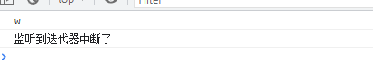

>[success] # 什么是迭代器
1. **迭代器（iterator），使用户在容器对象（container，例如链表或数组）上遍访的对象**，使用该接口无需关心对象的内部实现细节
2. **迭代器是帮助我们对某个数据结构进行遍历的对象**

>[danger] ##### js 迭代器 定义
1. **在JavaScript中，迭代器也是一个具体的对象，这个对象需要符合迭代器协议**往往就是一个指针对象，不断调用，然后不断地指向下一个对象的过程这种对象都有一个next 方法，调用该方法后会返回一个对象这个对象有两个属性值，一个是'value' 一个是'done',根据描述结构可以看做{ next(){ return {value:"",done:false }   } }
2.1. **done（boolean）**，如果迭代器可以产生序列中的下一个值，则为 false。如果迭代器已将序列迭代完毕，则为 true。这种情况下，value 是可选的，如果它依然存在，即为迭代结束之后的默认返回值
2.2. **value** 迭代器返回的任何 JavaScript 值。done 为 true 时可省略
2. 简单说只有实现了一个拥有以下语义（semantic）的 **`next()`** 方法，一个对象才能成为迭代器
* 参考  [迭代器协议](https://developer.mozilla.org/zh-CN/docs/Web/JavaScript/Reference/Iteration_protocols#%E8%BF%AD%E4%BB%A3%E5%99%A8%E5%8D%8F%E8%AE%AE "Permalink to 迭代器协议")
>[danger] ##### 根据定义写一个迭代器
~~~
1.大概的构想，需要不断调用，调用这个方法我们起名为'next',需要有返回值这个返回值
告诉我们当前迭代的内容是多少因此定义了一个对象，有'done' 如果是最后一个元素返回'true'
非最后元素返回'false','value' 表示返回的值
2. 这一部分就是迭代器对象
{
        next:function () {
            var done = (i>=items.length)
            var value = !done?items[i++]:undefined
            return{
                done:done,
                value:value
            }
        }
~~~
~~~
function createIterator(items) {
    var i = 0
    return {
        next:function () {
            var done = (i>=items.length)
            var value = !done?items[i++]:undefined
            return{
                done:done,
                value:value
            }
        }
    }
}
var iterator = createIterator([1,2,3])
console.log(iterator.next()) // {done: false, value: 1}
~~~
* 类的形式表现
~~~
class Iterator {
    constructor(assemble) {
        let self = this;
        self.assemble = assemble;
        self.index = 0;
    }
    next() {
        let self = this,
            assemble = self.assemble;
        if (self.index > assemble.length - 1) {
            return {
                done: true,
                value: undefined
            };
        }
        return {
            done: false,
            value: assemble[self.index++]
        };
    }
}
~~~
>[danger] ##### 什么是js可迭代对象
1. 当一个对象实现了**iterable protocol协议时**，它就是一个可迭代对象
2. 这个对象的要求是必须实现 **@@iterator 方法**，在代码中我们使用 **Symbol.iterator** 访问该属性；
3. 简单说将迭代器方法作为对象本身的方法去调用，迭代器和这个对象组合叫做**可迭代对象**，在js中这类对象的方法必须 **@@iterator 方法**
~~~
/*
1.必须实现一个特定的函数: [Symbol.iterator]
2.这个函数需要返回一个迭代器(这个迭代器用于迭代当前的对象)
*/
const infos = {
	friends: ['kobe', 'james', 'curry'],
	[Symbol.iterator]: function () {
		let index = 0
		const infosIterator = {
			next:  () =>{
				// done: Boolean
				// value: 具体值/undefined
				if (index < this.friends.length) {
					return {
						done: false,
						value: this.friends[index++],
					}
				} else {
					return { done: true }
				}
			},
		}
		return infosIterator
	},
}

// 可迭代对象必然具备下面的特点
const iterator = infos[Symbol.iterator]()
console.log(iterator.next())
console.log(iterator.next())
console.log(iterator.next())
console.log(iterator.next())
~~~
>[danger] ##### 原生迭代器对象
1. **String、Array、Map、Set、arguments**对象、**NodeList**集合他们都是可迭代对象，内部都实现了**Symbol.iterator** 方法
2. 可迭代对象都可使用 **for ...of、展开语法（spread syntax）、yield、解构赋值（Destructuring\_assignment）**
3. 创建一些对象时：创建一些对象时：**new Map(\[Iterable\])、new WeakMap(\[iterable\])、new Set(\[iterable\])、new WeakSet(\[iterable\]);** 他们需要的传参也是可迭代对象
4. 一些方法的调用：**Promise.all(iterable)、Promise.race(iterable)、Array.from(iterable)**
5. **迭代器的中断**，遍历的过程中通过break、return、throw中断了循环操作，在解构的时候，没有解构所有的值，想去监听中断需要在迭代器对象中指定**return方法**
* 没有加return 方法
~~~
const person = {
	name: 'w',
	age: 12,
	[Symbol.iterator]() {
		let index = 0
		const ls = Object.values(this)
		return {
			next: () => {
				if (index < ls.length) {
					return { done: false, value: ls[index++] }
				} else {
					return { done: true }
				}
			},
		}
	},
}

for (const item of person) {
	console.log(item)
	if (item === 'w') {
		break
	}
}
~~~
执行效果

* 使用return 函数增加提示
~~~
const person = {
	name: 'w',
	age: 12,
	[Symbol.iterator]() {
		let index = 0
		const ls = Object.values(this)
		return {
			next: () => {
				if (index < ls.length) {
					return { done: false, value: ls[index++] }
				} else {
					return { done: true }
				}
			},
			return: () => {
				console.log('监听到迭代器中断了')
				return { done: true }
			},
		}
	},
}

for (const item of person) {
	console.log(item)
	if (item === 'w') {
		break
	}
}
~~~
 执行效果

* 注参考  [可迭代对象示例](https://developer.mozilla.org/zh-CN/docs/Web/JavaScript/Reference/Iteration_protocols#%E5%8F%AF%E8%BF%AD%E4%BB%A3%E5%AF%B9%E8%B1%A1%E7%A4%BA%E4%BE%8B "Permalink to 可迭代对象示例")
>[danger] ##### 判断js 可迭代对象
~~~
let someString = "hi";
typeof someString[Symbol.iterator];          // "function"
~~~
虽然可能 有些自己定义的对象去重写了`Symbol.iterator`但如果不能返回迭代器对象，那么可以认为它是一个*格式不佳*的（*Non-well-formed*）可迭代对象 。产生下面报错
~~~
var nonWellFormedIterable = {}
nonWellFormedIterable[Symbol.iterator] = () => 1
[...nonWellFormedIterable] // TypeError: [] is not a function
~~~
>[info] ## 必读 参考
https://developer.mozilla.org/zh-CN/docs/Web/JavaScript/Reference/Iteration_protocols#iterable