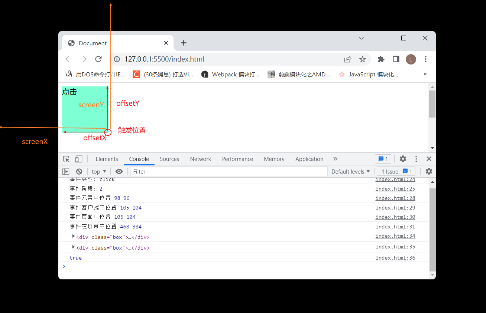
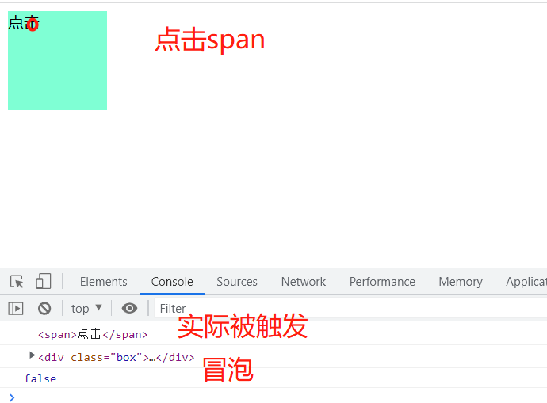
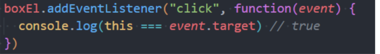

>[success] # event 事件对象
1. 当事件被触发时候，点击事件一些信息会被封装到一个**Event**对象中，这个对象由浏览器创建，称之为**event对象**
2. `event` 通过事件回调函数的参数获取
>[danger] ##### event 属性和方法
* **属性**
1. **type**：事件的类型；
2. **target**：当前事件发生的元素；
3. **currentTarget**：当前处理事件的元素；
4. **eventPhase**：事件所处的阶段；
5. **offsetX、offsetY**：事件发生在元素内的位置；
6. **clientX、clientY**：事件发生在客户端内的位置；
7. **pageX、pageY**：事件发生在客户端相对于document的位置；
8. **screenX、screenY**：事件发生相对于屏幕的位置；

~~~
<!DOCTYPE html>
<html lang="en" style="height: 200%">
	<head>
		<meta charset="UTF-8" />
		<meta http-equiv="X-UA-Compatible" content="IE=edge" />
		<meta name="viewport" content="width=device-width, initial-scale=1.0" />
		<title>Document</title>
		
	</head>
	<body>
		

			点击
		

		
	</body>
</html>

~~~
* currentTarget/target

~~~
<!DOCTYPE html>
<html lang="en" style="height: 200%">
	<head>
		<meta charset="UTF-8" />
		<meta http-equiv="X-UA-Compatible" content="IE=edge" />
		<meta name="viewport" content="width=device-width, initial-scale=1.0" />
		<title>Document</title>
		
	</head>
	<body>
		

			点击
		

		
	</body>
</html>
~~~

* 事件
1. **preventDefault**：取消事件的默认行为；
2. **stopPropagation**：阻止事件的进一步传递（冒泡或者捕获都可以阻止）；
>[danger] ##### 事件处理中的this
1. 可以通过this来获取当前的发生元素

~~~
<!DOCTYPE html>
<html lang="en" style="height: 200%">
	<head>
		<meta charset="UTF-8" />
		<meta http-equiv="X-UA-Compatible" content="IE=edge" />
		<meta name="viewport" content="width=device-width, initial-scale=1.0" />
		<title>Document</title>
		
	</head>
	<body>
		

			点击
		

		
	</body>
</html>

~~~