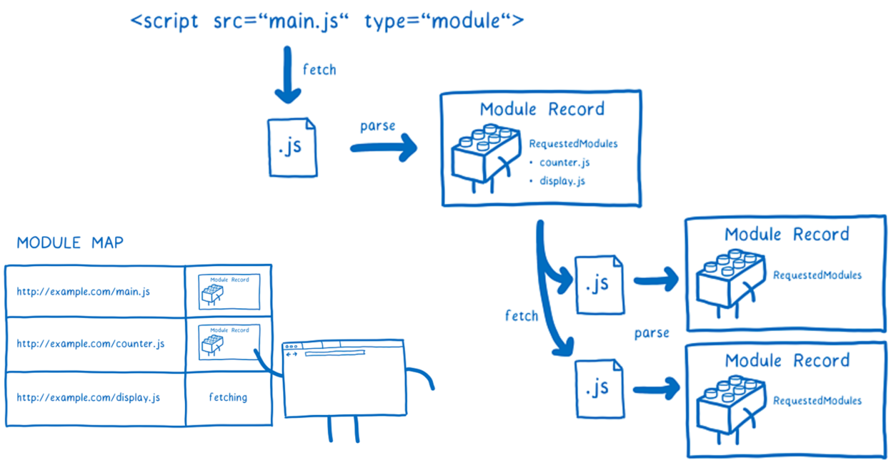
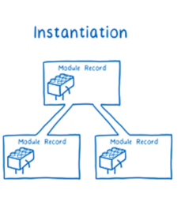
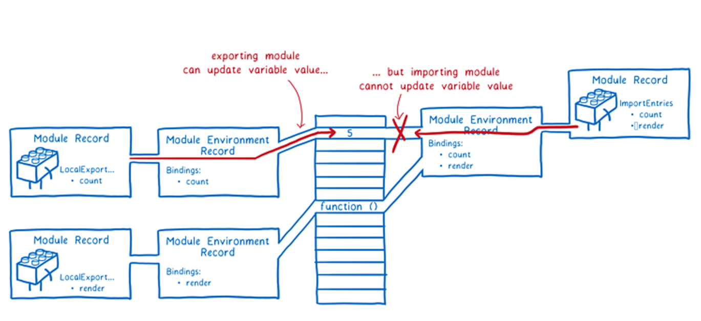
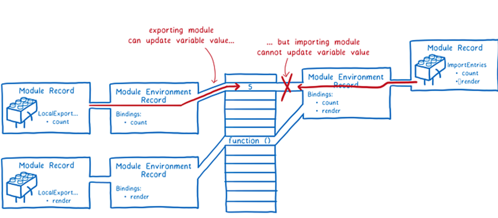

>[success] # 执行过程
1. **ES Module**在**被JS引擎解析时**，开始构建，会根据，根据地址查找js文件，并且下载，将其解析成模块记录（Module Record），如下图根据每个文件依赖导入依次去下载，然后每个下载模块都有一个自己作用域的空间

2. 实例化（Instantiation），对模块记录进行实例化，并且分配内存空间，解析模块的导入和导出语句，把模块指向对应的内存地址

3. 运行（Evaluation），运行代码，计算值，并且将值填充到内存地址中

>[success] # export 和 import 特点
1. **import 导入成员并不是复制一个副本**，而是直接导入模块成员的引用地址，也就是说 import 得到的变量与** export 导入的变量在内存中是同一块空间**。一旦模块中成员修改了，这里也会**同时修改**

2. 导入模块成员变量**是只读的**，但是需要注意如果导入的是一个对象，对象的属性读写不受影响
* index.js
~~~
import { name, age } from './module.js'

console.log(name, age)

// 导入成员并不是复制一个副本，
// 而是直接导入模块成员的引用地址，
// 也就是说 import 得到的变量与 export 导入的变量在内存中是同一块空间。
// 一旦模块中成员修改了，这里也会同时修改，
setTimeout(function () {
  console.log(name, age)
}, 1500)

// 导入模块成员变量是只读的
// name = 'tom' // 报错

// 但是需要注意如果导入的是一个对象，对象的属性读写不受影响
// name.xxx = 'xxx' // 正常
~~~
* module.js
~~~
var name = 'jack'
var age = 18

export { name, age }

setTimeout(function () {
  name = 'ben'
}, 1000)

~~~

[关于import.meta](https://developer.mozilla.org/zh-CN/docs/Web/JavaScript/Reference/Statements/import.meta)
>[success] # export 和 import
~~~
1.一下只是一个小的总结，具体可以参考'周爱民'老师的文章
~~~
[周爱民老师的文章](https://time.geekbang.org/column/article/166491)
[mdn的文章](https://developer.mozilla.org/zh-CN/docs/Web/JavaScript/Reference/Statements/export)

>[danger]##### node 和 es6 导出的区别
* 引用周爱民老师文章中的内容
~~~
1. ECMAScript 6 模块是静态装配的，而传统的 Node.js 模块却是动态加载的。因而两种模块的实现效果
与处理逻辑都大相径庭，Node.js 无法在短期内提供有效的手段帮助开发者将既有代码迁移到新的模块规范下
~~~
>[danger] ##### 总结
* export 能导出什么

~~~
1.本质上 export 也就只能导出这六种声明语法所声明的标识符
~~~
[关于六种声明语法](https://www.kancloud.cn/cyyspring/more/1292116)
~~~
1.这里只是简单总结：因此可以看到最常见的导出方式

    // 导出“（声明的）名字”
    export <let/const/var> x ...;
    export function x() ...
    export class x ...
    export {x, y, z, ...};
    
    
    // 导出“（重命名的）名字”
    export { x as y, ...};
    export { x as default, ... };
    
    
    // 导出“（其它模块的）名字”
    export ... from ...;
2.比较特别的default 可以看做：

export default function() {}

// 类似于如下代码
//（但并不在当前模块中声明名字"default"）
export var default = function() {}
3.这里运行机制简单理解：
4.ESModule 根据 import 构建依赖树，所以在代码运行前名字就是已经存在于上下文，
然后在运行模块最顶层代码，给名字绑定值，就出现了‘变量提升’的效果。
~~~