[TOC]
>[success] # 弹性盒子布局
~~~
1.2009年，W3C 提出了一种新的方案----Flex 布局，可以简便、完整、响应式地实现各种页面布局，Flex 是 Flexible 
Box 的缩写，意为"弹性布局"，用来为盒状模型提供最大的灵活性
~~~
>[danger] ##### flex 出现解决的问题 
~~~
1.布局的传统解决方案，基于[盒状模型]，依赖[`display`]属性 +[`position`]属性 +
[`float`]属性。
2.flex 可以更方便的实现我们想要的布局方式
3.设为 Flex 布局以后，子元素的`float`、`clear`和`vertical-align`属性将失效。
~~~
* 举个例子
~~~
1.现在我有四个div 我想让它们在一行排列，效果如图，我们能想到的方法
 1.1.将块级元素div转化行内块
 1.2.使用浮动
 1.3.使用定位
~~~
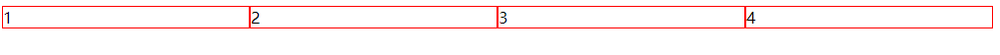
* 以行内块作为例子·
~~~html
<!DOCTYPE html>
<html lang="en">
<body>

    

        <!-- 如果换行会出现有间距问题，和相邻行内元素（行内块）在一行上,但是之间会有空白缝隙 -->
        
1

2

3

4

    

</body>

</html>
~~~
>[danger] ##### 做一个构想
~~~
1.现在让我们单纯设计，一个可以不用通过[`display`]属性 +[`position`]属性 +[`float`]属性。我们要考虑他所具备
的行为要有那些
 1.1.可以规定元素布局形式，也就是可以设置让其'水平行或垂直列'
 1.2.可以控制在主轴上的对齐方式，如果是水平排列是居左居右，如果是垂直列是居上还是居下
~~~
>[info] ## 真正的弹性盒子
~~~
1.如图一样需要有一个父元素(flex container)，父元素内部子元素叫'flex items'
2.子元素可以按照'main axis'(from main-start to main-end) 或'cross axis'(from cross-start to cross-end)进行布置，
'main axis'主轴、'cross axis' 交叉轴，主轴的开始位置结束位置分别是'main-start'、'main-end',交叉轴的开始位置
结束位置'cross-start'、'cross-end'
~~~
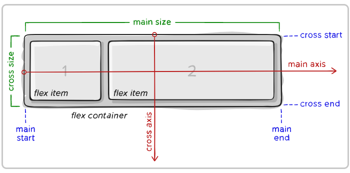
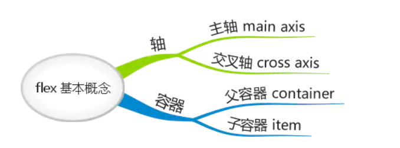
>[info] ## 真正的弹性盒子构成
1. 开启了 flex 布局的元素叫 **flex container**
2. flex container 里面的直接子元素叫做** flex item**
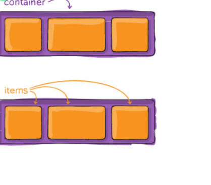
>[danger] ##### 当flex container中的子元素变成了flex item时, 具备一下特点
1. flex item的布局将受flex container属性的设置来进行控制和布局;
2. flex item不再严格区分**块级元素和行内级元素**
3. flex item默认情况下是包裹内容的, 但是可以设**置宽度和高度;**

>[info] ## 弹性盒子属性
整个弹性盒子布局整体可以看做两个部分，分别是`flex container` 弹性盒子的容器和 **flex items** 弹性盒子中的元素，因此在对应配置属性上也都是针对二者
* 其中**flex container** 上的 CSS 属性
1. flex-flow
2. flex-direction
3. flex-wrap
4. flex-flow
5. justify-content
6. align-items
7. align-content
* 应用在 **flex items** 上的 CSS 属性
1. flex-grow
2. flex-basis
3. flex-shrink
4. order
5. align-self
6. flex
>[info] ## 弹性盒子的使用
~~~
1.需要定义其父级为一个弹性盒子 -- 'display: flex'
2.可以在父级设置属性规定其内部子元素横纵轴排列方向 -- 'flex-direction'
3.可以在父级设置换行即排列子元素换行，默认情况下，项目都排在轴线 -- 'flex-wrap'
4.可以在父级设置内部子元素在主轴的对齐方式也就是'main-start'、'main-end'、'cross-start'、'cross-end' -- 'justify-content'
5.可以在父级设置内部子元素整侧轴对齐 -- 'align-items'
6.可以设置多个多根轴线侧轴对齐如果项目只有一根轴线，该属性不起作用 -- 'align-content'
~~~
* 注说明
设置 display 属性为**flex** 或者 **inline-flex** 可以成为 **flex container**，区别就是设置**flex**的 flex container 以 块 形式存在，**inline-flex**的 flex container 以 行内块 形式存在
>[danger] ##### 设置弹性盒子
~~~
1.在父元素'flex container' 设置属性'display: flex' 或者'display: inline-flex;'
~~~
~~~html
<!DOCTYPE html>
<html lang="en">
<body>
    

        
1

        
2

        
3

        
4

    

</body>

</html>
~~~
>[danger] ##### 轴排列方向 -- 'flex-direction'
**flex items** 默认都是沿着 **main axis**（主轴）**从 main start 开始往 main end** 方向排布，因此即可设置四个方向依次是，默认主轴从左到右，从右到左，将交叉轴设置为主轴，从上到下和 从下到上
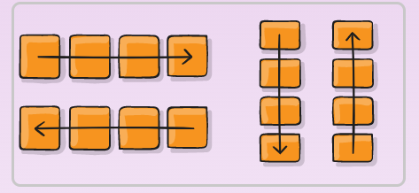

~~~
1.设置'flex item' 在元素中的排列方向设置属性'flex-direction: row | row-reverse | column | column-reverse;'
依次表示'主轴为水平方向，起点在左端（横向正序）'、'主轴为水平方向，起点在右端（横向倒叙）'
'主轴为垂直方向，起点在上沿。（纵向正序）'、'主轴为垂直方向，起点在下沿（纵向倒叙）'
~~~
* 代码案例
~~~html
<!DOCTYPE html>
<html lang="en">

<body>
    

        
1

        
2

        
3

        
4

    

</body>

</html>
~~~
>[danger] ##### 换行 -- flex-wrap 
~~~
1.默认情况下，项目都排在一条线（又称"轴线"）上，简单的说你不让他换行他会一直在这个轴线无限排列
2.'  flex-wrap: nowrap | wrap | wrap-reverse;','nowrap（默认）：不换行'、'wrap：换行，第一行在上方'、
'wrap-reverse：换行，第一行在下方'
~~~

* 使用阮一峰老师的图
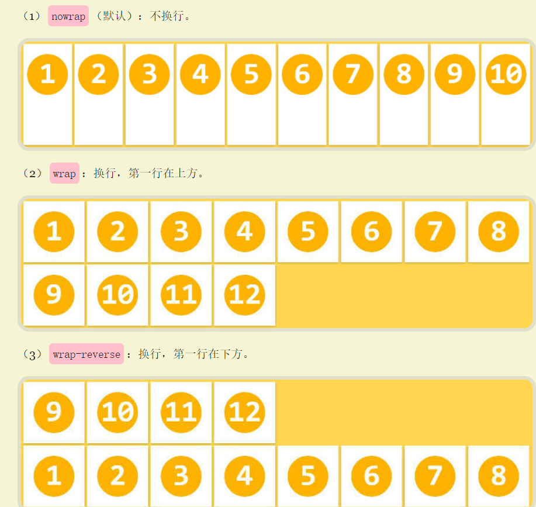
~~~html
<!DOCTYPE html>
<html lang="en">

<body>
    

        
1

        
2

        
3

        
4

        
5

    

</body>

</html>
~~~
>[danger] ##### flex-flow -- 属性是 flex-direction 和 flex-wrap 的简写
~~~
1.flex-flow属性是flex-direction属性和flex-wrap属性的简写形式，默认值为row nowrap。顺序任何, 并且都可以省略;

~~~
>[danger] ##### justify-content --- 设置主轴排列
* **justify-content 决定了 flex items 在 main axis**上的对齐方式
~~~
1.'justify-content'控制的是主轴('main axis')方向排列子容器
2.'justify-content: flex-start | flex-end | center | space-between | space-around;|space-evenly'
 2.1. flex-start（默认值）：与 main start 对齐
 2.2. flex-end：与 main end 对齐
 2.3. center：居中对齐
 2.4. space-between：flex items 之间的距离相等，main start、main end两端对齐
 2.5. space-around：flex items 之间的距离相等，flex items 与 main start、main end 之间的距离是 flex items 之间距离的一半
 2.6.space-evenly：flex items 之间的距离相等，flex items 与 main start、main end 之间的距离 等于 flex items 之间的距离
~~~
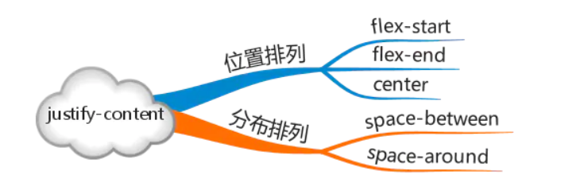
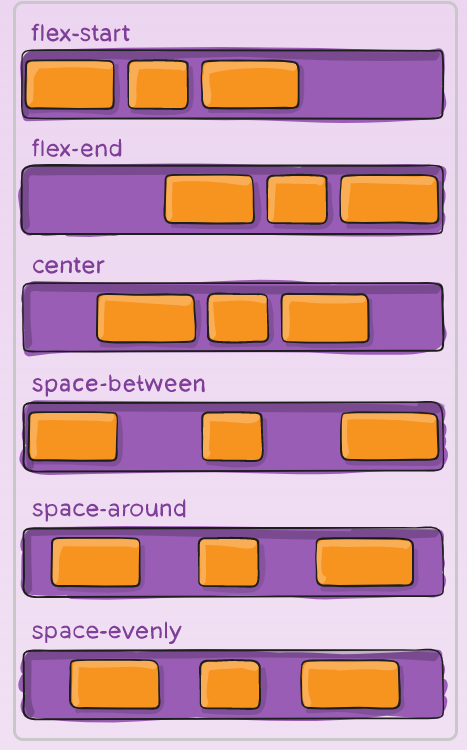
~~~
<!DOCTYPE html>
<html lang="en">

<body>
    

        
1

        
2

        
3

    

</body>

</html>
~~~
>[danger] ##### align-items -- 交叉轴
* **align-items 决定了 flex items 在 cross axis** 上的对齐方式
~~~
1.相比'justify-content' ,'align-items' 负责的是交叉轴也就是'cross axis' 的位置
2.'align-items: flex-start | flex-end | center | baseline | stretch;' 
 2.1. flex-start：与 cross start 对齐
 2.2. flex-end：与 cross end 对齐
 2.3. center：居中对齐
 2.4. baseline：与基准线对齐
 2.5. stretch：当 flex items 在 cross axis 方向的 size 为 auto 时（即没设置指定宽度），会自动拉伸至填充 flex container
 2.6. normal：在弹性布局中，效果和stretch一样
~~~
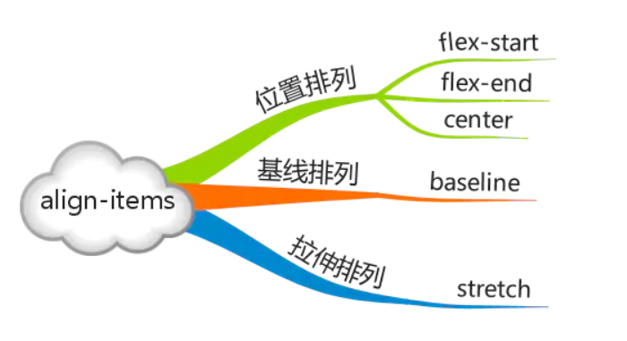
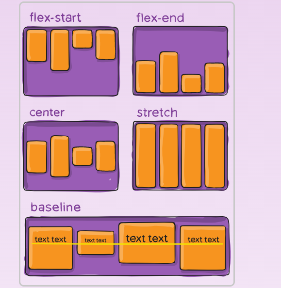
~~~html
<!DOCTYPE html>
<html lang="en">

<body>
    

        
1

        
2

        
3

       
    

</body>

</html>
~~~
>[danger] ##### align-content -- 多行沿交叉轴对齐
* **align-content 决定了多行 flex items** 在 cross axis 上的对齐方式，用法与 justify-content 类似
~~~
1如果项目只有一根交叉轴，该属性不起作用。理解成必须多行这个属性才生效，必须flex 父容器设置高度
2.' align-content: flex-start | flex-end | center | space-between | space-around | stretch;'
~~~
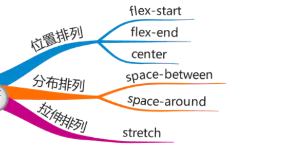
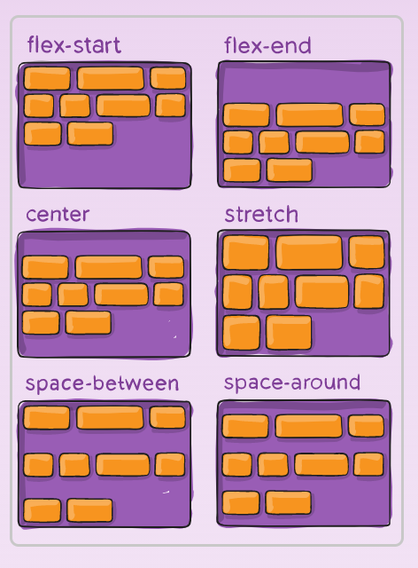

>[info] ## flex-items 设置的属性

~~~
1.刚才是给父容器设置弹性盒子规定内部排列效果，每个单独项也是可以做单独配置，可配置的属性有
'order'、'flex-grow'、'flex-shrink'、'flex-basis'、'flex'、'align-self'
~~~
>[danger] ##### align-self属性
* **flex items 可以通过 align-self 覆盖 flex container** 设置的 align-items
~~~
1. `align-self`属性允许单个项目有与其他项目不一样的对齐方式，可覆盖`align-items`属性。默认值为`auto`，表示继承父元素的
`align-items`属性，如果没有父元素，则等同于`stretch`。
2. auto（默认值）：遵从 flex container 的 align-items 设置`stretch、flex-start、flex-end、center、baseline`，效果跟 align-items 一致
3. flex items 扩展后的最终 size 不能超过 max-width\\max-height
~~~
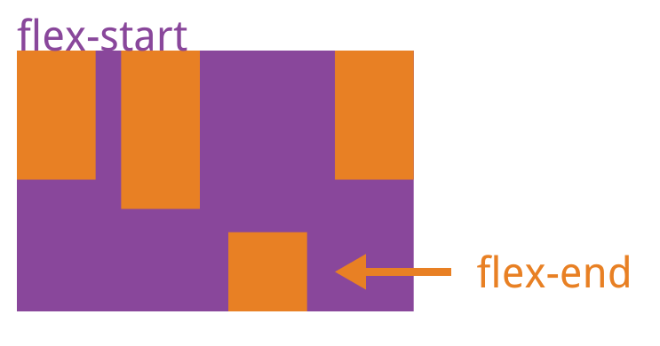
>[danger] ##### order属性定义项目的排列顺序
~~~
1.每个item 默认排序值为0，可以通过改变排序数值来影响他们排序的位置，数字越小越靠前
~~~

>[danger] ##### flex-grow 项目的放大比例
~~~
1.可以设置每个item 占比大小默认为0，即如果存在剩余空间，也不放大
2. 当 flex container 在 main axis 方向上有剩余 size 时，flex-grow 属性才会有效
~~~
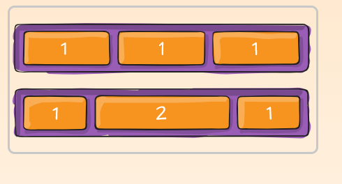
* 对于默认0的解释如图，即使有剩余空间其他的不会顶开
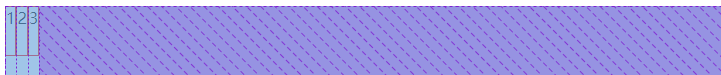
* 修改了第一块的flex-grow 为1则自动撑开
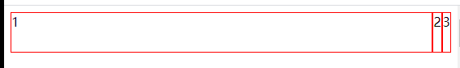

>[danger] ##### flex-shrink缩小比例
~~~
1.如果所有项目的flex-shrink属性都为1，当空间不足时，都将等比例缩小。如果一个项目的flex-shrink属性为0，其他
项目都为1，则空间不足时，前者不缩小负值对该属性无效,简单说当 flex items 在 main axis 方向上超过了 flex container 
的 size，flex-shrink 属性才会有效
2. flex items 收缩后的最终 size 不能小于 min-width\\min-height
~~~
>[danger]  flex属性
~~~
1. `flex`属性是`flex-grow`,`flex-shrink`和`flex-basis`的简写，默认值为`0 1 auto`。后两个属性可选。
 1.1. 第一个值必须为一个无单位数，并且它会被当作  的值。
 1.2. 第二个值必须为一个无单位数，并且它会被当作  的值。
 1.3. 第三个值必须为一个有效的宽度值， 并且它会被当作  的值
~~~
* 注：flex-basis 用来设置 flex items 在 main axis 方向上的 base size

>[danger] ##### 内容参考

[# Flex 布局教程：语法篇](https://www.ruanyifeng.com/blog/2015/07/flex-grammar.html)
[# A Complete Guide to Flexbox](https://css-tricks.com/snippets/css/a-guide-to-flexbox/)
[
一款通过游戏让你学会flexbox的网站，一共24关
](http://flexboxfroggy.com/)

https://juejin.cn/post/6844903474774147086 -- 二次纠正重看
[后续看](https://blog.csdn.net/cc18868876837/article/details/88138057)