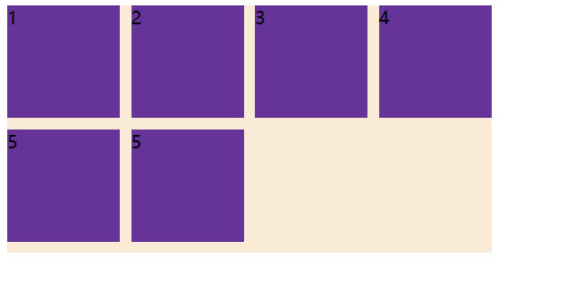
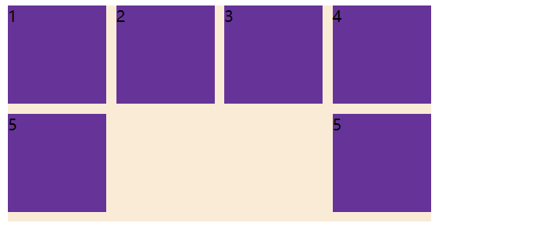

>[success] # 等距布局
* 项目中经常需要如下布局形式

* 如果使用flex 的**justify-content: space-between;** 当内容没有完全占满整个容器效果

* 想利用flex 达到效果，第一种方法计算法，以当前案例来说外层容器为430，每个容器宽度为100，则每个容器中间为10且最后4n的元素右边距为0
~~~
<!DOCTYPE html>
<html lang="en">
<head>
	<meta charset="UTF-8">
	<meta http-equiv="X-UA-Compatible" content="IE=edge">
	<meta name="viewport" content="width=device-width, initial-scale=1.0">
	<title>Document</title>
	
</head>
<body>
	

		
1

		
2

		
3

		
4

		
5

		
5

	

</body>
</html>

~~~
* **推荐**使用占位法，将占位元素宽度设置和内容元素一样，占位元素不要设置高度，占位元素个数为**列数减-2** 即当前四列则4-2，两个占位元素，好处不用计算
~~~
<!DOCTYPE html>
<html lang="en">
<head>
	<meta charset="UTF-8">
	<meta http-equiv="X-UA-Compatible" content="IE=edge">
	<meta name="viewport" content="width=device-width, initial-scale=1.0">
	<title>Document</title>
	
</head>
<body>
	

		
1

		
2

		
3

		
4

		
5

		
5

		<i></i><i></i>
	

</body>
</html>

~~~