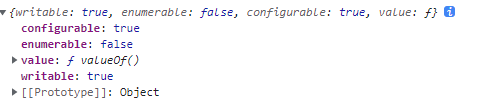

>[success] # for...in 和 Object.keys
~~~
1.'for..in'循环遍历属性和整个原型链，上面章节也介绍过如果有可枚举的属性那么for...in 将会全部遍历出来
2.'Object.keys' 仅仅是对象自己的属性，非原型链上的，并且也需要是可枚举类型
3.'Object.getOwnPropertyNames' 可以获取一个对象的所有属性,甚至包括不可枚举的，但
不包括Symbol值作为名称的属性和原型链上的
4.'getOwnPropertySymbols'返回一个给定对象自身的所有 Symbol 属性的数组。
~~~
[eslint-refactor-for-in](https://www.30secondsofcode.org/blog/s/eslint-refactor-for-in)
>[danger] ##### for...in 和 Object.keys 案例说明
* Object.keys 循环打印的结果是不包含'prototype'
~~~
1.下面案例可以看出Object.keys 循环打印的结果是不包含'prototype'
~~~
~~~
function Test1(){
    this.name = 'W'
}
Test1.prototype.getName=function(){
    return this.name
}

const test1 = new Test1()
for(let i in test1){
    console.log(i,'for..in')
}
Object.keys(test1).forEach(function(v){console.log(v)})

// 打印结果
name for..in
getName for..in

name
~~~
* 可枚举类型 还是唯一解释权
~~~
1.下面案例可以看出Object.keys 和 for...in 都对不可枚举类型是都不支持的
~~~
~~~
function Test1(){
    Object.defineProperty(this,'name',{enumerable:false})
}
Test1.prototype.getName=function(){
    return this.name
}

const test1 = new Test1()
for(let i in test1){
    console.log(i,'for..in')
}
Object.keys(test1).forEach(function(v){console.log(v)}) // 由于不可枚举即使不在原型链上的没有结果
// 打印结果
getName for..in
~~~
>[danger] #####  产生疑问记录
~~~
1.for...in 可以循环'prototype' 为什么 for...in 直接循环 new Object 并没有输出打印，原因是这些属
性是不可枚举的 举个例子：
 Object.getOwnPropertyDescriptor(Object.prototype,'valueOf')
~~~
* 如图
