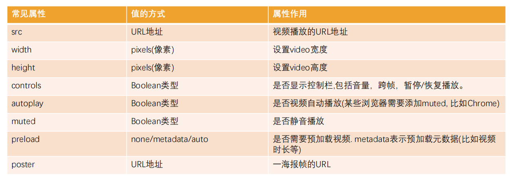
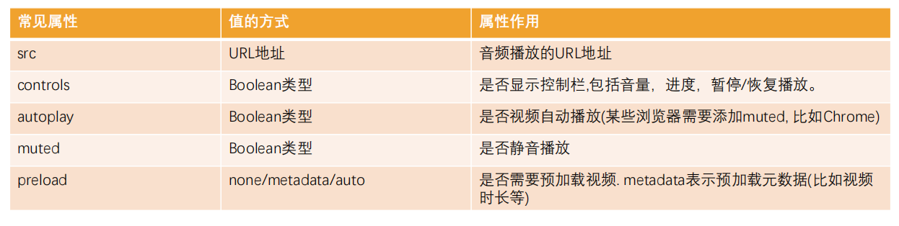

>[success] # video
* 大部分浏览器配置`autoplay` 并不会生效，因为防止一些不正规的视频在打开网页时候即播放出声音，因此往往需要配合`muted` 即静音自动播放才能达到自动播放效果

>[danger] ##### 案例
* 通过元素指定更多视频格式的源，通过p/div等元素指定在浏览器不支持video元素的情况, 显示的内容;
~~~
<!DOCTYPE html>
<html lang="en">
<head>
    <meta charset="UTF-8">
    <title>Title</title>

</head>
<body>
<!--audio:音频-->
<!--
src:播放文件的路径
controls:音频播放器的控制器面板
autoplay:自动播放
loop:循环播放-->
<audio src="../mp3/aa.mp3" controls></audio>

<!--video：视频-->
<!--
src:播放文件的路径
controls:音频播放器的控制器面板
autoplay:自动播放
loop:循环播放
poster:指定视频还没有完全下载完毕，或者用户没有点击播放前显示的封面。 默认显示当前视频文件的第一副图像
width:视频的宽度
height:视频的高度
-->
<!--注意事项：视频始终会保持原始的宽高比。意味着如果你同时设置宽高，并不是真正的将视频的画面大小设置为指定的大小，而只是将视频的占据区域设置为指定大小，除非你设置的宽高刚好就是原始的宽高比例。所以建议：在设置视频宽高的时候，一般只会设置宽度或者高度，让视频文件自动缩放-->
<!--<video src="../mp3/mp4.mp4" poster="../images/l1.jpg" controls  height="600"></video>-->

<!--source:因为不同的浏览器所支持的视频格式不一样，为了保证用户能够看到视频，我们可以提供多个视频文件让浏览器自动选择-->
<!--<video src="../mp3/flv.flv" controls></video>-->
<video controls>
    <!--视频源，可以有多个源-->
    <source src="../mp3/flv.flv" type="video/flv">
    <source src="../mp3/mp4.mp4" type="video/mp4">
    
都不支持

</video>

</body>
</html>
~~~
>[success] # audio
