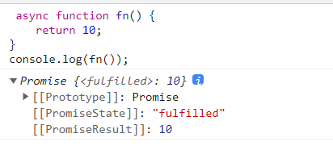
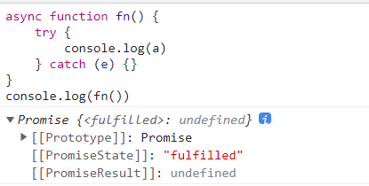
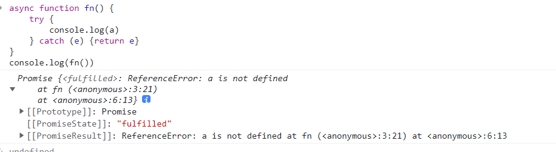

[TOC]
>[success] # async  配合 await
[先看这个章节链接](https://www.kancloud.cn/cyyspring/more/2241086)
[mdn好文章必读收获满满](https://developer.mozilla.org/zh-CN/docs/learn/JavaScript/%E5%BC%82%E6%AD%A5/Async_await)
~~~
1.虽然es6 提供了Promise 作为异步处理解决了地狱回调的问题，但是在书写一直链式使用then
确实也是和正常逻辑代码书样子还是有一定差别的，在es8 async  配合 await可以解决相对应
的问题
2.或者使用co 函数库 ，但是现在async  配合 await 可以完全替代他了
3.async 函数 func 最后返回的结果直接是 Promise 对象
4.await  操作符用于等待一个Promise 对象，mdn 的介绍：
 await 表达式会暂停当前 async function 的执行，等待 Promise 处理完成。若 Promise
 正常处理(fulfilled)，其回调的resolve函数参数作为 await 表达式的值，继续执行 async function。
 若 Promise 处理异常(rejected)，await 表达式会把 Promise 的异常原因抛出。
 另外，如果 await 操作符后的表达式的值不是一个 Promise，则返回该值本身
~~~
>[info] ## 使用
~~~
1.async:函数修饰符  控制函数返回promise实例
 1.1.函数内部执行报错，则返回失败的promise实例，失败的原因
 1.2.自己返回一个promise，以自己返回的为主
 1.3.如果函数内部做了异常捕获，则还是成功态
2.使用async的主要目的：是为了在函数内部使用await
3.await:后面应该放置一个promise实例我们书写的不是，浏览器也会把其变为promise实例
  3.1.await是异步的微任务
  3.2.如果我们的异步函数的返回值是一个对象并且实现了thenable，那么会由对象的
then方法来决定
 3.3.await会等到Promise的状态变成fulfilled状态，之后继续执行异步函数
~~~
>[danger] ##### 案例
~~~
 async function fn() {
    return 10; // 其实相当于 return Promise.resolve(10)
}
console.log(fn());
~~~
* 如图

>[danger] ##### 案例二 解释1.3
~~~
async function fn() {
    try {
        console.log(a)
    } catch (e) {}
}
console.log(fn())
~~~
* 如图

* 虽然返回异常但也是成功

>[danger] ##### 案例三 解释await
1. await后面是一个普通的值，那么会直接返回这个值
2. await后面是一个thenable的对象，那么会根据对象的then方法调用来决定后续的值
3. await后面的表达式，返回的Promise是reject的状态，那么会将这个reject结果直接作为函数的Promise的reject值
~~~
async function func() {
    // await 1; //-> await Promise.resolve(1);

    let result1 = await api(1000);
    console.log(result1);

    let result2 = await api(3000);
    console.log(result2);
}
func();
~~~
>[danger] ##### 异步函数有返回值时，和普通函数会有区别
1. 异步函数也可以有返回值，但是异步函数的返回值相当于被包裹到Promise.resolve中

2. 果我们的异步函数的返回值是Promise，状态由会由Promise决定
3. 如果我们的异步函数的返回值是一个对象并且实现了thenable，那么会由对象的then方法来决定

~~~
async function foo2() {
// 1.返回一个普通的值
// -> Promise.resolve( ["abc", "cba", "nba"])
return ["abc", "cba", "nba"]

// 2.返回一个Promise
// return new Promise((resolve, reject) => {
//   setTimeout(() => {
//     resolve("aaa")
//   }, 3000)
// })

// 3.返回一个thenable对象
// return {
//   then: function(resolve, reject) {
//     resolve("bbb")
//   }
// }
}
~~~
~~~
foo2().then(res => {
	console.log("res:", res) // 情况1 ["abc", "cba", "nba"] 情况2 aaa 情况三bbb
})
~~~
>[danger] ##### 异步异常
1. 调用后通过catch 接受异常
~~~
async function foo() {
	
	throw new Error("1")

	// return new Promise((resolve, reject) => {
	//   reject("err rejected")1
	// })

	return 123
}

// promise -> pending -> fulfilled/rejected
foo().then(res => {
	console.log("res:", res)
}).catch(err => {
	console.log(" err:", err)
	console.log("继续执行其他的逻辑代码")
})
~~~
2. await 接受异步如果是异常
~~~
function requestData(url) {
	return new Promise((resolve, reject) => {
		setTimeout(() => {
			// reject("error message")
		}, 2000)
	})
}

async function getData() {
	const res1 = await requestData('1')
	console.log('res1:', res1)

	const res2 = await requestData(res1 + '2')
	console.log('res2:', res2)
}

getData().catch((err) => {
	console.log('err:', err)
})
~~~
>[info] ## Promise 和 async 等同写法
~~~
1.第一种sequential 是所有总和时间，后续四种都是以最长时间为准
~~~
~~~
var resolveAfter2Seconds = function resolveAfter2Seconds() {
    console.log('starting slow promise')
    return new Promise((resolve) => {
        setTimeout(function () {
            resolve('slow')
            console.log('slow promise is done')
        }, 5000)
    })
}

var resolveAfter1Second = function resolveAfter1Second() {
    console.log('starting fast promise')
    return new Promise((resolve) => {
        setTimeout(function () {
            resolve('fast')
            console.log('fast promise is done')
        }, 1000)
    })
}

// sequential:相继的 /[sɪˈkwenʃl]/
var sequential = async function sequential() {
    console.time('3')
    console.log('==SEQUENTIAL START==')
    const slow = await resolveAfter2Seconds()
    console.log(slow)
    const fast = await resolveAfter1Second()
    console.log(fast)
    console.timeEnd('3')
}

// concurrent:同时发生的 /[kənˈkʌrənt]/
var concurrent = async function concurrent() {
    console.time('1')

    console.log('==CONCURRENT START with await==')
    const slow = resolveAfter2Seconds()
    const fast = resolveAfter1Second()
    console.log(await slow)
    console.log(await fast)
    console.timeEnd('1')
}

var concurrentPromise = function concurrentPromise() {
    console.log('==CONCURRENT START with Promise.all==')
    return Promise.all([resolveAfter2Seconds(), resolveAfter1Second()]).then(
        (messages) => {
            console.log(messages[0])
            console.log(messages[1])
        }
    )
}

// parallel:平行的 /[ˈpærəlel]/
var parallel = async function parallel() {
    console.time('2')

    console.log('==PARALLEL with await Promise.all==')
    await Promise.all([
        (async () => {
            let result = await resolveAfter2Seconds()
            console.log(result)
        })(),
        (async () => {
            let result = await resolveAfter1Second()
            console.log(result)
        })(),
    ])
    console.timeEnd('2')
}

var parallelPromise = function parallelPromise() {
    console.log('==PARALLEL with Promise.then==')
    resolveAfter2Seconds().then((message) => console.log(message))
    resolveAfter1Second().then((message) => console.log(message))
}

sequential() // 6S+
// concurrent() // 5S+

// concurrentPromise() // 5S+

// parallel() // 5S+
// parallelPromise() // 5S+
~~~
>[info] ## 了解生成器函数
~~~
1.next 执行下一步，yield会返回一个迭代器对象，生成器函数可以用throw 接受抛出的异常
~~~
~~~
// 生成器函数回顾

function * foo () {
  console.log('start')

  try {
    const res = yield 'foo'
    console.log(res)
  } catch (e) {
    console.log(e)
  }
}

const generator = foo()

const result = generator.next()
console.log(result)

// generator.next('bar')

generator.throw(new Error('Generator error'))
// 打印结果
start
{ value: 'foo', done: false }
Error: Generator error
~~~
>[danger] ##### Generator 配合 Promise 的异步方案
~~~
1.现在定义main 方法中的异步写起来已经和同步方法的感觉一样 可以依次执行 ，也不用链式使用，
配合封装co方法
~~~
~~~
// Generator 配合 Promise 的异步方案

function ajax (url) {
  return new Promise((resolve, reject) => {
    var xhr = new XMLHttpRequest()
    xhr.open('GET', url)
    xhr.responseType = 'json'
    xhr.onload = () => {
      if (xhr.status === 200) {
        resolve(xhr.response)
      } else {
        reject(new Error(xhr.statusText))
      }
    }
    xhr.send()
  })
}

function * main () {
  try {
    const users = yield ajax('/api/users.json')
    console.log(users)

    const posts = yield ajax('/api/posts.json')
    console.log(posts)

    const urls = yield ajax('/api/urls11.json')
    console.log(urls)
  } catch (e) {
    console.log(e)
  }
}

function co (generator) {
  const g = generator()
  // 通过生成器返回的迭代器对象的格式配合递归结合Promise 实现
  function handleResult (result) {
    if (result.done) return // 生成器函数结束
    result.value.then(data => {
      handleResult(g.next(data))
    }, error => {
      g.throw(error)
    })
  }

  handleResult(g.next())
}

co(main)
~~~
>[info] ## 封装递归的方法过于麻烦 使用async 和awit 配合
~~~
const pr = new Promise((resolve, reject) => {
    resolve(1)
})

async function te() {
    const a = await pr
    console.log(a)
    console.log(2)
}

te()
console.log(3)
// 打印结果：
3
1
2
~~~
* 如果想让上面打印 1 2 3的顺序
~~~
const pr = new Promise((resolve, reject) => {
    resolve(1)
})

async function te() {
    const a = await pr
    console.log(a)
    console.log(2)
}

te().then(() => {
    console.log(3)
})
~~~
>[danger] ##### Async / Await 语法糖
~~~
1.Async / Await 返回的是一个promise 因此可以通过then 继续调用
~~~
~~~
// Async / Await 语法糖

function ajax (url) {
  return new Promise((resolve, reject) => {
    var xhr = new XMLHttpRequest()
    xhr.open('GET', url)
    xhr.responseType = 'json'
    xhr.onload = () => {
      if (xhr.status === 200) {
        resolve(xhr.response)
      } else {
        reject(new Error(xhr.statusText))
      }
    }
    xhr.send()
  })
}

// function co (generator) {
//   const g = generator()

//   function handleResult (result) {
//     if (result.done) return // 生成器函数结束
//     result.value.then(data => {
//       handleResult(g.next(data))
//     }, error => {
//       g.throw(error)
//     })
//   }

//   handleResult(g.next())
// }

async function main () {
  try {
    const users = await ajax('/api/users.json')
    console.log(users)

    const posts = await ajax('/api/posts.json')
    console.log(posts)

    const urls = await ajax('/api/urls.json')
    console.log(urls)
  } catch (e) {
    console.log(e)
  }
}

// co(main)
const promise = main()

promise.then(() => {
  console.log('all completed')
})

~~~