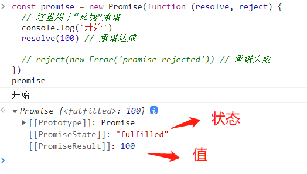
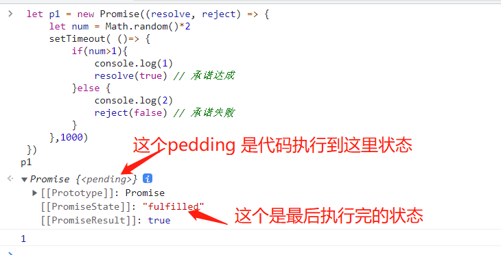
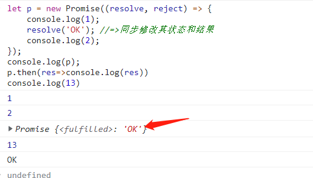
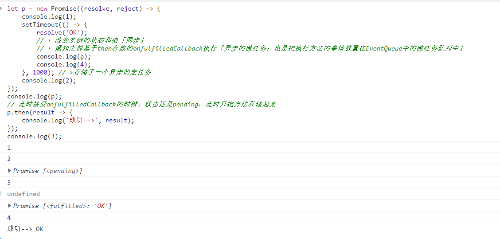
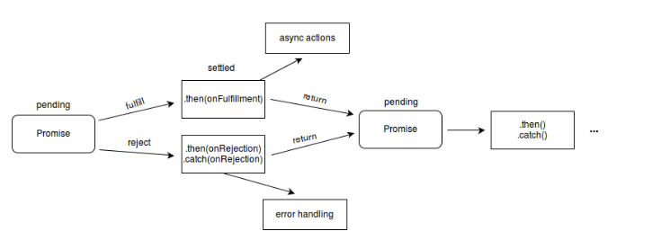

[TOC]
>[success] # Promise 使用
~~~
1.需要知道关于promise：
    1.1.promise 的 executor（执行器） 里的代码是同步的
    1.2.promise 的回调是 microTask（微任务） 而 setTimeout 的回调是 task（任务/宏任务）
    1.3.microTask 早于 task 被执行。
~~~
* 标记
https://www.ecma-international.org/ecma-262/6.0/#sec-performpromisethen
https://www.ecma-international.org/ecma-262/6.0/#sec-returnifabrupt
https://www.ecma-international.org/ecma-262/6.0/#sec-promise-executor
>[info] ##### 创建一个Promise
~~~
1.Promis 通过new的形式创建。在构造函数初始化的时候需要传入一个函数作为参数，这个函数被称为
'处理器函数 (executor function)' 即'[executor]:可执行函数'
  1.1.new Promise的时候,在Promise内部会立即把[executor]函数执行
  1.2.同时给'[executor]'函数传递两个值'函数类型'：resolve/reject,当异步任务顺利完成且返回结果值时，会调用
  'resolve' 函数；而当异步任务失败且返回失败原因（通常是一个错误对象）时，会调用'reject' 函数。
2.Promise 创建的实例内置私有属性 
   2.1.'[[PromiseState]]' 实例状态：pending准备状态  fulfilled/resolved成功态  rejected失败态
   2.2.'[[PromiseResult]]'实例的值
3.公共属性方法 Promise.prototype，提供的方法有例如'then','catch','finally'
4.执行then方法时，存放的两个方法中的某一个方法执行  p.then(onfulfilledCallback,onrejectedCallback)
  4.1.状态成功执行的是：onfulfilledCallback
  4.2.状态失败执行的是：onrejectedCallback
  4.3.并且把[[PromiseResult]]的值传递给方法
~~~
>[danger] ##### 先看一个简单案例
~~~
const promise = new Promise(function (resolve, reject) {
  // 这里用于“兑现”承诺
  console.log('开始')
  resolve(100) // 承诺达成

  // reject(new Error('promise rejected')) // 承诺失败
})
~~~
* 如图

>[danger] ##### 案例二
~~~
// 创建一个Promise对象，p1对象承诺在未来的某一个时刻完成。
 let p1 = new Promise((resolve, reject) => {
     let num = Math.random()*2
     setTimeout( ()=> {
         if(num>1){
             console.log(1)
             resolve(true) // 承诺达成
         }else {
             console.log(2)
             reject(false) // 承诺失败
         }
     },1000)
 })
~~~
* 如图 随机状态成功，注意这里控制台看结果的时候显示

>[danger] ##### Promise的生命周期
~~~
1.在[executor]执行resolve/reject都是为了改变promise实例的状态和值「结果」,一但状态被改变成
fulfilled/rejected则不能在改为其他的状态
2.整个'Promise' 的生命周期  有两个阶段个阶段 :
    2.1.进行中(pending) 进行中状态因为操作都没结束也可以理解成未处理(unsettled)
    2.2.当操作处理结束后就会变成已处理的状态(settled)
3.正是因为这两个阶段会出现三种状态（当然1.2和1.3的状态只会出现一种）
    3.1.pending: 初始状态，既不是成功，也不是失败状态。 -- 进行中(pending)阶段发生的
    3.2.fulfilled: 意味着操作成功完成。-- 已处理的状态(settled)
    3.3.rejected: 意味着操作失败。-- 已处理的状态(settled)
4.内部的[[PromiseState]] 属性会被设置为"pending" 、 "fulfilled" 或 "rejected"，以反映Promise的状态。该属性并未在 
Promise 对象上被暴露出来，因此你无法以编程方式判断 Promise 到底处于哪种状态。
~~~
* 如图

>[info] ## Promise 异步
~~~
1.承诺是一个同步，他不是靠then 方法来执行了，then方法只是在未来的某一个时刻来
看兑现承诺结果，毕竟结果是一件未来的事情，承诺是此时此刻的，异步产生是在then 调用
~~~
>[danger] ##### 案例一

~~~
1.执行p.then(onfulfilledCallback,onrejectedCallback)
 1.1.首先把传递进来的onfulfilledCallback和onrejectedCallback存储起来存储在一个容器中：因为可以基于
 then给其存放好多个回调函数
 1.2.其次再去验证当前实例的状态，如果实例状态是pending，则不做任何的处理， 如果已经变为fulfilled/rejected，
  则会通知对应的回调函数执行「但是不是立即执行，而是把其放置在EventQueue中的微任务队列中」 “promise本
  身不是异步的，是用来管理异步的，但是then方法是异步的「微任务」”

    let p = new Promise((resolve, reject) => {
        console.log(1);
        resolve('OK'); //=>同步修改其状态和结果
        console.log(2);
    });
    console.log(p); //此时状态已经修改为成功...
    p.then(res=>console.log(res))
    console.log(13)
~~~
* 如图

>[danger] ##### 案例二
~~~
let p = new Promise((resolve, reject) => {
    console.log(1);
    setTimeout(() => {
        resolve('OK');
        // + 改变实例的状态和值「同步」
        // + 通知之前基于then存放的onfulfilledCallback执行「异步的微任务：也是把执行方法的事情放置在EventQueue中的微任务队列中」
        console.log(p);
        console.log(4);
    }, 1000); //=>存储了一个异步的宏任务
    console.log(2);
});
console.log(p);
// 此时接受onfulfilledCallback的时候，状态还是pending，此时只把方法存储起来
p.then(result => {
    console.log('成功-->', result);
});
console.log(3);
~~~

>[danger] ##### 案例三
~~~
const promise = new Promise(function (resolve, reject) {
    // 我的承诺是现在的承诺
    console.log('我承诺我要好好学习js')
    // ---------------------成功还是失败是以后的事--------------------------
    // 因为是不可逆的要不成功 要不失败，所以下面的失败是被注释因为也不能执行
    resolve('我每天学js24个小时') // 承诺达成 {1}

    // reject(new Error('我每天打游戏24小时没时间')) // 承诺失败
})

// ---------------通过then 来兑现这个承诺的结果----------------------
promise.then(function (value) {
    // 即便没有异步操作，then 方法中传入的回调仍然会被放入队列，等待下一轮执行
    console.log('resolved', value)
}, function (error) {
    console.log('rejected', error)
})

console.log('end')
// 打印结果：
我承诺我要好好学习js
end
resolved 我每天学js24个小时
~~~
>[danger] ##### 总结
~~~
1.Promise的参数'executor' 函数内部都是同步，resolve/reject 是向外传递结果，then 用来接受参数，即使向下面
这样，内部没有任何类似settimeout 的异步方法， resolve('OK');也同步执行完了，但想获取结果需要，通过then
此时then 会等主线程的任务都完成，然后再去EventQueue中的微任务队列中去除结果
let p = new Promise((resolve, reject) => {
    console.log(1);
    resolve('OK'); //=>同步修改其状态和结果
    console.log(2);
})
但当里面是异步函数时候，内部是同步执行，不过此时同步读取到setTimeout，setTimeout被推入到webapi线程
当1000 毫秒还没结束,此时打印p是状态是pendding，当1000ms 后  resolve('OK'); 此时状态变为成功，但是需要
then 去接受结果
const p = new Promise((resolve, reject) => {
    setTimeout(()=>{
        resolve('OK');

    },1000)
    // reject('NO');
})
console.log(p)
~~~

>[danger] ##### 关于then 方法
* MDN的图

~~~
1.当调用then 方法时候'resolve' 或者'reject'触发产生的异步函数会被添加到任务队列中并异步执行
2.通过'MDN'提供的图来看出新建的'Promise是pending状态'，'fulfill'之后就会执行调用then的回调函数了，倘若
'reject'了就会调用'catch'来进行异常处理了，并且无论是调用then还是catch都会返回新的promise，这就是为什么
promise可以链式调用了。
3.也就像刚才说的'Promise就是获取异步返回值'，因此'Promise'对象'then' 方法可以理解成获取当初在
'处理器函数 (executor function)'中的异步方法给出的结果，要注意的是:
'then() 函数会返回一个全新的 Promise，和原来的不同'
~~~
 * MDN 中给出的案例
 ~~~
let myFirstPromise = new Promise(function(resolve, reject){
    //当异步代码执行成功时，我们才会调用resolve(...), 当异步代码失败时就会调用reject(...)
    //在本例中，我们使用setTimeout(...)来模拟异步代码，实际编码时可能是XHR请求或是HTML5的一些API方法.
    setTimeout(function(){
        resolve("成功!"); //代码正常执行！
    }, 250);
});

myFirstPromise.then(function(successMessage){
    //successMessage的值是上面调用resolve(...)方法传入的值.
    //successMessage参数不一定非要是字符串类型，这里只是举个例子
    console.log("Yay! " + successMessage);
});
~~~
>[danger] ##### 总结
~~~
1.执行then方法会返回一些全新的promise实例
  1.1.方法执行不报错，如果方法中返回一个全新的Promise实例，则全新的Promise实例的成功和失败决定
  下一个成功和失败，如果不是返回promise则 [[PromiseState]]:fulfiled  [[PromiseResult]]:返回值
  1.2.如果方法执行报错：则 [[PromiseState]]:rejected  [[PromiseResult]]:报错原因
~~~
~~~
// 其实相当于第一then 返回值为 Promise.resolve(undefined)
const p = new Promise((resolve,reject)=>{
    resolve(1)
}).then(res=>{
    console.log(res) // 1
}).then(res=>{ 
    console.log(res) // undefined
})

//--------------
const p = new Promise((resolve,reject)=>{
    resolve(1)
}).then(res=>{

    console.log(res) // 1
    return Promise.resolve(2)
}).then(res=>{ console.log(res)}) // 2
~~~
>[danger] ##### 循环Promise 数组
1.[参考mdn](https://developer.mozilla.org/zh-CN/docs/Web/JavaScript/Reference/Global_Objects/Promise/resolve)
~~~
/**
 * Runs promises from array of functions that can return promises
 * in chained manner
 *
 * @param {array} arr - promise arr
 * @return {Object} promise object
 */
function runPromiseInSequence(arr, input) {
  return arr.reduce(
   // Promise.resolve(input).then(currentFunction)
    (promiseChain, currentFunction) => promiseChain.then(currentFunction),
    Promise.resolve(input)
  );
}

// promise function 1
function p1(a) {
  return new Promise((resolve, reject) => {
    resolve(a * 5);
  });
}

// promise function 2
function p2(a) {
  return new Promise((resolve, reject) => {
    resolve(a * 2);
  });
}

// function 3  - will be wrapped in a resolved promise by .then()
function f3(a) {
 return a * 3;
}

// promise function 4
function p4(a) {
  return new Promise((resolve, reject) => {
    resolve(a * 4);
  });
}

const promiseArr = [p1, p2, f3, p4];
runPromiseInSequence(promiseArr, 10)
  .then(console.log);   // 1200
~~~