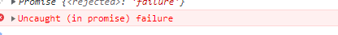
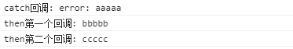
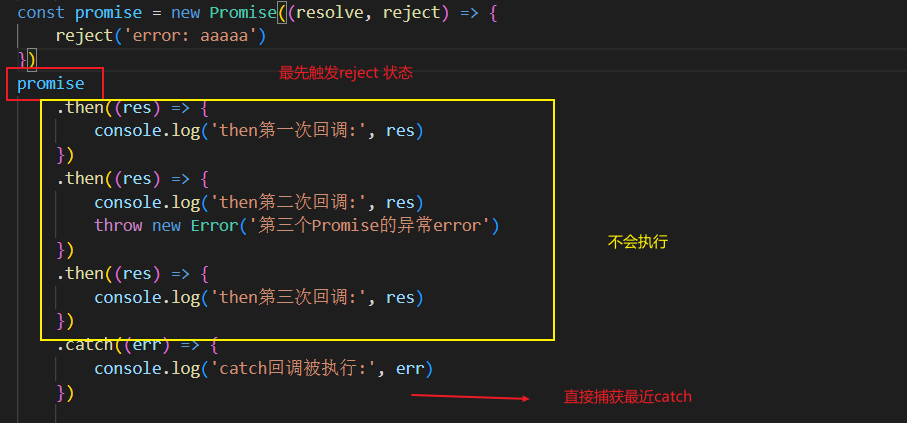
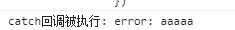
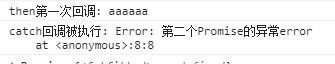
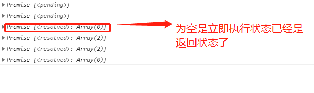
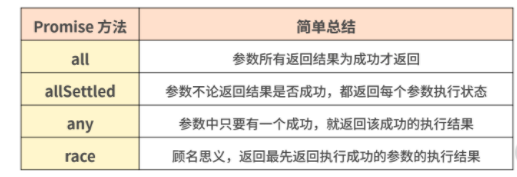

[TOC]
>[success] # Promise 更多用法
~~~
~~~
>[info] ## 创建Promise 对象
~~~
1. 创建Promise 对象的有两大类别，第一类别就是上一个章节有使用的new 的形式创建可以理解成
'创建未完成的Promise'，另一种就是下面章节说的'创建已处理的Promise'
~~~
>[danger] ##### 创建未完成的Promise
~~~
1.new Promise(executor) -- 参数为'处理器函数 (executor function)'
~~~
* 简单案例 更多详细看上一个章节
~~~
let p1 = new Promise((resolve, reject) => {
   setTimeout( ()=> {
       resolve(2) 
       console.log(1)
   },1000)
})
// 使用
p1.then((parmas)=>{
    console.log(parmas)
})
// 打印结果
1
2
~~~
>[danger] ##### 创建已处理的Promsie(一) -- resolve
~~~
1.Promise.resolve()方法接收一个参数，并会返回一个处于已完成状态的 Promise ，参数有三种形式
    1.1.第一种参数形式Promise.resolve(value); -- 普通value参数
    1.2.第二种参数形式Promise.resolve(promise); -- promise 对象作为参数
    1.3第三种参数形式.Promise.resolve(thenable); -- 拥有then方法并且接受res和rej两个参数的普通对象就可理解为
       'thenable'类型
2.由于该Promise永远不存在拒绝状态，因而该Promise的拒绝处理程序永远不会被调用
~~~
* 等同的写法
~~~
Promise.resolve('foo')
    .then(function (value) {
        console.log(value)
    })
// 等同
new Promise(function (resolve, reject) {
    resolve('foo')
})
~~~
* 第一种参数 --- value
~~~
const p = Promise.resolve(1)
p.then((status)=>{
    console.log(status)
})
// 打印结果：
1
~~~
* 第二种参数 -- Promise
~~~
1.直接返回参数promise这promise 对象，至于这个promise是返回成功还是失败都取决于参数这个promise的结果
~~~
~~~
let p1 = new Promise(function (res,rej) {
    let num = Math.random()*2
    setTimeout(function () {
        if(num>1){
            console.log(1)
            res(true)
        }else {
            console.log(2)
            rej(false)
        }
    },1000)
})
const p2 = Promise.resolve(p1)
// 此时P2 成功还是失败状态完全取决于p1，虽然P2 调用了resolve 也要看 p1实际结果情况
p2.then((status)=>{
   console.log(status)
}).catch((err)=>{
    console.log(err)
})
~~~
* 第三种参数 -- 非Promise 的Thenable对象
~~~
1.thenable 对象和Promise之间都有then()方法之一相似之处，当作为参数的时候会将thenanle对象转化成一个
已完成的Promise对象，注意此时then 会自动加入两个回调函数参数
~~~
~~~
let thenable = {
   // 会自动加入两个回调函数参数
    then:function (res,rej) {
        res(42)
    }
}
let p1 = Promise.resolve(thenable)
p1.then(function (v) {
    console.log(v)
})
~~~
>[danger] ##### 创建已处理的Promsie(二) -- reject
~~~
1.Promise.reject()方法接收一个参数，并会返回一个处于已拒绝状态的 Promise 其余的和 resolve 是一样的
~~~
>[info] ## Promise 执行器错误和全局的拒绝处理

>[danger] ##### 处理器函数 (executor function)错误
~~~
1.当创建的Promise 对象中的'处理器函数 (executor function)'内部抛出一个错误则'promise'的拒绝处理程序就会 被
调用
2.下面的案例JSON.parse('err') 这个用法明显错误，但会在catch 阶段执行也就是'rejected'意味着操作失败

~~~
~~~
let p = new Promise(function (res,rej) {
    JSON.parse('err')
})
p.then((status)=>{
    console.log(status)
}).catch((err)=>{
    console.log('err',err)
})
~~~
* 上面的代码等同于
~~~
let p = new Promise(function (res,rej) {
    try{
        JSON.parse('err')
    }catch (e) {
        rej(e)
    }

})
p.then((status)=>{
    console.log(status)
}).catch((err)=>{
    console.log('err',err)
})
~~~
>[danger] ##### 全局的Promise 拒绝处理
~~~
1.当 Promise 被拒绝时，会有两个事件之一被派发到全局作用域浏览器环境这里指的是'window'
    1.1.'rejectionhandled'当 Promise 被'拒绝'、并且在'reject'函数处理该 'rejection' 之后会派发此事件。
    1.2.'unhandledrejection'当 Promise 被'拒绝'，但没有提供 'reject' 函数来处理该 'rejection' 时，会派发此事件。
2.这两个事件event分别有三个属性
    2.1 event.type -- 事件名
    2.2.event.promise -- 被拒绝的Promise 对象
    2.3.event.reason -- 来自Promise 拒绝值
~~~
* 这是一个rejected--操作失败的已处理的状态(settled)，使用'unhandledrejection' 来做监听
~~~
window.addEventListener('unhandledrejection', event =>
{
    console.log(event.reason); // 打印"Hello, Fundebug!"
    console.log(event.type); // 'unhandledrejection'
    console.log(event.promise); // promise 对象
});
var r = foo();
r.then((params)=>{
    console.log(params)
})
~~~
* rejectionhandled 事件错误没有立刻处理而是稍后处理就会触发
~~~
window.addEventListener('rejectionhandled', event =>
{
    console.log('rejection handled'); // 1秒后打印"rejection handled"
});

function foo()
{
    return Promise.reject('Hello, Fundebug!');
}

var r = foo();
setTimeout(() =>
{
    r.catch(e =>{});
}, 1000);
~~~
>[danger] ##### 书中给的一个简单的未处理拒绝跟踪器案例
~~~
let possiblyUnhandledRejections = new Map();
// 当一个拒绝未被处理，将其添加到 map
window.onunhandledrejection = function(event) {
    possiblyUnhandledRejections.set(event.promise, event.reason);
};
// 如果是因为延迟才处理的话可以剔除
window.onrejectionhandled = function(event) {
    possiblyUnhandledRejections.delete(event.promise);
};
setInterval(function() {
    possiblyUnhandledRejections.forEach(function(reason, promise) {
        console.log(reason.message ? reason.message : reason);
        // 做点事来处理这些拒绝
        handleRejection(promise, reason);
    });
    possiblyUnhandledRejections.clear();
}, 60000);
~~~
>[info] ## 链式调用的 -- then
~~~
1.then 方法返回一个 Promise 对象，其允许方法链。
2.当一个值只是从一个 then 内部返回时，它将等价地返回 Promise.resolve(<由被调用的处理程序返回的值>)。
3.也可以返回是一个Promise 对象
~~~
>[danger] ##### 通过链式调用来理解Promise如何解决了地狱回调
~~~
1.首先promise如果没有采用链式写法 其实还是和以前使用地狱回调是一个问题
~~~
~~~
function ajax (url) {
  return new Promise(function (resolve, reject) {
    var xhr = new XMLHttpRequest()
    xhr.open('GET', url)
    xhr.responseType = 'json'
    xhr.onload = function () {
      if (this.status === 200) {
        resolve(this.response)
      } else {
        reject(new Error(this.statusText))
      }
    }
    xhr.send()
  })
}

// 嵌套使用 Promise 是最常见的误区
// ajax('/person').then(function (urls) {
//   ajax(urls.users).then(function (users) {
//     ajax(urls.users).then(function (users) {
//       ajax(urls.users).then(function (users) {
//         ajax(urls.users).then(function (users) {

//         })
//       })
//     })
//   })
// })

~~~
* 正确使用
~~~
function ajax (url) {
  return new Promise(function (resolve, reject) {
    var xhr = new XMLHttpRequest()
    xhr.open('GET', url)
    xhr.responseType = 'json'
    xhr.onload = function () {
      if (this.status === 200) {
        resolve(this.response)
      } else {
        reject(new Error(this.statusText))
      }
    }
    xhr.send() 
  })
}

ajax('/api/users.json')
  .then(function (value) {
    console.log(1111)
    return ajax('/api/urls.json')
  }) // => Promise
  .then(function (value) {
    console.log(2222)
    console.log(value)
    return ajax('/api/urls.json')
  }) // => Promise
  .then(function (value) {
    console.log(3333)
    return ajax('/api/urls.json')
  }) // => Promise
  .then(function (value) {
    console.log(4444)
    return 'foo'
  }) // => Promise
  .then(function (value) {
    console.log(5555)
    console.log(value)
  })

~~~
>[danger] ##### 案例
~~~
1.执行器传入的value 值为1，当p2 执行完返回的vaule + 1也就是2，这个值随后传给了下一个then，此时相当于
Promise.resolve(<由被调用的处理程序返回的值>)，又产生新的异步回调队列，因此下面P2.then 先打印出1，这个
新的异步回调队列在在执行 因此最后才打印'2'
~~~
~~~
var p2 = new Promise(function(resolve, reject) {
    resolve(1);
});

p2.then(function(value) {
    console.log(value); // 1
    return value + 1;
}).then(function(value) {
    console.log(value + '我接收的是上一个promise 的返回值');
});

p2.then(function(value) {
    console.log(value); // 1
});

// 打印结果
1
1
2我接收的是上一个promise 的返回值
~~~
>[info] ## 链式调用的 -- catch
~~~
1.和then一样不过是失败的时候才触发
2. catch 返回的也是一个promise
3. catch 是捕获最近 `reject` 状态
~~~
* 如果Promise 异常却没有抓异常执行代码后会有报错

~~~
const promise = new Promise((resolve, reject) => {
	reject('failure')
})

promise.then((res) => {
	console.log('成功的回调:', res)
})
~~~
* **catch** 返回的也是一个promise
~~~
const promise = new Promise((resolve, reject) => {
	reject("error: aaaaa")
})

// 1.catch方法也会返回一个新的Promise
promise.catch(err => {
	console.log("catch回调:", err)
	return "bbbbb"
}).then(res => {
	console.log("then第一个回调:", res)
	return "ccccc"
}).then(res => {
	console.log("then第二个回调:", res)
})
~~~
执行结果

* catch 是捕获最近 `reject` 状态

~~~
const promise = new Promise((resolve, reject) => {
	reject('error: aaaaa')
})
promise
	.then((res) => {
		console.log('then第一次回调:', res)
	})
	.then((res) => {
		console.log('then第二次回调:', res)
		throw new Error('第三个Promise的异常error')
	})
	.then((res) => {
		console.log('then第三次回调:', res)
	})
	.catch((err) => {
		console.log('catch回调被执行:', err)
	})
~~~
执行结果

* 通过**throw new Error** 进入catch
~~~
const promise = new Promise((resolve, reject) => {
resolve('aaaaaa')
})

promise
.then((res) => {
	console.log('then第一次回调:', res)
	throw new Error('第二个Promise的异常error')
})
.then((res) => {
	console.log('then第二次回调:', res)
	throw new Error('第三个Promise的异常error')
})
.then((res) => {
	console.log('then第三次回调:', res)
})
.catch((err) => {
	console.log('catch回调被执行:', err)
})
~~~
执行结果

>[info] ## finally
 * 比较简单使用了mdn 上的解答
~~~
1.方法返回一个Promise。在promise结束时，无论结果是fulfilled或者是rejected，都会执行指定的回调函数。这为在
Promise是否成功完成后都需要执行的代码提供了一种方式。
2.这避免了同样的语句需要在then()和catch()中各写一次的情况。
~~~
~~~
p.finally(onFinally);

p.finally(function() {
   // 返回状态为(resolved 或 rejected)
});
~~~

>[info] ## Promise -- all
~~~
1.Promise.all() 方法只接受一个参数并返回Promise。这个参数需要是一个'可迭代对象'，结果导向分两种
    1.1. 如果可迭代对象中的'Promise'全部成功，那么Promise.all()会等这些可迭代对象都完成后才会返回
    1.2.如果可迭代对象中的'Promise' 对象只要有一个拒绝那么Promise.all()没有等所有的Promise都返回就
    会直接返回这个立刻被拒绝的
简单的解释：'Promise.all 等待所有都完成（或第一个失败）'
2.如果如果传入的可迭代对象是空的，就是同步，Promise.all() 就是同步触发
~~~
>[danger] ##### 解释第一条
* 全部成功状态
~~~
var resolvedPromisesArray = [Promise.resolve(33), Promise.resolve(44)];

var p = Promise.all(resolvedPromisesArray);
p.then((value)=>{
    console.log(value)
})

打印结果:
[33, 34] // 返回的是可迭代对象中Promise 所有成功返回值的数组形式
~~~
* 有一个失败状态
~~~
var mixedPromisesArray = [Promise.resolve(33), Promise.reject(44),Promise.resolve(55)];

var p = Promise.all(mixedPromisesArray);
p.then((value)=>{
    console.log(value)
}).catch((err)=>{
    console.log(err,'失败')
})

打印结果：
44 "失败"
~~~
>[danger] ##### 解释第二条
~~~
var resolvedPromisesArray = [Promise.resolve(33),Promise.resolve(32)];
var unPromisesArray = [1,2];
var emptyPromises = []
// 可迭代对象中的参数都是Promise 对象
var p1 = Promise.all(resolvedPromisesArray);

// 可迭代对象 中的参数都是非Promise 对象
var p2 = Promise.all(unPromisesArray);

// 可迭代对象为空
var p3 = Promise.all(emptyPromises)

// 立即打印p1 和 p2
console.log(p1);
console.log(p2);
console.log(p3);

// 使用setTimeout，我们可以在堆栈为空后执行代码
setTimeout(function(){
    console.log(p1);
    console.log(p2);
    console.log(p3);
});
~~~
* 执行结果如图

>[info] ## race
~~~
1.Promise.race(iterable) 方法返回一个 promise，一旦迭代器中的某个promise解决或拒绝，返回的 promise就会解决或拒绝
2.Promise.race(iterable) 中迭代对象里面的Promise对象是竞争关系，那个快就先返回最快的那个成功或者失败
~~~
>[danger] ##### 案例
~~~js
var p1 = new Promise(function(resolve, reject) { 
    setTimeout(resolve, 500, "one"); 
});
var p2 = new Promise(function(resolve, reject) { 
    setTimeout(resolve, 100, "two"); 
});

Promise.race([p1, p2]).then(function(value) {
  console.log(value); // "two"
  // 两个都完成，但 p2 更快
});
~~~
>[danger] ##### 图片的加载
~~~
1.有时候图片加载想做一个计时，当超过某个特定时间的时候，就返回告诉加载超时就可以使用race
~~~
~~~
//请求某个图片资源

function requestImg(){

  var p = new Promise(function(resolve, reject){

    var img = new Image();

    img.onload = function(){ resolve(img); }

    img.src = 'http://www.baidu.com/img/flexible/logo/pc/result.png';

  });

  return p;

}

//延时函数，用于给请求计时

function timeout(){

  var p = new Promise(function(resolve, reject){

    setTimeout(function(){ reject('图片请求超时'); }, 5000);

  });

  return p;

}

Promise.race([requestImg(), timeout()])

.then(function(results){

  console.log(results);

})

.catch(function(reason){

  console.log(reason);

});

~~~
>[info] ## 总结
[总结图片来源](https://kaiwu.lagou.com/course/courseInfo.htm?courseId=601#/detail/pc?id=6187)
