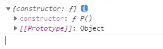
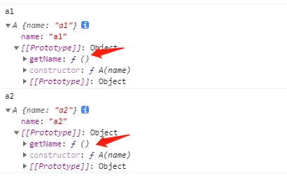
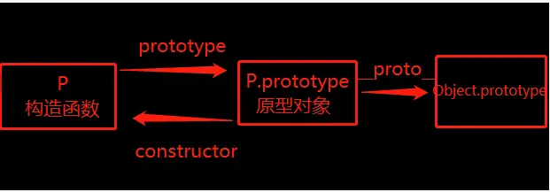

[TOC]
>[success] # js --prototype、__proto__与constructor
1. 了解js 对象必须要知道三个属性**prototype、__proto__与constructor**,在ES标准定义中`__proto__`其实是暴露了通过它访问的对象的内部
2.  关于`[[Prototype]]` （ `__proto__` ）执行过程
2.1. 当我们通过引用对象的属性**key**来获取一个**value**时，它会触发 `[[Get]]`的操作
2.2. 这个操作会首先检查该对象是否有**对应的属性**，如果有的话就使用它
2.3. 如果对象中没有改属性，那么会访问对象`[[prototype]]`（`__proto__`）内置属性指向的对象上的属性

3. **prototype** 属性是**函数**所独有的, 虽然函数也是对象，但是其他对象是不具备**prototype** 属性`[[Prototype]]`（`__proto__`）和`constructor`
4. 对象具有`[[Prototype]]` （ `__proto__`） 属性，当对象去掉`constructor`属性时候，它会触发 `[[Get]]`的操作发现自身没有然后会去`[[Prototype]]`中去找到`constructor`
5. 虽然自定义函数时会默认生成显式原型对象(prototype)但是（**箭头函数除外**）
* **总结**
对象所具备的属性`[[Prototype]]` （ `__proto__`）和`constructor`，函数也是特殊的对象因此也具有这些属性，但是**prototype**是函数所独有属性
~~~
// 对象打三个属性
const aObj = {}
console.log(aObj .__proto__) // 有值
console.log(aObj .constructor) // 有值
console.log(aObj .prototype) // undefined

// 方法打印三个属性
function aFun(){}
undefined
console.log(aFun.__proto__)  // 有值
console.log(aFun.constructor) // 有值
console.log(aFun.prototype) // 有值
~~~
>[danger] ##### 函数是特殊的对象，通过getOwnPropertyNames查看身上的属性

~~~
function test(){}
Object.getOwnPropertyNames(test)
// 打印结果
["length", "name", "arguments", "caller", "prototype"]
~~~
>[danger] ##### es6 之后获取隐式\_\_proto\_\_
1. 在之前浏览器厂商么为了可以让用户获取\_\_proto\_\_（隐式原型链）上的值，自定义了给浏览器使用,不是标准的属性 \_\_proto\_\_，随着后续js升级MDN对这个这里的描述该属性属于**废弃属性**
2. 新版开始定义是`__proto__`暴露了通过它访问的对象的内部`[[Prototype]]`,也就是说新版开始是要控制内部`[[Prototype]]`,需要使用新的api
2.1. **Object.getPrototypeOf/Reflect.getPrototypeOf** 获取隐式原型链
2.2. **Object.setPrototypeOf/Reflect.setPrototypeOf** 赋值隐式原型链，尽管如此，设置对象的[[Prototype]]是一个缓慢的操作，如果性能是一个问题，应该避免去进行赋值操作

[mdn 描述链接](https://developer.mozilla.org/zh-CN/docs/Web/JavaScript/Reference/Global_Objects/Object/proto)

>[danger] ##### prototype -- 原型对象
1. **prototype** -- 该属性的值是一个对象，因为是对象所以它也具有`[[Prototype]]`（`__proto__`）和`constructor`
~~~
function P(){}
console.log(P.prototype)
~~~
+
>[info] ## 三者的关系
在探索三者关系前要清楚**new** 创建一个对象时候所做的事
1. 在内存中创建一个新的对象（空对象）
2. 这个对象内部的\[\[prototype\]\]属性会被赋值为该构造函数的prototype属性
~~~
function A() {}
A.prototype.getName = function () {
	return 'name'
}

/**
 * 创建步骤
 * 1. const a = {} // 创建了一个空对象
 * 2. a.__proto__ = A.prototype //  隐式原型链赋值为该构造函数的prototype属性
 * 也可以写成
 * Object.setPrototypeOf(a,A.prototype)
 */
const a = new A()

~~~
因此我们可以将对象共享属性都放到构造函数的原型链上**prototype**，由构造函数创建出来的所有对象, 他们的隐式构造函数\[\[Prototype\]\]都会指向构造函数显示原型链**prototype**达到共享这些属性
当对象在属性时候会先在自己身上查找, 没有找到就会去自己隐式原型上找\[\[Prototype\]\]
>[danger] ##### \[\[prototype\]\] 和 prototype关系
首先确定是**构造函数** 通过**new**创建了对象，对象的隐式原型链\[\[prototype\]\] 指向了构造函数的**prototype**，因此可以说**对象的隐式原型链等于构造函数的prototype**

* 通过下面案例可以看出'a2' 和'a1' 共享了getName方法
~~~
function A(name){
    this.name = name
}
A.prototype.getName = function(){
    return this.name
}
ƒ (){
    return this.name
}
const a1 = new A('a1')
const a2 = new A('a2')
~~~
~~~
function A() {}
A.prototype.getName = function () {
	return 'name'
}

const a = new A()
console.log(Object.getPrototypeOf(a) === A.prototype) // true

~~~

>[danger] ##### prototype 和 constructor关系
1. prototype  是对象因此它 具有**constructor** 函数， prototype 上**constructor** 属性指向是所在函数(即构造函数)
~~~
function A() {}

console.log(A.prototype.constructor === A) // true
~~~
2.'prototype'同样拥有自己的 隐式原型对象[[prototype]] 

>[danger] ##### 三者关系
* \[\[prototype\]\] 指向创建它的构造函数的原型链**prototype**,**prototype**作为对象具有**constructor** 属性，**constructor** 又指向当前构造函数，因此\[\[prototype\]\]  上也有**constructor** 属性也向当前构造函数
* 由于对象去调用自身不存在的属性时候，会去隐式原型链上找，因此对象可以直接调用**constructor**属性
~~~
function Person() {}

var PersonPrototype = Person.prototype
console.log(PersonPrototype.constructor === Person) // true

var p = new Person()
console.log(p.__proto__.constructor === Person) // true
console.log(p.constructor === Person) // true
console.log(p.constructor.name === Person.name) // true

~~~
>[danger] ##### 不要去做的事 -- 重写原型对象
每创建一个函数, 就会同时创建它的prototype对象, 这个对象也会自动获取constructor属性，但重新赋值一个对象相当于丢失了指向自身constructor属性，而constructor属性还变成当前赋值对象的
~~~
   function Person() {

    }

    console.log(Person.prototype)
    

    // 直接赋值一个新的原型对象
    Person.prototype = {
      message: "Hello Person",
      info: { name: "哈哈哈", age: 30 },
      running: function() {},
      eating: function() {},
      // constructor: Person
    }

	// 非要覆盖 可以这么写
    Object.defineProperty(Person.prototype, "constructor", {
      enumerable: false,
      configurable: true,
      writable: true,
      value: Person
    })
~~~
>[danger] ##### 小补充对象创建过程
[参考](https://www.kancloud.cn/cyyspring/more/2226424)
>[info] ## 文章参考
[帮你彻底搞懂JS中的prototype、__proto__与constructor（图解）](https://blog.csdn.net/cc18868876837/article/details/81211729)
[03 | JavaScript 如何实现继承？](https://kaiwu.lagou.com/course/courseInfo.htm?courseId=822#/detail/pc?id=7199)
[# 继承与原型链mdn](https://developer.mozilla.org/zh-CN/docs/Web/JavaScript/Inheritance_and_the_prototype_chain)
