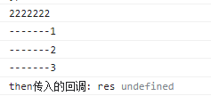
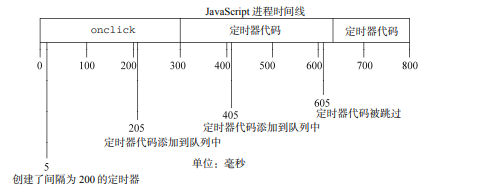

>[success] # js -- 宏任务和微任务
1. 事件循环中并非只维护着一个队列，事实上是有两个队列
1.1.  **宏任务队列**（macrotask queue）：ajax、setTimeout、setInterval、DOM监听、UI Rendering等
1.2. **微任务队列**（microtask queue）：Promise的then回调、 Mutation Observer API、queueMicrotask()等
2. 执行任何一个宏任务之前（不是队列，是一个宏任务），都会先查看微任务队列中是否有任务需要执行也就是宏任务执行之前，必须保证微任务队列是空的；如果不为空，那么就优先执行微任务队列中的任务（回调）；

>[danger] ##### 宏任务和微任务API
* **异步宏任务：macrotask**
    定时器:setTimeout/setInterval      
    事件绑定/队列
    数据请求:Ajax/Fetch
    MessageChannel
    setImmediate「NODE」
* **异步微任务：microtask**
   Promise.then/catch/finally
    async/awai
    queueMicrotask
    MutationObserver
    IntersectionObserver
    requestAnimationFrame
    process.nextTick「NODE」
    ...
>[danger] ##### 微任务队列
1. 以微任务Promise 为例，其实进入队列部分是**then 回调**，整个executor（执行器） 里的代码是同步的，但是then 中的回调进入微任务队列中等待值返回后进入js引擎中执行
~~~
new Promise((resolve, reject) => {
	console.log("2222222")
	console.log("-------1")
	console.log("-------2")
	resolve()
	console.log("-------3")
}).then(res => {
	console.log("then传入的回调: res", res)
})
~~~

>[success] # Promise 和 setTimeout 到底谁先执行
[Chrome开发工程师一篇文章](https://jakearchibald.com/2015/tasks-microtasks-queues-and-schedules/)
>[info] ## 定时器的介绍
~~~
1.需要重点注意的是`setTimeout(…)`不会自动的把你的回调放到事件循环队列中。它设置了一个定时器。
当定时器过期了，宿主环境会将你的回调放到事件循环队列中，以便在以后的循环中取走执行它。
看看下面的代码:
setTimeout(myCallback, 1000);
2.这并不意味着`myCallback`将会在 1,000ms 之后执行，而是，在 1,000ms 之后将被添加到事件队列。
然而，这个队列中可能会拥有一些早一点添加进来的事件 —— 你的回调将会等待被执行
~~~
>[danger] ##### JavaScript高级程序设计（第3版）中的一个案例来说明定时器会延迟执行
~~~
1.下面代码有一个点击事件，当点击事件结束触发，会触发里面的定时器，那么定时器真的会在事件触发的250ms
后执行么？
    答案：尽管在 255ms 处添加了定时器代码，但这时候还不能执行，因为 onclick 事件处 理程序仍在运行。
    定时器代码最早能执行的时机是在 300ms 处，即 onclick 事件处理程序结束之后。
~~~

~~~
var btn = document.getElementById("my-btn");
btn.onclick = function(){
     setTimeout(function(){
     document.getElementById("message").style.visibility = "visible";
     }, 250);
 //其他代码
}; 
~~~
>[danger] ##### 小技巧连续的定时器
~~~
1.setInterval() 是连续执行的定时器，这个会有一个弊端像下面图一样：
      定时器是在 205ms 处添加到队列中的，但是直到过了 300ms 处才能够执行第一个定时器。当执行
    这个定时器代码时，在 405ms 处又给队列添加了另外一个副本。在下一个间隔，即 605ms 处，第一 
    个定时器代码仍在运行，同时在队列中已经有了一个定时器代码的实例。结果是，在这个时间点上的
    定时器代码不会被添加到队列中。结果在 5ms 处添加的定时器代码结束之后，405ms 处添加的定时器代码 
    就立刻执行。
~~~

* 使用链式setTimeout() 解决
~~~
1.每次函数执行的时候都会创建一个新的定时器。第二个 setTimeout()调用使用了 arguments.callee 来获取对
当前执行的函数的引用，并为其设置另外一 个定时器。这样做的好处是，在前一个定时器代码执行完之前，
不会向队列插入新的定时器代码，确保 不会有任何缺失的间隔
~~~
~~~
setTimeout(function(){
     //处理中
     setTimeout(arguments.callee, interval);
}, interval);
~~~
* 书中一个元素向右移动，当左坐标在 200 像素的时候停止的案例
~~~
setTimeout(function(){
    var div = document.getElementById("myDiv");
    left = parseInt(div.style.left) + 5;
    div.style.left = left + "px";
    if (left < 200){
        setTimeout(arguments.callee, 50);
    }
}, 50);
~~~
>[info] ## Promise 和 setTimeout 的执行顺序
~~~
1.Promise 和 setTimeout 都是异步，都会被在特定时间添加到队列中，那么到底谁会先执行？
2.首先要弄清'任务'和'微观任务'，在'setTimeout'章节已经可以知道因为'js是单线程的缘故'所以
他需要对执行'任务'进行类似队列来决定他们的执行顺序触发时机，在任务中还有一种任务叫
'微观任务(Microtasks)'
~~~
>[danger] ##### 一个说明的案例
~~~
1.下面代码打印结果为'a,b,c,d',先打印'a'在打印'b' 因为代码的先后执行顺序先依次'a' 和'b' 但是'c'
和'd' 都是异步他们的先后执行显而易见不会因为他们代码执行顺序先后而依次打印。
2.首先'Promise ':需要进行 io、等待或者其它异步操作的函数，不返回真实结果，而返回一'承诺'，
函数的调用方可以在合适的时机，选择等待这个承诺兑现（通过 Promise 的 then 方法的回调）
3.这里可以简单的理解这两个异步:'Promise 属于我们说的微观任务，setTimeout 属于宏观任务'，因此
'Promise 永远在队列尾部添加微观任务。setTimeout 等宿主 API，则会添加任务。'因此可以得到
一个结论'作为微观任务的代表Promise这个异步会直接在特定情况下添加到对应队列执行尾部'，
'setTimeout 则会根据调用他的宿主api执行了才把自己放到尾部'
4.因此'Promise 会比setTimeout先执行'
~~~
~~~
var r = new Promise(function(resolve, reject){
    console.log("a");
    resolve()
});
setTimeout(()=>console.log("d"), 0)
r.then(() => console.log("c"));
console.log("b")
~~~
>[danger] ##### 再来一个极端的案例接着说明
~~~
1.我们延迟Promise执行时间，增加到1s，这时候打印结果如果按照我们的猜想，即使'Promise'延迟了
你'setTimeout'也要排在我的后面，因为我'Promise' 就是比你先进队列的不服你也给等着'我微观任务'
就是牛逼因此打印结果'c1 c2 d'
2.根据' 极客时间 winter老师的总结'这里要说明
    2.1.首先我们分析有多少个宏任务；
    2.2.在每个宏任务中，分析有多少个微任务；根据调用次序，确定宏任务中的微任务执行次序；
    2.3.根据宏任务的触发规则和调用次序，确定宏任务的执行次序；
    2.4.确定整个顺序。
~~~
~~~
setTimeout(()=>console.log("d"), 0)
var r = new Promise(function(resolve, reject){
    resolve()
});
r.then(() => { 
    var begin = Date.now();
    while(Date.now() - begin < 1000);
    console.log("c1") 
    new Promise(function(resolve, reject){
        resolve()
    }).then(() => console.log("c2"))
});
~~~
*   一个很有意思的属性'MutationObserver'

>[danger] ##### 总结
~~~
1.不同队列优先级不同，每次事件循环时会从优先级高的队列中获取事件，只有当优先级高的队列为空
时才会从优先级低的队列中获取事件，同级队列之间的事件不存在优先级，只遵循先进先出的原则

process.nextTick(Node.js) > 
MutationObserver(浏览器)/promise.then(catch、finnally)>
setImmediate(IE) > 
setTimeout/setIntervalrequestAnimationFrame >
其他 I/O 操作 / 浏览器 DOM 事件
2.一次 Eventloop 循环会处理一个宏任务和所有这次循环中产生的微任务。
 2.1.macrotasks(宏任务): 
    script(整体代码),setTimeout,setInterval,setImmediate,I/O,UI rendering,event listner
 2.2.microtasks(微任务): 
    process.nextTick, Promises, Object.observe, MutationObserver

~~~
[参考文章 拉钩](https://kaiwu.lagou.com/course/courseInfo.htm?courseId=180#/detail/pc?id=3180)


