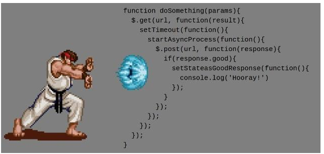

[TOC]
>[success] # 老派callback 还是新派 Promise
[MDN -- 参考](https://developer.mozilla.org/zh-CN/docs/learn/JavaScript/%E5%BC%82%E6%AD%A5/%E7%AE%80%E4%BB%8B)
~~~
1.就像上节笔记写的不是所有的回调都是异步一样，但是异步回调出现的问题就是'回调地狱'
~~~
>[info] ## js 中常见的异步
~~~
1.定时器都是异步操作
2.事件绑定都是异步操作
3.AJAX中一般我们都采取异步操作（也可以同步）
简单的理解：网络操作，浏览器事件，都必须是异步执行

'注这里有个小说明'：虽然实际上是可以 同步 实现 Ajax 请求的，但是最好永远都不要这么做。如果你使用了同步的 
Ajax 请求，你的 JavaScript 应用就会被阻塞 —— 用户就不能点击、输入数据、导航或是滚动。这将会阻止用户的任
何交互动作。这是一种非常糟糕的做法
~~~
>[danger] ##### 主要说一下事件模型这种异步
[更详细的了解文章推荐](https://github.com/xitu/gold-miner/blob/master/TODO/how-javascript-works-event-loop-and-the-rise-of-async-programming-5-ways-to-better-coding-with.md)
~~~
1.下面的代码先打印出来2,当你什么时候点击按钮什么时候才会出来1，这是js最基础的异步编程形式，
其实你可以吧'onclick'想成定时器，只不过这时候的定时器不是通过你设定时间来触发，而是通过你
触发的事件来触发
~~~
~~~
let button = document.getElementById('test')
button.onclick = function () {
    console.log(1)
    
}
console.log(2)
~~~

>[info] ## 为什么要有新派的Promise
参考的文章
[developers.google](https://developers.google.com/web/fundamentals/primers/promises?hl=zh-cn#whats-all-the-fuss-about)
[廖雪峰老师的Promise](https://www.liaoxuefeng.com/wiki/1022910821149312/1023024413276544)
[腾讯 alloyteam--JavaScript Promise 启示录](http://www.alloyteam.com/2014/05/javascript-promise-mode/)
~~~
1.对于使用一个东西要知道为什么他会出现，一下内容均来自上面三篇文章的个人理解总结
2.首先回调处理异步的最大的问题就是会出现'回调地狱'，反复的嵌套，但实际异步的时候我们只关心成功还是失败，
无非也就是如果成功了你去做什么，失败了你去做什么，如果将这种结果性质的东西不在通过内部回调，而是链式形
式进行返回后面的只需要你告诉我成功了还是失败了去做我自己的分支代码，就可以避免回调这种形式
~~~
>[danger] ##### 用个回调方式 来解释第二条
~~~
1.这是一个简单的案例如果随机数大于1将会返回'随机数字大于1',相反则会返回'随机数字小于1',实际上现在只是
很简单的一层，如果我们在callback函数中接着来要做判断，我们要接着不停的嵌套，然而实际的结果我们只想
知道他的返回结果，走我们不一样的条件分支就好了
~~~
~~~
var fun = function(callback){
    var num = Math.random()*2
    setTimeout(function () {
         if(num<1){
             callback&&callback(false)
         }else{
             callback&&callback(true)
         }
    },100)
}

var callback = function(status){
    if(status){
        console.log('随机数字大于1')
    }else{
        console.log('随机数字小于1')
    }

}
fun(callback)

~~~
>[danger] ##### 完成第二条的思路代码
~~~
1.下面代码是不可以运行的，只是我们按照我们现在想要的思路去实一个看似是代码的代码，我们用fun 这个函数
去包裹'setTimeout'这个异步函数,fun这个函数有两个参数,'res'是成功回调接受成功返回的参数，'rej'正好和'res'相反
，这样正好我们就得到我们想要的只关心异步的结果，我们通过链式去调用'fun'的结果，then接受的是'res'，
catch 接受的是'rej'
2.这样整个代码没有回调，只需要通过链式这种更简洁的形式根据返回成功还是失败的状态来做代码逻辑的判断即可
~~~
~~~
var fun = function(res,rej){
    var num = Math.random()*2
    setTimeout(function () {
        if(num<1){
            res(false)
        }else{
            rej(true)
        }
    },100)
}
fun.then(function (status) {
    console.log('随机数字大于1')
}).catch(function(status){
    console.log('随机数字小于1')

})
~~~